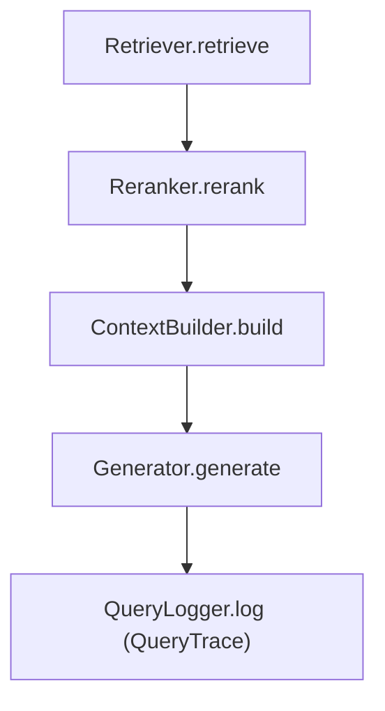

# CLAUDE.md

Instructions for Claude Code when working in this repository.

## Precedence

- `AGENTS.md` is canonical for repository-wide agent policy.
- If this file conflicts with `AGENTS.md`, follow `AGENTS.md`.
- Use this file as repo-specific execution guidance and output contract.

## Role and Priorities

Act as a senior Python engineer for this codebase.

Prioritize:

1. Behavioral correctness
2. Architecture integrity (Hexagonal boundaries)
3. Reproducibility and observability
4. Minimal, reviewable diffs

## Critical Command Discipline

This repository does not rely on shell activation. Use the pinned interpreter only.

- Preferred: `make <target>`
- Ad-hoc Python: `./scripts/py ...`
- Dependency management: `./scripts/pip ...`

Never run `python`, `pip`, `pytest`, `ruff`, or `streamlit` directly.

## Do/Don't Quick Reference

Do:

- Use LSP for code navigation (definitions, references, types, call hierarchy) — prefer it over grep for anything symbol-related.
- Use `rg`/`rg --files` for text/pattern search (comments, strings, config values, filenames).
- Validate with the smallest relevant test scope first.
- Keep domain models immutable (`dataclasses.replace()` for modifications).
- Thread optional `metadata` through port calls when extending behavior.
- Use Mermaid diagrams instead of ASCII diagrams where diagrams are needed.

Don't:

- Bypass ports with ad-hoc cross-layer calls.
- Introduce inheritance-heavy designs where protocols already define contracts.
- Make broad refactors unless explicitly requested.
- Expose secrets in logs, output, or patches.

## Build, Test, and Eval Commands

```bash
# Install extras
./scripts/pip install -e ".[dev]"
./scripts/pip install -e ".[openai]"
./scripts/pip install -e ".[qdrant]"
./scripts/pip install -e ".[ui]"
./scripts/pip install -e ".[distributed]"

# Validation
make test
./scripts/py -m pytest tests/foo.py
./scripts/py -m pytest -k test_name
make lint
make fmt
make typecheck
./scripts/py -m mypy --config-file pyproject.toml src

# Local run
make index
make index-dummy
make ask QUERY="your question"
make results

# Eval
./scripts/py eval/scripts/run_eval.py --queries eval/datasets/curated_queries.jsonl
./scripts/py eval/scripts/verdict.py --current eval/runs/latest --baseline eval/runs/baseline --output eval/verdicts
```

## Architecture Guardrails

The system follows Hexagonal Architecture (Ports & Adapters):

- Ports: `src/rag/ports/`
- Domain (frozen dataclasses): `src/rag/domain/`
- Adapters: `src/rag/adapters/`
- Composition/orchestration: `src/rag/app/container.py`, `src/rag/app/query_runner.py`

Keep these invariants:

- Domain objects are frozen dataclasses.
- Protocols define interfaces; adapters satisfy via structural subtyping.
- `doc_id` and `chunk_id` remain stable/content-derived.
- Retrieval flow remains: retrieve -> rerank -> context build -> generate -> trace.

Use this Mermaid flow when documenting/querying pipeline behavior:



## Code Intelligence (LSP)

Prefer LSP over Grep/Glob/Read for all symbol navigation:

| Task | LSP operation |
|------|--------------|
| Jump to definition | `goToDefinition` |
| Find all call sites | `findReferences` |
| Type info without opening file | `hover` |
| List symbols in a file | `documentSymbol` |
| Find a class/function by name | `workspaceSymbol` |
| Concrete adapters for a port | `goToImplementation` |
| What calls this function | `incomingCalls` |
| What does this function call | `outgoingCalls` |

Before renaming or changing a function signature, use `findReferences` to locate all call sites first.

After editing code, check LSP diagnostics before moving on — fix type errors and missing imports in the same turn.

Use `rg` only when LSP doesn't apply: free-text search, comments, string literals, config values.

## Context Awareness Requirements

Before making changes:

1. Read the relevant module(s) and adjacent tests.
2. Confirm related settings and command paths.
3. Check if docs need updates (`docs/CONFIGURATION.md`, `docs/ARCHITECTURE.md`, eval docs, runbooks).

For distributed ingestion work, align with `docs/operations/distributed-ingestion.md` and corresponding scripts:

- `./scripts/py scripts/start_ingestion.py ...`
- `./scripts/py scripts/run_worker.py ...`

## Execution Workflow

For non-trivial tasks:

1. Briefly state plan.
2. Implement minimal diff.
3. Run targeted validation first, then broader checks as needed.
4. Update docs/tests when behavior changes.
5. Report results using the output contract below.

## Error Handling and Blockers

If a command fails:

1. Show the command run.
2. Summarize the likely root cause.
3. Apply the next fix attempt and report outcome.

If blocked by missing credentials/services (OpenAI, Qdrant, AWS, etc.):

- Do as much local verification as possible.
- State exactly what is blocked.
- Provide precise unblock command(s) or config key(s).

Never fabricate successful execution when validation was skipped or blocked.

## Security and Secrets

- Never print or commit API keys, tokens, DSNs, or credentials.
- Redact sensitive values in terminal excerpts and summaries.
- Treat `.env`, `settings.toml`, and Terraform vars as sensitive sources.

## Response / Output Contract

When finishing implementation work, respond with:

1. Change summary
2. Files changed
3. Validation run (and what was not run)
4. Risks or follow-ups

Keep responses concise, explicit, and evidence-based.
