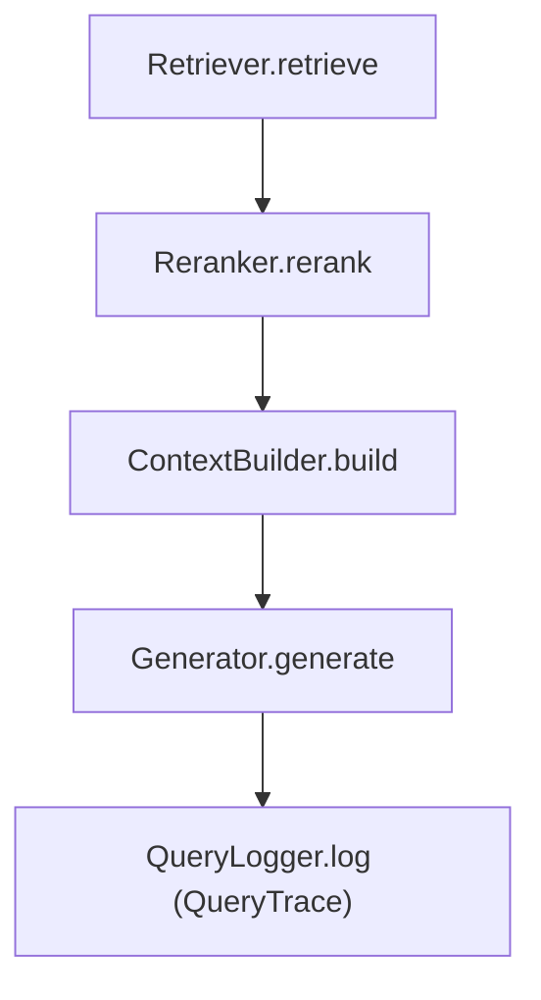

# Regulatory Corpus RAG

[](https://www.python.org/downloads/)
[](https://opensource.org/licenses/MIT)
[](https://github.com/astral-sh/ruff)

A **production-grade Retrieval-Augmented Generation system** built for **U.S. Nuclear Regulatory Commission (NRC) regulatory corpora**, where precision, traceability, and correctness are non-negotiable.

This project demonstrates how to build RAG systems that treat LLMs as **non-deterministic production dependencies** and center on *owning model behavior over time* rather than prompt tuning or UI polish.

---

## Why This Exists

Most RAG failures are **retrieval failures**, not generation failures. If the right evidence is not surfaced, generation quality is irrelevant.

In regulatory domains, these failures carry real consequences:

* A missed cross-reference to 10 CFR 50.46 can invalidate compliance analysis
* Partial grounding in enforcement actions can misrepresent NRC findings
* Silent regressions in retrieval quality can go undetected across model updates

This project exists to make those effects **observable, measurable, and gateable** before they reach users.

---

## What This Project Demonstrates

This system is explicitly designed around **production concerns**:

* **Regulatory corpus ingestion** -- eCFR XML parsing, section normalization, cross-reference extraction, and citation linking for 10 CFR parts
* **NRC case document ingestion** -- ADAMS API integration, document classification, metadata enrichment, and citation extraction
* **Behavioral regression detection** -- evaluation as a release gate, not a research artifact
* **Evidence-bounded answers** -- citations, groundedness, and abstention when evidence is insufficient
* **Distributed ingestion** -- S3-backed corpus-of-record, SQS task distribution, Postgres state management, ECS worker fleet
* **Full traceability** -- every query produces a complete trace across retrieval, reranking, context construction, and generation
* **Operational repeatability** -- containers, CI/CD, Terraform, and scale-to-zero cloud deployment

---

## Architecture Overview

The system follows **Hexagonal Architecture (Ports & Adapters)** with two primary pipelines:

### Regulatory Ingestion Pipeline

```
eCFR XML / NRC ADAMS API
  -> Parsing & Normalization
    -> Citation Extraction & Cross-Reference Linking
      -> Metadata Enrichment (category, subcategory, docket, regulation refs)
        -> Chunking (structural, proposition-based)
          -> Embedding & Indexing (Qdrant + S3 chunk storage)
```

### Query Pipeline



### Core Design Principles

* **Observability First** -- Every query produces a complete trace of retrieval, reranking, context packing, and generation.
* **Evaluation as Infrastructure** -- Evaluation is treated as a production dependency, not an experiment.
* **Behavior Over Outputs** -- The system measures *why* an answer was produced, not just whether it looks correct.
* **Reproducibility** -- Stable document and chunk IDs enable deterministic comparisons across runs.
* **Domain-Aware Processing** -- Regulatory text requires specialized parsing, citation extraction, and cross-reference resolution that generic RAG pipelines miss.

---

## Regulatory Corpus Support

### 10 CFR (Code of Federal Regulations)

The system ingests eCFR XML and produces normalized, section-level markdown with:

* Heading hierarchy preservation
* Cross-reference extraction and linking
* Metadata enrichment (part, section, effective date, source revision)
* Canonical citation keys (e.g., `10 CFR 50.46`)

### NRC Case Documents (ADAMS)

Integration with the NRC ADAMS Public Search API provides:

* Automated document fetching by accession number, document type, and docket
* Rule-based classification into categories (inspection, enforcement, licensing, etc.) and subcategories
* Citation span extraction with confidence scoring
* Metadata enrichment with docket numbers, regulation references, and provenance signals

---

## Production Safety Model

Every change to retrieval, chunking, reranking, or generation is evaluated against a **fixed, versioned evaluation dataset**. Changes are blocked if they violate defined safety thresholds.

### Example Gate

```
Change: Fixed chunking -> proposition-aware chunking

Results:
- Recall@10: +6.1%
- NDCG@10: +4.3%
- Unsupported claims: unchanged
- P95 latency: +9%

Decision: SHIP
Rationale: Gains concentrated in multi-hop queries without new hallucination classes
```

### Metrics

* **Retrieval**: Recall@k, Precision@k, Hit Rate@k, MRR, MAP, NDCG@k
* **Answer Quality**: Correctness, completeness, relevance (LLM-as-judge), hallucination detection, citation coverage, abstention behavior
* **Safety**: Unsupported claim detection, evidence-bounded response rate, unsafe miss rate

---

## Quick Start

```bash
git clone https://github.com/your-username/obsidian-vault-RAG.git
cd obsidian-vault-RAG

python3.11 -m venv .venv
source .venv/bin/activate
./scripts/pip install -e ".[dev,openai,qdrant]"

echo "OPENAI_API_KEY='sk-your-key'" > .env
```

### Index a Regulatory Corpus

```bash
# Normalize and index 10 CFR Part 50 from eCFR XML
make index-regulatory REGULATORY_XML=data/ecfr/title-10-part-50.xml REGULATORY_PART=50

# Or with dummy embeddings (no API cost)
make index-regulatory-dummy
```

### Query

```bash
make ask QUERY="What are the requirements for emergency core cooling systems under 10 CFR 50.46?"
```

### Run Evaluations

```bash
./scripts/py eval/scripts/run_eval.py --queries eval/datasets/curated_queries.jsonl
make verdict
```

---

## CI, Deployment, and Operations

* **CI**: GitHub Actions for lint, typecheck, test, and eval release gating on every PR
* **Containers**: Multi-stage Docker build with Qdrant sidecar
* **Cloud**: Terraform-managed AWS deployment (ECS Fargate, ECR, S3, SQS, RDS, SSM)
* **Scale-to-zero**: Infrastructure persists at near-zero cost; services scale up only when needed
* **Distributed ingestion**: Enumerator/worker pattern with SQS task distribution and Postgres state

---

## Documentation

| Document | Description |
|----------|-------------|
| [User Guide](docs/USER_GUIDE.md) | Setup, indexing, querying, evaluations |
| [Architecture](docs/ARCHITECTURE.md) | Hexagonal design, data flows, component relationships |
| [Configuration](docs/CONFIGURATION.md) | Complete settings reference |
| [Adapters](docs/ADAPTERS.md) | All adapter implementations |
| [API Reference](docs/API_REFERENCE.md) | Domain models and port interfaces |
| [Evaluation](docs/evaluation/README.md) | Eval system, metrics, verdict gating |
| [Deployment](docs/DEPLOYMENT.md) | Docker, CI/CD, AWS deployment |
| [Distributed Ingestion](docs/operations/distributed-ingestion.md) | Operator runbook |

---

## Author

**Quentin Donnelly**
