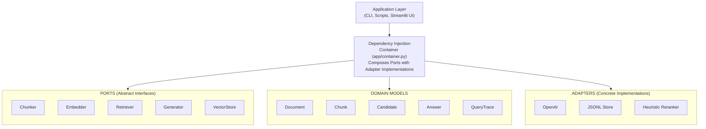
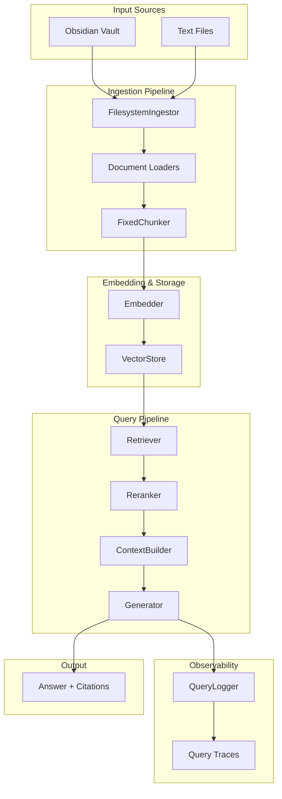
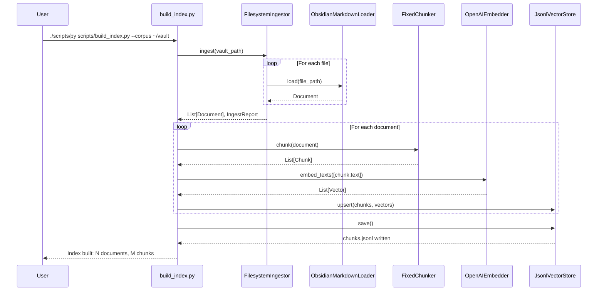
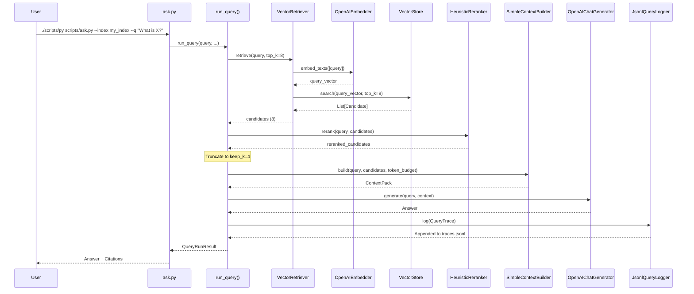
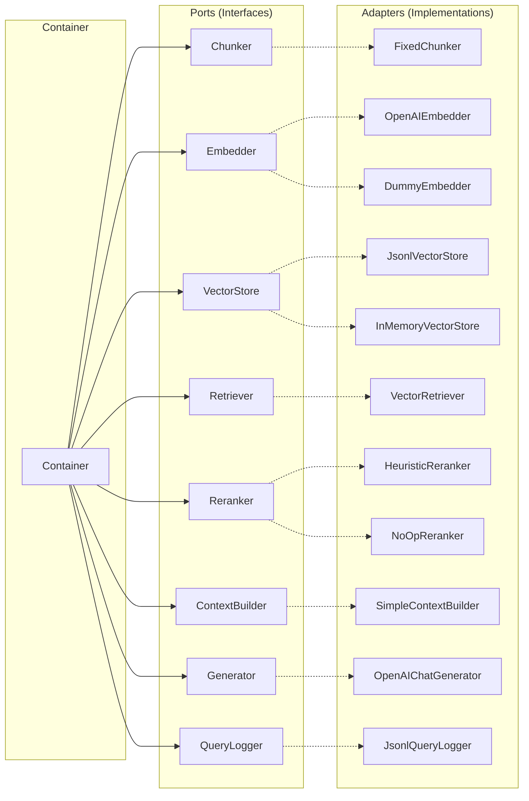
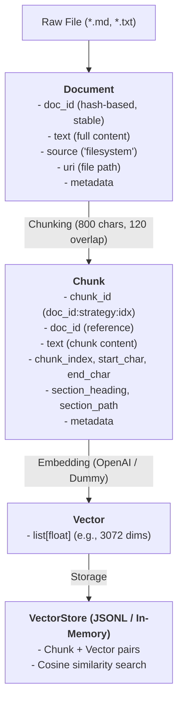
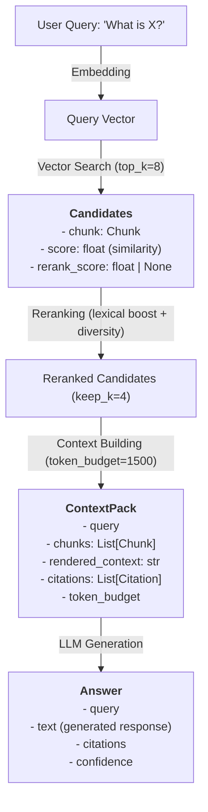
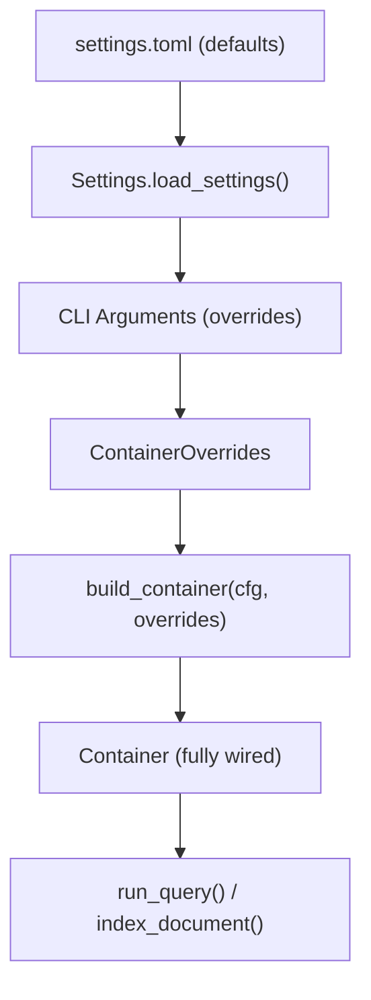

# Architecture Documentation

This document provides a comprehensive overview of the RAG system architecture, including component relationships, data flows, and design patterns.

## Table of Contents

- [Overview](#overview)
- [Architecture Pattern](#architecture-pattern)
- [System Architecture Diagrams](#system-architecture-diagrams)
- [Data Flow](#data-flow)
- [Component Responsibilities](#component-responsibilities)
- [Design Principles](#design-principles)

---

## Overview

The Obsidian Vault RAG system implements a **Retrieval-Augmented Generation** pipeline with a focus on observability and evaluation. The architecture follows the **Hexagonal (Ports & Adapters)** pattern, enabling clean separation of concerns and easy component swapping.

### Key Architectural Goals

1. **Observability First**: Every query generates a complete trace with all intermediate results
2. **Evaluation as First-Class**: Built-in evaluation framework with comprehensive metrics
3. **Clean Boundaries**: Protocol-based interfaces allow easy swapping of implementations
4. **Reproducibility**: Stable IDs for documents and chunks enable deterministic behavior

---

## Architecture Pattern

### Hexagonal Architecture (Ports & Adapters)



### Benefits

- **Testability**: Protocol-based interfaces allow easy mocking
- **Flexibility**: Swap OpenAI for local models without code changes
- **Clarity**: Clear separation between "what" (ports) and "how" (adapters)

---

## System Architecture Diagrams

### High-Level System Overview



### Indexing Flow



### Query Flow



### Container Composition



---

## Data Flow

### Document Processing Pipeline



### Query Processing Pipeline



---

## Component Responsibilities

### Domain Models

| Model | Responsibility |
|-------|---------------|
| `Document` | Raw source unit before chunking; stable ID from content hash |
| `Chunk` | Embedding unit with provenance (offsets, section info) |
| `Candidate` | Retrieved chunk + retrieval/rerank scores |
| `Citation` | Source pointer for answer attribution |
| `ContextPack` | Final evidence bundle for generator |
| `Answer` | LLM output with citations and optional confidence metadata |
| `QueryTrace` | Complete observability record for debugging/evaluation |

### Ports (Interfaces)

| Port | Methods | Purpose |
|------|---------|---------|
| `Ingestor` | `ingest()` | Convert raw inputs to Documents |
| `Chunker` | `chunk()` | Split Document into Chunks |
| `Embedder` | `embed_texts()` | Convert text to dense vectors |
| `VectorStore` | `upsert()`, `search()`, `save()`, `load()` | Store and search embeddings |
| `Retriever` | `retrieve()` | Fetch candidate chunks for query |
| `Reranker` | `rerank()` | Re-order candidates by relevance |
| `ContextBuilder` | `build()` | Pack candidates into prompt context |
| `Generator` | `generate()` | Produce answer from context |
| `QueryLogger` | `log()` | Persist query traces |

### Adapters (Implementations)

| Adapter | Port | Description |
|---------|------|-------------|
| `FilesystemIngestor` | `Ingestor` | Walks directory tree, delegates to loaders |
| `ObsidianMarkdownLoader` | - | Loads .md with transclusion expansion |
| `TextLoader` | - | Loads plain .txt files |
| `FixedChunker` | `Chunker` | Character-based chunking (800/120) |
| `ObsidianStructuralChunker` | `Chunker` | Markdown-aware structural chunking |
| `ObsidianPropositionChunker` | `Chunker` | Proposition-based chunking (seq2seq) |
| `OpenAIEmbedder` | `Embedder` | OpenAI text-embedding-3-large |
| `DummyEmbedder` | `Embedder` | Random vectors for testing |
| `JsonlVectorStore` | `VectorStore` | JSONL-persisted, in-memory search |
| `InMemoryVectorStore` | `VectorStore` | Pure in-memory (no persistence) |
| `BM25Retriever` | `Retriever` | Keyword based search |
| `VectorRetriever` | `Retriever` | Pure vector similarity search |
| `HybridRetriever` | `Retriever` | Vector + keyword search with RRF fusion |
| `HeuristicReranker` | `Reranker` | Lexical overlap boost + diversity |
| `NoOpReranker` | `Reranker` | Pass-through (baseline) |
| `SimpleContextBuilder` | `ContextBuilder` | Token budget + deduplication |
| `PropositionAwareContextBuilder` | `ContextBuilder` | Proposition expansion + deduplication |
| `OpenAIChatGenerator` | `Generator` | GPT-4.1-mini chat completions |
| `JsonlQueryLogger` | `QueryLogger` | JSONL append logging |

---

## Design Principles

### 1. Stable Identifiers

Documents and chunks have deterministic IDs based on content:
- `doc_id`: Hash of (source + path + content)
- `chunk_id`: `{doc_id}:{strategy}:{index}:{start}-{end}`

This enables reproducible experiments and cache-friendly operations.

### 2. Metadata Preservation

Information flows through the pipeline without loss:
- Document metadata → Chunk metadata → Citation metadata
- Section headings and paths preserved for context

### 3. Token Budget Enforcement

Context building explicitly respects LLM context windows:
- Simple heuristic: ~4 characters per token
- Stops adding chunks when budget exceeded
- Deduplication prevents redundant content

### 4. Observability

Every query generates a `QueryTrace` containing:
- All retrieved candidates with scores
- All reranked candidates with scores
- Packed chunk IDs (what went to LLM)
- Timing breakdown by stage
- Final answer with citations

### 5. Composability

Small, focused adapters composed via the `Container`:
- Each adapter does one thing well
- Container wires dependencies
- CLI can override settings for experiments

### 6. Evaluation as First-Class

Built-in evaluation framework with:
- `EvalQuery` schema for ground truth
- Retrieval metrics (Recall, Precision, MRR, NDCG)
- Answer quality metrics (LLM-as-judge)
- Breakdowns by query type and difficulty

---

## File Organization

```
src/rag/
├── domain/              # Core data models
│   ├── models.py        # Document, Chunk, Candidate, Answer, etc.
│   └── filters.py       # Filter AST for metadata queries
│
├── ports/               # Abstract interfaces (Protocol classes)
│   ├── chunker.py       # Chunker protocol
│   ├── embedder.py      # Embedder protocol
│   ├── retriever.py     # Retriever protocol
│   ├── reranker.py      # Reranker protocol
│   ├── context_builder.py
│   ├── generator.py
│   ├── vector_store.py
│   ├── logger.py
│   └── ...
│
├── adapters/            # Concrete implementations
│   ├── chunking/        # Fixed, ObsidianStructural, ObsidianProposition
│   │   └── _markdown.py # Shared markdown parsing infrastructure
│   ├── embedding/       # OpenAI, Dummy, SQLite cache
│   ├── generation/      # OpenAI chat
│   ├── ingestion/       # Filesystem, loaders
│   ├── retrieval/       # VectorRetriever
│   ├── reranking/       # Heuristic, NoOp
│   ├── vectorstores/    # JSONL, in-memory
│   ├── context_building/ # Simple, PropositionAware
│   │   └── _shared.py   # Shared utilities (token estimation, dedupe)
│   ├── logging/
│   └── filters/
│
├── app/                 # Application orchestration
│   ├── container.py     # Dependency injection
│   ├── pipeline.py      # Core functions
│   └── query_runner.py  # Full pipeline with tracing
│
├── eval/                # Evaluation framework
│   ├── schema.py        # EvalQuery, QueryType, Difficulty
│   └── models.py        # EvalResult, RetrievalSummary
│
└── settings.py          # Configuration loading
```

---

## Configuration Flow



The configuration system allows:
1. Sensible defaults in `settings.toml`
2. CLI overrides for one-off experiments
3. Environment variables for secrets (`OPENAI_API_KEY`)
