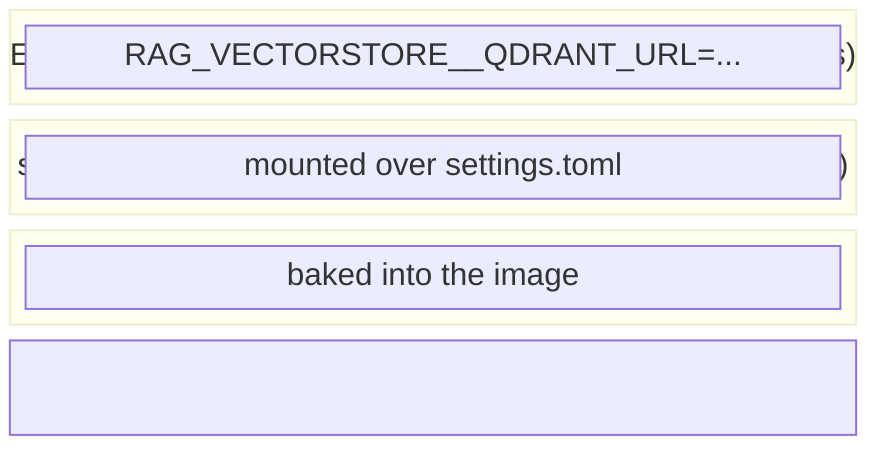
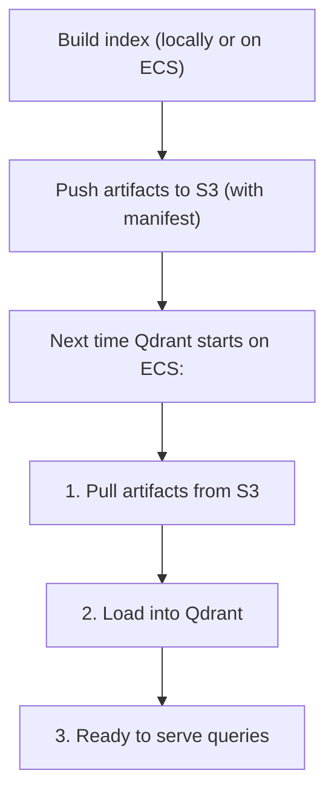
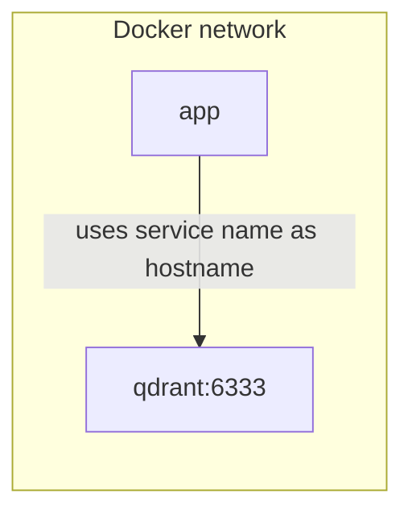
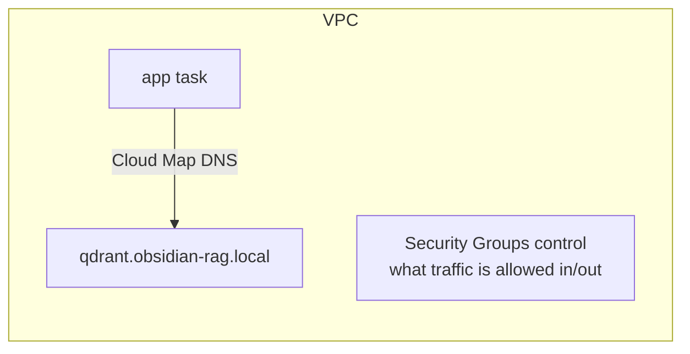
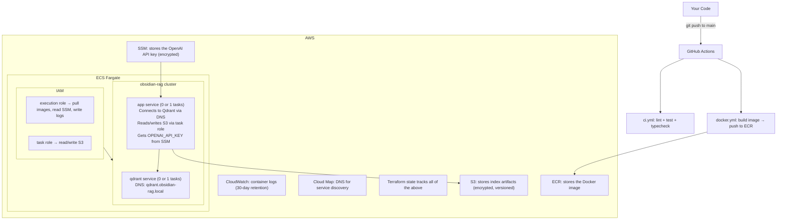

# Infrastructure Architecture Guide

## 1. What This Document Covers

This document explains the infrastructure that packages, deploys, and runs the obsidian-vault-RAG system. It covers four technology layers:

1. **Docker** -- packaging the Python application into a portable, reproducible container
2. **CI/CD with GitHub Actions** -- automatically verifying code quality and building container images
3. **Terraform** -- declaring the AWS infrastructure as code
4. **AWS services** -- ECR, S3, SSM Parameter Store, ECS Fargate, Cloud Map, CloudWatch, and IAM

Each section walks through the actual project files, explains what each line does, and teaches the underlying concept it relies on. By the end, you should be able to explain every piece of this infrastructure in an interview or to a colleague.

```mermaid
graph LR
    subgraph Laptop ["Your Laptop"]
        direction TB
        L1["docker compose"]
        L2["settings.toml"]
        L3[".env"]
        L4["terraform plan"]
        L5["terraform apply"]
    end

    subgraph GHA ["GitHub Actions"]
        direction TB
        G1["ci.yml: lint, test"]
        G2["docker.yml: build & push to ECR"]
    end

    subgraph AWS
        direction TB
        A1["ECR (images)"]
        A2["ECS Fargate: app + qdrant containers"]
        A3["S3 (artifacts)"]
        A4["SSM (secrets)"]
        A5["CloudWatch (logs)"]
    end

    Laptop -- "terraform apply" --> GHA
    GHA -- "push image" --> AWS
```



---

## 2. Docker: Packaging the Application

### What is Docker and why use it?

Docker solves the "works on my machine" problem. Without Docker, deploying a Python application means installing the right Python version, the right system libraries, the right pip packages, and hoping the target server's OS matches your development machine. Docker eliminates all of that by packaging the application, its dependencies, and a minimal operating system into a single artifact called an **image**.

Two key concepts:

- **Image**: A read-only blueprint. Think of it as a snapshot of a filesystem plus metadata (what command to run, what user to run as, etc.). Images are built once and can be run anywhere Docker is installed.
- **Container**: A running instance of an image. You can run many containers from the same image, just as you can run many processes from the same executable.

In this project, the same Docker image runs locally via Docker Compose and on AWS via ECS Fargate. That is the core value: build once, run anywhere.

### The Dockerfile, line by line

**File: `Dockerfile`**

The Dockerfile is a recipe for building an image. Docker reads it top to bottom, executing each instruction to construct the filesystem layer by layer.

#### The build stage

```dockerfile
FROM python:3.11-slim AS builder
```

`FROM` declares the **base image** -- the starting filesystem. `python:3.11-slim` is an official image maintained by the Docker community. It contains a Debian Linux installation with Python 3.11 pre-installed. The `slim` variant omits documentation, man pages, and other non-essential files, keeping the image smaller. `AS builder` names this stage so a later stage can copy files from it. This is a **multi-stage build**, explained below.

```dockerfile
WORKDIR /app
```

Sets the working directory inside the container. All subsequent `RUN`, `COPY`, and `CMD` instructions execute relative to `/app`. The container has its own isolated filesystem -- this `/app` has nothing to do with any `/app` on your laptop.

```dockerfile
RUN apt-get update && apt-get install -y --no-install-recommends \
    build-essential \
    && rm -rf /var/lib/apt/lists/*
```

`RUN` executes a shell command inside the image being built. This installs `build-essential` (C compiler, make, etc.) because some Python packages (like numpy-based dependencies) need to compile C extensions during `pip install`. The flags:
- `--no-install-recommends`: only install the package and its hard dependencies, not "recommended" extras. This keeps the image smaller.
- `rm -rf /var/lib/apt/lists/*`: deletes the package index cache. Since we will never run `apt-get install` again in this stage, the cache is dead weight.

Both optimizations matter because Docker images are a stack of **layers**. Every `RUN`, `COPY`, or `ADD` instruction creates a new layer. Layers are cached and reused. If you leave 50 MB of apt cache in a layer, that 50 MB ships with every image forever, even if a later layer "deletes" it (layers are additive). This is why the install and cleanup are in the same `RUN` command.

```dockerfile
COPY pyproject.toml ./
```

Copies `pyproject.toml` from your project directory into the container's `/app`. Notice that the source code is NOT copied yet. This is deliberate -- it is the **layer caching strategy**.

Docker caches each layer. If the input to a `COPY` or `RUN` instruction has not changed since the last build, Docker reuses the cached layer instead of re-executing it. By copying `pyproject.toml` first and running `pip install` before copying the source code, we ensure that changing a Python source file does not invalidate the dependency installation cache. Dependencies only re-install when `pyproject.toml` changes.

```dockerfile
RUN touch README.md && mkdir -p src/rag && touch src/rag/__init__.py \
    && pip install --no-cache-dir ".[openai,qdrant]"
```

This is **Phase 1** of a two-phase install pattern. The problem: `pip install .` needs to read the project's metadata, which requires the package to exist (setuptools needs to discover the `src/rag` package). But we do not want to copy the real source code yet (that would bust the cache on every code change). The solution: create a **stub source tree** -- just enough files for setuptools to find the package name and proceed. `pip install --no-cache-dir ".[openai,qdrant]"` then installs all dependencies (the `openai` and `qdrant` extras from `pyproject.toml`). `--no-cache-dir` prevents pip from storing a download cache inside the image (we will never install packages again, so the cache is wasted space).

```dockerfile
COPY src/ src/
COPY scripts/ scripts/
COPY settings.toml ./
```

NOW the real source code is copied in. Because the dependency layer above is cached (and its inputs -- `pyproject.toml` -- have not changed), a source code change only rebuilds from this point onward.

```dockerfile
RUN pip install --no-cache-dir --no-deps .
```

**Phase 2**: reinstall the project package, but with `--no-deps` (do not install dependencies -- they already exist from Phase 1). This replaces the stub `src/rag/__init__.py` in `site-packages` with the real package code.

Why not use `pip install -e .` (editable install)? Editable installs create a symlink from `site-packages` back to the source directory. That makes sense during development (edit code, immediately see changes). In Docker, it is wrong for two reasons: (1) the source directory might not exist in the runtime stage, and (2) it creates a fragile dependency on the filesystem layout.

#### The runtime stage

```dockerfile
FROM python:3.11-slim AS runtime
```

This starts a **new, clean image** -- again from `python:3.11-slim`. This is the multi-stage build payoff. The `builder` stage had `build-essential` (C compiler, headers, etc.) installed -- those tools were needed to compile C extensions but are not needed to run the application. By starting fresh, the runtime image does not contain any build tools. This makes the final image smaller and reduces the attack surface.

```dockerfile
COPY --from=builder /usr/local/lib/python3.11/site-packages /usr/local/lib/python3.11/site-packages
COPY --from=builder /usr/local/bin /usr/local/bin
```

`COPY --from=builder` copies files from the `builder` stage into the `runtime` stage. This grabs all the installed Python packages (including compiled `.so` files) and any CLI entry points. The key insight: we get the compiled packages without carrying along the compiler.

```dockerfile
COPY --from=builder /app/src src/
COPY --from=builder /app/scripts scripts/
COPY --from=builder /app/settings.toml settings.toml
COPY --from=builder /app/pyproject.toml pyproject.toml
```

Copy the application code and configuration from the builder. These files are already in the builder stage because we `COPY`-ed them there.

```dockerfile
COPY docker-entrypoint.sh /usr/local/bin/docker-entrypoint.sh
RUN chmod +x /usr/local/bin/docker-entrypoint.sh
```

Copy the entrypoint script (explained below) and make it executable.

```dockerfile
RUN mkdir -p /app/artifacts
```

Create the artifacts directory. On AWS, this is ephemeral (lost when the container stops). In Docker Compose, it is mounted as a bind mount so artifacts persist on the host.

```dockerfile
RUN useradd --create-home --shell /bin/bash appuser && \
    chown -R appuser:appuser /app
USER appuser
```

Create a non-root user and switch to it. By default, containers run as root. If an attacker exploits a vulnerability in the application, running as root means they have root access inside the container (and potentially ways to escalate to the host). Running as `appuser` limits the blast radius. This is a container security best practice.

```dockerfile
ENTRYPOINT ["docker-entrypoint.sh"]
CMD ["help"]
```

`ENTRYPOINT` defines the executable that always runs when the container starts. `CMD` provides default arguments to the entrypoint. Together they mean: if you run `docker run <image>`, it executes `docker-entrypoint.sh help`. If you run `docker run <image> build-index --corpus /data`, it executes `docker-entrypoint.sh build-index --corpus /data`. The entrypoint is the constant; CMD is the default that can be overridden.

### docker-entrypoint.sh

**File: `docker-entrypoint.sh`**

```bash
#!/usr/bin/env bash
set -euo pipefail
```

The shebang (`#!/usr/bin/env bash`) tells the OS to run this script with bash. `set -euo pipefail` enables three safety flags:
- `-e`: exit immediately if any command fails (non-zero exit code). Without this, the script would keep running after errors.
- `-u`: treat unset variables as errors. Without this, `$UNDEFINED_VAR` silently expands to an empty string.
- `-o pipefail`: in a pipeline like `cmd1 | cmd2`, the exit code is normally from `cmd2` only. With `pipefail`, the pipeline fails if any command in it fails.

These flags are standard practice in production shell scripts. They prevent silent failures.

```bash
CMD="${1:-help}"
shift || true
```

Captures the first argument (defaulting to `help` if none provided) and shifts it off the argument list so `"$@"` contains only the remaining arguments.

```bash
case "$CMD" in
  build-index)
    exec python scripts/build_index.py "$@"
    ;;
  query)
    exec python scripts/ask.py "$@"
    ;;
```

This is the **command dispatch pattern**: the first argument selects which Python script to run, and the remaining arguments are forwarded. This makes the container feel like a CLI tool with subcommands.

The `exec` keyword is critical. Without it, bash would spawn Python as a child process, and bash would remain as PID 1 (the first process in the container). The problem: Docker sends termination signals (SIGTERM) to PID 1. If bash is PID 1, Python never receives the signal and cannot shut down gracefully. `exec` replaces the bash process with Python, making Python PID 1 so it receives signals directly.

```bash
  *)
    exec "$CMD" "$@"
    ;;
```

The catch-all case: if the command is not recognized, execute it directly. This lets you run `docker run <image> bash` to get a shell inside the container for debugging.

### .dockerignore

**File: `.dockerignore`**

```
.venv/
__pycache__/
*.pyc
.git/
.github/
artifacts/
logs/
data/
eval/runs/
.env
.mypy_cache/
.pytest_cache/
.ruff_cache/
infra/
docs/
tests/
*.egg-info/
.DS_Store
```

When you run `docker build`, Docker sends the entire project directory (the "build context") to the Docker daemon. The `.dockerignore` file excludes files from the build context, just like `.gitignore` excludes files from git. Excluding `.git/` (which can be hundreds of megabytes), `artifacts/`, `tests/`, and `docs/` makes the build context smaller, which means:
1. Faster builds (less data to transfer to the daemon)
2. Smaller images (excluded files cannot accidentally end up in a `COPY . .` instruction)
3. Security: `.env` is excluded so API keys never end up inside the image

### Docker Compose: multi-container local development

**File: `docker-compose.yml`**

Docker Compose is a tool for defining and running multi-container applications. Instead of manually starting each container and wiring them together, you declare the desired state in a YAML file and run `docker compose up`.

```yaml
services:
  qdrant:
    image: qdrant/qdrant:v1.13.2
    ports:
      - "6333:6333"
      - "6334:6334"
    volumes:
      - qdrant_data:/qdrant/storage
    restart: unless-stopped
    healthcheck:
      test: ["CMD-SHELL", "bash -c 'echo > /dev/tcp/localhost/6333'"]
      interval: 5s
      timeout: 3s
      retries: 5
```

**Services** are the containers in your application. The `qdrant` service runs the official Qdrant vector database image. Key concepts:

- **`ports: "6333:6333"`**: Maps host port 6333 to container port 6333. The left side is your laptop; the right side is inside the container. This lets you access Qdrant at `localhost:6333` from outside Docker.

- **`volumes: qdrant_data:/qdrant/storage`**: This is a **named volume**. Docker manages the storage location. Named volumes persist across container restarts -- if you `docker compose down` and `docker compose up` again, Qdrant's data is still there. Named volumes are the right choice for database storage because Docker manages their lifecycle.

- **`healthcheck`**: Docker periodically runs this command to determine if the container is healthy. The test `bash -c 'echo > /dev/tcp/localhost/6333'` attempts a TCP connection to port 6333. If the connection succeeds, the container is healthy. This is a bash trick -- the Qdrant image does not include `curl` or `wget`, so we use bash's built-in TCP support instead. The `interval`, `timeout`, and `retries` control how often Docker checks and how many failures it tolerates before marking the container as unhealthy.

```yaml
  app:
    build: .
    env_file:
      - .env
    volumes:
      - ./artifacts:/app/artifacts
      - ./settings.docker.toml:/app/settings.toml:ro
    depends_on:
      qdrant:
        condition: service_healthy
```

- **`build: .`**: Build the image from the Dockerfile in the current directory (instead of pulling a pre-built image).

- **`env_file: .env`**: Load environment variables from the `.env` file. This is how the OpenAI API key gets into the container locally.

- **`./artifacts:/app/artifacts`**: This is a **bind mount** -- it maps a specific directory on your host into the container. Unlike named volumes, you control the location. Changes inside the container appear on your host and vice versa. This is the right choice for application data you want to inspect and manage directly.

- **`./settings.docker.toml:/app/settings.toml:ro`**: Mounts the Docker-specific settings file over the default `settings.toml` inside the container. The `:ro` suffix makes it read-only. This is the **settings overlay** mechanism: the container sees Docker-appropriate paths (like `qdrant_url = "http://qdrant:6333"`) instead of the local development paths.

- **`depends_on` with `condition: service_healthy`**: The app container will not start until the `qdrant` service passes its health check. Without this, the app might start, try to connect to Qdrant, and fail because Qdrant is still initializing. The `service_healthy` condition (as opposed to just `service_started`) waits for the health check to pass, not just for the container to exist.

```yaml
volumes:
  qdrant_data:
```

Declares the named volume. Docker creates and manages this storage automatically.

**How containers find each other**: Docker Compose creates a virtual network for all services in the file. Each service is reachable by its service name as a hostname. The app container can connect to Qdrant at `http://qdrant:6333` because Docker's internal DNS resolves the hostname `qdrant` to the Qdrant container's IP address.

---

## 3. Configuration: Making One Image Work Everywhere

### The 12-Factor App principle

The [Twelve-Factor App](https://12factor.net) methodology states that configuration -- anything that varies between environments (development, staging, production) -- should come from the environment, not be baked into the code. API keys, database URLs, and feature flags should all be injectable at runtime.

This project implements a three-layer configuration system:



The same Docker image works in three contexts:
1. **Docker Compose locally**: `settings.docker.toml` is mounted as `settings.toml`; secrets come from `.env`
2. **ECS on AWS**: Environment variables are set in the task definition; secrets come from SSM Parameter Store
3. **CI tests**: Default `settings.toml` with dummy backends; no secrets needed

### Environment variable overrides

**File: `src/rag/config/env_override.py`**

The application scans for environment variables with the prefix `RAG_` and uses double underscores to separate the section from the key:

```python
_PREFIX = "RAG_"
_SEP = "__"
```

For example, `RAG_VECTORSTORE__QDRANT_URL=http://qdrant:6333` maps to `settings["vectorstore"]["qdrant_url"]`. The code splits the variable name, lowercases it, and inserts the value into the settings dictionary.

Type coercion is automatic: the code looks at the existing value in the TOML dictionary to determine the target type.

```python
def _coerce(value: str, existing: Any, *, env_key: str = "") -> Any:
    if isinstance(existing, bool):
        return value.lower() in ("true", "1", "yes")
    if isinstance(existing, int):
        return int(value)
    if isinstance(existing, float):
        return float(value)
    return value
```

If `top_k` is `8` in `settings.toml` (an integer), then `RAG_RETRIEVAL__TOP_K=12` is coerced to the integer `12`, not the string `"12"`. This is what makes the system seamless: you set strings in environment variables (the only type they support), and the application figures out the right Python type.

### Secrets management

Secrets flow differently in each environment:

**Local development**: The `.env` file (never committed -- it is in `.gitignore`) contains `OPENAI_API_KEY=sk-...`. Docker Compose loads it via the `env_file` directive.

**File: `.env.example`**
```
OPENAI_API_KEY=
```

**AWS**: SSM Parameter Store holds the secret as a `SecureString` (encrypted with KMS). The ECS task definition declares a `secrets` block that tells the ECS agent to fetch the value at container startup and inject it as an environment variable:

```json
"secrets": [
  {
    "name": "OPENAI_API_KEY",
    "valueFrom": "<ARN of SSM parameter>"
  }
]
```

The container code does not know the difference. It just reads `os.environ["OPENAI_API_KEY"]`. The infrastructure handles the secret injection.

---

## 4. CI/CD: Automated Quality Gates and Delivery

### What is CI/CD?

- **CI (Continuous Integration)**: Automatically verify code quality -- linting, formatting, type checking, tests -- on every push or pull request. If any check fails, the developer knows immediately.
- **CD (Continuous Delivery)**: Automatically build and publish artifacts (in this case, a Docker image) when code merges to main.

### GitHub Actions concepts

GitHub Actions is GitHub's built-in CI/CD platform. The key concepts:

- **Workflow**: A YAML file in `.github/workflows/` that defines an automation. This project has two: `ci.yml` and `docker.yml`.
- **Trigger**: The `on` block defines when the workflow runs (e.g., on push, on pull request).
- **Job**: A unit of work that runs on a single machine. Jobs in the same workflow can run in parallel.
- **Step**: A single command or action within a job. Steps run sequentially.
- **Runner**: The machine that executes a job. `runs-on: ubuntu-latest` means GitHub provisions a fresh Ubuntu VM for each run.
- **Action**: A reusable step published to the GitHub marketplace. `uses: actions/checkout@v4` checks out your repository; `uses: actions/cache@v4` caches files between runs.
- **Secret**: A value stored in GitHub's encrypted settings, injected at runtime via `${{ secrets.NAME }}`. Secrets never appear in logs.

### The CI workflow

**File: `.github/workflows/ci.yml`**

```yaml
name: CI

on:
  push:
    branches: [main]
  pull_request:
    branches: [main]
```

This workflow triggers on every push to `main` and every pull request targeting `main`. It runs on both events so that: (1) PRs get feedback before merging, and (2) the main branch is verified after merging in case of merge conflicts.

```yaml
jobs:
  lint-and-test:
    runs-on: ubuntu-latest
```

A single job named `lint-and-test` on a fresh Ubuntu VM.

```yaml
    steps:
      - uses: actions/checkout@v4
```

Check out the repository code. Without this step, the runner has an empty filesystem.

```yaml
      - name: Set up Python 3.11
        uses: actions/setup-python@v5
        with:
          python-version: "3.11"
```

Install Python 3.11. The runner has a system Python, but this ensures the exact version matches the project.

```yaml
      - name: Cache pip packages
        uses: actions/cache@v4
        with:
          path: ~/.cache/pip
          key: ${{ runner.os }}-pip-${{ hashFiles('pyproject.toml') }}
          restore-keys: |
            ${{ runner.os }}-pip-
```

**Caching**: `pip install` downloads packages from the internet, which is slow. The cache action saves the pip download cache between workflow runs. The cache key includes a hash of `pyproject.toml`, so when dependencies change, the cache is invalidated and a fresh download happens. The `restore-keys` fallback means even if the exact key does not match, a partial cache (from a previous `pyproject.toml`) is used for packages that have not changed.

```yaml
      - name: Lint
        run: python -m ruff check .

      - name: Format check
        run: python -m ruff format --check .

      - name: Type check
        run: python -m mypy --config-file pyproject.toml src

      - name: Test
        run: python -m pytest -q
```

Four quality gates in sequence: linting (code style and errors), format checking (consistent formatting), type checking (mypy static analysis), and tests. No API keys are needed because the test suite uses dummy and in-memory backends. If any step fails, the workflow fails and the PR is flagged.

### The Docker workflow

**File: `.github/workflows/docker.yml`**

```yaml
name: Docker Build & Push

on:
  push:
    branches: [main]
```

This workflow only triggers on push to `main` -- not on pull requests. There is no reason to build and push a Docker image for a PR that has not been merged yet.

```yaml
env:
  AWS_REGION: us-east-1
```

A workflow-level environment variable, available to all jobs.

```yaml
    permissions:
      id-token: write
      contents: read
```

Declares the minimum permissions the job needs. `contents: read` allows checking out code. `id-token: write` is for OIDC-based authentication (a more secure alternative to long-lived AWS keys, though this workflow uses static keys).

```yaml
      - name: Configure AWS credentials
        uses: aws-actions/configure-aws-credentials@v4
        with:
          aws-access-key-id: ${{ secrets.AWS_ACCESS_KEY_ID }}
          aws-secret-access-key: ${{ secrets.AWS_SECRET_ACCESS_KEY }}
          aws-region: ${{ env.AWS_REGION }}
```

The credential flow: AWS access key and secret key are stored as GitHub Secrets. This action reads them and configures the AWS CLI/SDK for subsequent steps. The secrets are never printed in logs.

```yaml
      - name: Login to Amazon ECR
        id: ecr-login
        uses: aws-actions/amazon-ecr-login@v2
```

Authenticates Docker with ECR (Elastic Container Registry). ECR is a private Docker image registry -- you need credentials to push images. The `id: ecr-login` assigns an identifier so the next step can reference the registry URL from this step's output.

```yaml
      - name: Build, tag, and push image
        env:
          ECR_REGISTRY: ${{ steps.ecr-login.outputs.registry }}
          ECR_REPOSITORY: obsidian-rag
          IMAGE_TAG: ${{ github.sha }}
        run: |
          docker build -t $ECR_REGISTRY/$ECR_REPOSITORY:$IMAGE_TAG .
          docker tag $ECR_REGISTRY/$ECR_REPOSITORY:$IMAGE_TAG $ECR_REGISTRY/$ECR_REPOSITORY:latest
          docker push $ECR_REGISTRY/$ECR_REPOSITORY:$IMAGE_TAG
          docker push $ECR_REGISTRY/$ECR_REPOSITORY:latest
```

The **tagging strategy**: each image gets two tags:
1. `${{ github.sha }}` -- the full git commit hash (e.g., `6e62e4c...`). This provides traceability: given a running container, you can determine exactly which commit built it.
2. `latest` -- a convenience tag that always points to the most recent build. ECS task definitions reference `:latest` so they get the newest image without updating the tag.

Both tags are pushed to ECR. The SHA tag is immutable (it always points to that specific build). The `latest` tag is overwritten on each push.

---

## 5. Terraform: Infrastructure as Code

### What is Terraform?

The problem: clicking through the AWS console to create an S3 bucket, an ECS cluster, IAM roles, and so on is unreproducible. If you need to recreate the infrastructure (new AWS account, disaster recovery, second environment), you have to remember every click. Terraform solves this by letting you declare infrastructure in code.

**Infrastructure as Code** means: you write files that describe the infrastructure you want (an S3 bucket with versioning, an ECS cluster with two services, etc.), and Terraform figures out how to create, update, or delete AWS resources to match your declaration.

### The plan/apply cycle

Terraform has a deliberate two-step process:

1. **`terraform plan`**: Reads the code, compares it to the current state of your infrastructure, and shows what it would create, modify, or destroy. Nothing actually happens.
2. **`terraform apply`**: Executes the plan. Creates, modifies, or destroys resources to match the code.

This plan/apply separation is a safety mechanism. You always see what will happen before it happens.

### State

Terraform keeps a **state file** (`terraform.tfstate`) that records what resources it has created and their current attributes (IDs, ARNs, IP addresses). This is how Terraform knows the difference between "create a new S3 bucket" and "update the existing S3 bucket I created last time."

**File: `infra/.gitignore`**
```
*.tfstate
*.tfstate.*
.terraform/
*.tfvars
!terraform.tfvars.example
```

State files are excluded from git for two reasons:
1. They contain sensitive information (resource ARNs, and in this project, the plaintext OpenAI API key because the secrets module stores it in SSM).
2. Two people applying Terraform simultaneously would create conflicting state, potentially corrupting the infrastructure.

The `.terraform/` directory contains downloaded providers and modules (think of it as `node_modules` for Terraform). `*.tfvars` files contain variable values (potentially sensitive), except the `.example` file.

For production, you would configure a **remote backend** (S3 + DynamoDB for locking) so the state is stored centrally and access is coordinated. The root `main.tf` has this commented out:

```hcl
# backend "s3" {
#   bucket = "obsidian-rag-tfstate"
#   key    = "infra/terraform.tfstate"
#   region = "us-east-1"
# }
```

### HCL (HashiCorp Configuration Language)

Terraform uses HCL, a declarative language with a few key constructs:

- **`resource`**: The building block. Each resource maps to a real infrastructure object.
  ```hcl
  resource "aws_s3_bucket" "this" { ... }
  ```
  The type is `aws_s3_bucket` (an S3 bucket managed by the AWS provider). The name `this` is an internal reference (used in Terraform code to refer to this specific resource).

- **`variable`**: An input parameter to a module.
  ```hcl
  variable "bucket_name" {
    type = string
  }
  ```

- **`output`**: A value a module exposes for other modules or the operator to read.
  ```hcl
  output "bucket_arn" {
    value = aws_s3_bucket.this.arn
  }
  ```

- **`provider`**: A plugin that knows how to talk to a specific cloud or service.
  ```hcl
  provider "aws" {
    region = var.aws_region
  }
  ```

- **`terraform init`**: Downloads providers and initializes modules. Must be run once before `plan` or `apply`.

### Terraform modules

Modules are reusable, composable units of infrastructure -- like functions for infrastructure. Each module has:
- `main.tf` -- the resources it creates
- `variables.tf` -- its inputs (parameters)
- `outputs.tf` -- its return values

The root module (`infra/main.tf`) calls child modules:

```hcl
module "ecr" {
  source          = "./modules/ecr"
  repository_name = var.project_name
  force_delete    = true
  tags            = local.tags
}
```

`source` points to the module directory. The remaining attributes pass values to the module's variables. Outputs from one module can be passed as inputs to another -- Terraform resolves the dependency graph automatically.

### Module: ECR (Elastic Container Registry)

**What ECR is**: A private Docker image registry hosted in your AWS account. Think of Docker Hub, but private and integrated with AWS authentication. You push images to ECR, and ECS pulls images from ECR.

**Why you need it**: You cannot deploy a Docker image from your laptop to ECS. The image needs to live in a registry that ECS can access. ECR is the simplest option within AWS.

**File: `infra/modules/ecr/main.tf`**

```hcl
resource "aws_ecr_repository" "this" {
  name                 = var.repository_name
  image_tag_mutability = var.image_tag_mutability
  force_delete         = var.force_delete

  image_scanning_configuration {
    scan_on_push = true
  }

  tags = var.tags
}
```

- **`name`**: The repository name (`obsidian-rag`). You push images as `<account>.dkr.ecr.<region>.amazonaws.com/obsidian-rag:latest`.
- **`image_tag_mutability`**: Controls whether tags can be overwritten. `MUTABLE` (the default) allows pushing a new image with the `latest` tag, overwriting the previous one. `IMMUTABLE` would prevent this (useful for strict release tracking).
- **`force_delete`**: If `true`, the repository can be deleted even if it contains images. Set to `true` for development (easy teardown) and `false` for production (safety guard).
- **`scan_on_push`**: AWS automatically scans every pushed image for known vulnerabilities (CVEs) using a database of known-vulnerable packages. You can see the results in the ECR console.

**File: `infra/modules/ecr/variables.tf`**

```hcl
variable "image_tag_mutability" {
  description = "Tag mutability setting (MUTABLE or IMMUTABLE)"
  type        = string
  default     = "MUTABLE"

  validation {
    condition     = contains(["MUTABLE", "IMMUTABLE"], var.image_tag_mutability)
    error_message = "image_tag_mutability must be \"MUTABLE\" or \"IMMUTABLE\"."
  }
}
```

Terraform **validation blocks** catch invalid values at plan time, before any resources are created. This prevents a typo like `"mutable"` (lowercase) from reaching the AWS API and causing a confusing error.

```hcl
resource "aws_ecr_lifecycle_policy" "this" {
  repository = aws_ecr_repository.this.name

  policy = jsonencode({
    rules = [
      {
        rulePriority = 1
        description  = "Keep only 10 most recent images"
        selection = {
          tagStatus   = "any"
          countType   = "imageCountMoreThan"
          countNumber = 10
        }
        action = {
          type = "expire"
        }
      }
    ]
  })
}
```

Without a lifecycle policy, every pushed image accumulates forever. At ~100-200 MB per image, this adds up. The policy automatically deletes all but the 10 most recent images, keeping storage costs bounded.

**File: `infra/modules/ecr/outputs.tf`**

```hcl
output "repository_url" {
  value = aws_ecr_repository.this.repository_url
}

output "repository_arn" {
  value = aws_ecr_repository.this.arn
}
```

The `repository_url` output (e.g., `123456789.dkr.ecr.us-east-1.amazonaws.com/obsidian-rag`) is used by the ECS module to tell task definitions where to pull images from.

### Module: S3 (Simple Storage Service)

**What S3 is**: Object storage. You store files (called "objects") in "buckets." S3 is not a filesystem -- there are no directories, just keys that can contain `/` characters that look like paths. It is highly durable (99.999999999% -- eleven nines), effectively infinite in capacity, and very cheap.

**How it is used here**: Storing index artifacts (JSONL files, embedding caches, manifests). The RAG application builds an index locally, then pushes the artifacts to S3 so they can be pulled by an ECS task later.

**File: `infra/modules/s3/main.tf`**

```hcl
resource "aws_s3_bucket" "this" {
  bucket        = var.bucket_name
  force_destroy = var.force_destroy
  tags          = var.tags
}
```

Creates the bucket. `force_destroy = true` allows `terraform destroy` to delete the bucket even if it contains objects. Without this, you would need to empty the bucket manually first.

```hcl
resource "aws_s3_bucket_versioning" "this" {
  bucket = aws_s3_bucket.this.id
  versioning_configuration {
    status = "Enabled"
  }
}
```

**Versioning**: Every time you overwrite an object, S3 keeps the previous version. This is a safety net -- if you accidentally push a broken index, you can restore the previous version. Versioning is a separate resource in Terraform because AWS treats it as a separate configuration from the bucket itself.

```hcl
resource "aws_s3_bucket_server_side_encryption_configuration" "this" {
  bucket = aws_s3_bucket.this.id
  rule {
    apply_server_side_encryption_by_default {
      sse_algorithm = "AES256"
    }
  }
}
```

**Encryption at rest**: All objects are encrypted on disk using AES-256 (SSE-S3). This is an AWS-managed encryption key -- zero operational overhead. If someone gains access to the physical disks in AWS's data center, the data is encrypted.

```hcl
resource "aws_s3_bucket_public_access_block" "this" {
  bucket = aws_s3_bucket.this.id

  block_public_acls       = true
  block_public_policy     = true
  ignore_public_acls      = true
  restrict_public_buckets = true
}
```

**Public access block**: Four boolean flags that collectively make it impossible to accidentally make the bucket public. This is defense-in-depth -- even if someone attaches a misconfigured bucket policy, these settings override it. S3 data breaches from accidentally public buckets are a common news story; this prevents that.

```hcl
resource "aws_s3_bucket_lifecycle_configuration" "this" {
  bucket = aws_s3_bucket.this.id

  rule {
    id     = "expire-old-versions"
    status = "Enabled"

    noncurrent_version_expiration {
      noncurrent_days = 30
    }
  }
}
```

**Lifecycle policy**: Since versioning is enabled, old versions accumulate. This rule automatically deletes non-current versions after 30 days. This is cost control -- you get a 30-day safety net without unbounded storage growth.

### Module: SSM Parameter Store (Secrets)

**What SSM Parameter Store is**: AWS Systems Manager Parameter Store is a key-value store for configuration data and secrets. It is the simplest way to store secrets in AWS.

**File: `infra/modules/secrets/main.tf`**

```hcl
# Note: The secret value is stored in Terraform state in plaintext.
# For production, consider managing the value out of band (aws ssm put-parameter)
# and using lifecycle { ignore_changes = [value] } to keep it out of state.
resource "aws_ssm_parameter" "openai_api_key" {
  name        = "${var.name_prefix}/openai-api-key"
  description = "OpenAI API key for the RAG pipeline"
  type        = "SecureString"
  value       = var.openai_api_key

  tags = var.tags
}
```

- **`type = "SecureString"`**: The value is encrypted at rest using AWS KMS (Key Management Service). When you read it through the AWS console or API, it appears as `****` unless you explicitly decrypt it. Standard `String` parameters are stored in plaintext.
- **Why not `.env` files on AWS?**: ECS containers are ephemeral. There is no persistent filesystem to put a `.env` file on. Even if there were, managing files on containers at scale is fragile. SSM is a centralized, encrypted, auditable place for secrets.
- **The state-file tradeoff**: The comment in the code is important. Terraform needs to know the current value of the parameter to detect drift (changes outside of Terraform). That means the plaintext secret ends up in `terraform.tfstate`. This is why the state file must never be committed and, in production, should be stored in an encrypted S3 backend. The comment suggests the production pattern: set the secret value manually via `aws ssm put-parameter` and use `lifecycle { ignore_changes = [value] }` so Terraform does not need to know the value.

**File: `infra/modules/secrets/variables.tf`**

```hcl
variable "openai_api_key" {
  description = "OpenAI API key (stored as SecureString)"
  type        = string
  sensitive   = true
}
```

The `sensitive = true` flag tells Terraform to redact this value from plan and apply output. Without it, `terraform plan` would print the API key to the terminal.

### Module: ECS (Elastic Container Service)

This is the largest and most complex module because ECS orchestrates the running containers and ties together networking, logging, secrets, and IAM.

#### What ECS Fargate is

ECS (Elastic Container Service) is AWS's container orchestration service. **Fargate** is the serverless launch type: you define CPU and memory requirements, and AWS provisions the underlying compute. You never manage, patch, or SSH into servers.

Three concepts to distinguish:
- **Task definition**: A blueprint for a container (or group of containers). Specifies the image, CPU, memory, environment variables, secrets, log configuration. Think of it as a recipe.
- **Task**: A running instance of a task definition. Think of it as a meal cooked from the recipe.
- **Service**: A controller that ensures a specified number of tasks are always running. If a task crashes, the service launches a replacement. Think of it as the chef who keeps cooking.

#### The ECS cluster

**File: `infra/modules/ecs/main.tf`**

```hcl
resource "aws_ecs_cluster" "this" {
  name = var.cluster_name
  tags = var.tags
}
```

A **cluster** is a logical grouping of services and tasks. It is a namespace, not a server. With Fargate, the cluster contains zero servers -- AWS handles the compute.

#### CloudWatch log groups

```hcl
resource "aws_cloudwatch_log_group" "app" {
  name              = "/ecs/${var.cluster_name}/app"
  retention_in_days = var.log_retention_days
  tags              = var.tags
}

resource "aws_cloudwatch_log_group" "qdrant" {
  name              = "/ecs/${var.cluster_name}/qdrant"
  retention_in_days = var.log_retention_days
  tags              = var.tags
}
```

**CloudWatch Logs** is where container stdout and stderr go. Every `print()` statement or log message from the Python application ends up here. The `retention_in_days = 30` (default from `variables.tf`) automatically deletes logs older than 30 days. Without retention, logs accumulate forever and CloudWatch charges $0.50/GB ingested.

Terraform creates the log groups (not the ECS agent), which is why the container definitions later set `"awslogs-create-group" = "false"`. Managing log groups in Terraform gives you control over retention, tagging, and lifecycle.

#### Cloud Map / Service Discovery

```hcl
resource "aws_service_discovery_private_dns_namespace" "this" {
  name = "${var.cluster_name}.local"
  vpc  = data.aws_subnet.first.vpc_id
  tags = var.tags
}

data "aws_subnet" "first" {
  id = var.subnet_ids[0]
}
```

**Cloud Map** is AWS's service discovery service. It creates DNS records within a private namespace so containers can find each other by name instead of IP address.

`data "aws_subnet"` is a **data source** -- it reads existing infrastructure (the subnet) without creating anything. It is used here to look up the VPC ID from the provided subnet ID.

The namespace `obsidian-rag.local` is a private DNS zone. Only resources within the same VPC can resolve names in it.

```hcl
resource "aws_service_discovery_service" "qdrant" {
  name = "qdrant"

  dns_config {
    namespace_id = aws_service_discovery_private_dns_namespace.this.id
    dns_records {
      ttl  = 10
      type = "A"
    }
    routing_policy = "MULTIVALUE"
  }

  health_check_custom_config {
    failure_threshold = 1
  }
}
```

This creates a DNS record so that `qdrant.obsidian-rag.local` resolves to the IP address of the running Qdrant task. The `ttl = 10` means DNS clients cache the result for 10 seconds before re-querying (important because Fargate tasks can restart with a different IP). `MULTIVALUE` routing returns all healthy IPs if there are multiple tasks.

On the ECS side, the Qdrant service registers with Cloud Map:

```hcl
resource "aws_ecs_service" "qdrant" {
  ...
  service_registries {
    registry_arn = aws_service_discovery_service.qdrant.arn
  }
}
```

This is the ECS-Cloud Map integration: when the Qdrant task starts, ECS automatically registers its IP address in Cloud Map. When it stops, ECS deregisters it. The RAG app connects to `http://qdrant.obsidian-rag.local:6333` -- no hardcoded IPs.

**How this parallels Docker Compose**: In Docker Compose, containers use service names as hostnames (`http://qdrant:6333`). In ECS, containers use Cloud Map DNS names (`http://qdrant.obsidian-rag.local:6333`). Same concept, different mechanism.

#### Qdrant task definition

```hcl
resource "aws_ecs_task_definition" "qdrant" {
  family                   = "${var.cluster_name}-qdrant"
  requires_compatibilities = ["FARGATE"]
  network_mode             = "awsvpc"
  cpu                      = var.qdrant_cpu
  memory                   = var.qdrant_memory
  execution_role_arn       = aws_iam_role.task_execution.arn

  container_definitions = jsonencode([
    {
      name      = "qdrant"
      image     = var.qdrant_image
      essential = true
      portMappings = [
        { containerPort = 6333, protocol = "tcp" },
        { containerPort = 6334, protocol = "tcp" }
      ]
      logConfiguration = {
        logDriver = "awslogs"
        options = {
          "awslogs-group"         = aws_cloudwatch_log_group.qdrant.name
          "awslogs-region"        = data.aws_region.current.name
          "awslogs-stream-prefix" = "qdrant"
          "awslogs-create-group"  = "false"
        }
      }
    }
  ])

  tags = var.tags
}
```

- **`family`**: A name for the task definition. New revisions of the same family are tracked together.
- **`requires_compatibilities = ["FARGATE"]`**: This task runs on Fargate (serverless), not EC2 instances.
- **`network_mode = "awsvpc"`**: Each task gets its own elastic network interface (ENI) with its own private IP address. This is required for Fargate and means each task behaves like an independent host on the network.
- **`cpu` and `memory`**: Fargate requires you to declare CPU (in units where 1024 = 1 vCPU) and memory (in MB). The default for Qdrant is 512 CPU units (0.5 vCPU) and 1024 MB (1 GB) RAM.
- **`execution_role_arn`**: The IAM role the ECS *agent* uses (explained in the IAM section below). Qdrant only needs the execution role (to pull its image and write logs).
- **`logConfiguration`**: Sends container stdout/stderr to CloudWatch Logs using the `awslogs` driver. `"awslogs-create-group" = "false"` means the log group must already exist (Terraform creates it above).

#### RAG app task definition

```hcl
resource "aws_ecs_task_definition" "app" {
  family                   = "${var.cluster_name}-app"
  requires_compatibilities = ["FARGATE"]
  network_mode             = "awsvpc"
  cpu                      = var.app_cpu
  memory                   = var.app_memory
  execution_role_arn       = aws_iam_role.task_execution.arn
  task_role_arn            = aws_iam_role.task.arn

  container_definitions = jsonencode([
    {
      name      = "rag-app"
      image     = var.app_image
      essential = true
      environment = [
        { name = "RAG_VECTORSTORE__BACKEND", value = "qdrant" },
        { name = "RAG_VECTORSTORE__QDRANT_URL", value = "http://qdrant.${var.cluster_name}.local:6333" },
        { name = "RAG_VECTORSTORE__QDRANT_COLLECTION", value = "obsidian" },
      ]
      secrets = [
        {
          name      = "OPENAI_API_KEY"
          valueFrom = var.openai_api_key_arn
        }
      ]
      logConfiguration = { ... }
    }
  ])

  tags = var.tags
}
```

Key differences from the Qdrant task:

- **`task_role_arn`**: The IAM role the *running container* assumes. The app needs S3 access to push/pull artifacts. Qdrant does not need any AWS API access, so it has no task role.
- **`environment`**: Hardcoded environment variables set at deployment time. These use the `RAG_SECTION__KEY` convention that the env override code understands. `RAG_VECTORSTORE__QDRANT_URL` points to the Cloud Map DNS name.
- **`secrets`**: The ECS agent fetches the secret value from SSM Parameter Store at container startup and injects it as the environment variable `OPENAI_API_KEY`. The container code sees a normal environment variable -- it does not know the value came from SSM.

#### ECS services

```hcl
resource "aws_ecs_service" "qdrant" {
  name            = "${var.cluster_name}-qdrant"
  cluster         = aws_ecs_cluster.this.id
  task_definition = aws_ecs_task_definition.qdrant.arn
  desired_count   = var.qdrant_desired_count
  launch_type     = "FARGATE"

  network_configuration {
    subnets          = var.subnet_ids
    security_groups  = var.security_group_ids
    assign_public_ip = true
  }

  service_registries {
    registry_arn = aws_service_discovery_service.qdrant.arn
  }

  tags = var.tags
}
```

- **`desired_count`**: The number of tasks the service should maintain. Defaults to `0` (scale-to-zero). Set to `1` to run one task. If a task crashes, the service launches a replacement.
- **`assign_public_ip = true`**: Tasks in public subnets get a public IP address. This is needed for Fargate tasks in public subnets to pull images from ECR (they need internet access). For a portfolio project, this is acceptable. In production, you would use private subnets with a NAT gateway or VPC endpoints.
- **`service_registries`**: Connects this service to Cloud Map so its tasks are discoverable via DNS.

The app service is similar but without `service_registries` (the app connects to Qdrant, not the other way around).

#### IAM roles (identity and access management)

**File: `infra/modules/ecs/iam.tf`**

IAM is AWS's permission system. It controls who can do what to which resources. ECS requires two distinct roles, and understanding why is critical.

**Task execution role** -- permissions for the ECS *agent*, not your code:

```hcl
resource "aws_iam_role" "task_execution" {
  name = "${var.cluster_name}-task-execution"

  assume_role_policy = jsonencode({
    Version = "2012-10-17"
    Statement = [
      {
        Action = "sts:AssumeRole"
        Effect = "Allow"
        Principal = {
          Service = "ecs-tasks.amazonaws.com"
        }
      }
    ]
  })

  tags = var.tags
}
```

The `assume_role_policy` is a **trust policy** -- it answers "who is allowed to use this role?" Here, only the `ecs-tasks.amazonaws.com` service (the ECS agent) can assume this role. A random IAM user or Lambda function cannot.

```hcl
resource "aws_iam_role_policy_attachment" "task_execution_base" {
  role       = aws_iam_role.task_execution.name
  policy_arn = "arn:aws:iam::aws:policy/service-role/AmazonECSTaskExecutionRolePolicy"
}
```

This attaches a **managed policy** -- a pre-built set of permissions maintained by AWS. `AmazonECSTaskExecutionRolePolicy` grants permissions to pull images from ECR and write logs to CloudWatch. AWS maintains this policy so you do not need to enumerate every ECR and CloudWatch permission.

```hcl
resource "aws_iam_role_policy" "task_execution_ssm" {
  name = "${var.cluster_name}-ssm-read"
  role = aws_iam_role.task_execution.id

  policy = jsonencode({
    Version = "2012-10-17"
    Statement = [
      {
        Effect = "Allow"
        Action = [
          "ssm:GetParameters",
          "ssm:GetParameter"
        ]
        Resource = [var.openai_api_key_arn]
      }
    ]
  })
}
```

This is an **inline policy** -- custom permissions scoped to a specific resource. The execution role needs `ssm:GetParameter` to fetch the OpenAI API key from SSM at container startup (for the `secrets` block in the task definition). The `Resource` is restricted to the specific SSM parameter ARN -- the role cannot read any other SSM parameter. This is the **principle of least privilege**: grant only the permissions needed, to only the resources needed.

**Task role** -- permissions for your running application code:

```hcl
resource "aws_iam_role" "task" {
  name = "${var.cluster_name}-task"

  assume_role_policy = jsonencode({
    Version = "2012-10-17"
    Statement = [
      {
        Action = "sts:AssumeRole"
        Effect = "Allow"
        Principal = {
          Service = "ecs-tasks.amazonaws.com"
        }
      }
    ]
  })

  tags = var.tags
}
```

Same trust policy as above (ECS tasks can assume it), but this role is used differently.

```hcl
resource "aws_iam_role_policy" "task_s3" {
  name = "${var.cluster_name}-s3-access"
  role = aws_iam_role.task.id

  policy = jsonencode({
    Version = "2012-10-17"
    Statement = [
      {
        Effect = "Allow"
        Action = [
          "s3:GetObject",
          "s3:PutObject",
          "s3:ListBucket",
          "s3:DeleteObject"
        ]
        Resource = [
          var.s3_bucket_arn,
          "${var.s3_bucket_arn}/*"
        ]
      }
    ]
  })
}
```

The task role grants S3 access to the running container. The `Resource` block has two entries:
- `var.s3_bucket_arn`: Permission on the bucket itself (needed for `s3:ListBucket`)
- `"${var.s3_bucket_arn}/*"`: Permission on all objects within the bucket (needed for `s3:GetObject`, `s3:PutObject`, `s3:DeleteObject`)

**Why two roles?** The principle of least privilege. The ECS agent needs different permissions than the application. The agent needs to pull images and fetch secrets; the application needs S3 access. If the application is compromised, the attacker can only do what the task role allows (read/write S3). They cannot pull images from ECR, read secrets from SSM, or write to CloudWatch -- those permissions belong to the execution role, which the application code cannot access.

Notice that the Qdrant task definition only has `execution_role_arn` (no `task_role_arn`). Qdrant does not need any AWS API access -- it just runs a vector database. No task role means no AWS permissions at all, further limiting the blast radius if Qdrant were compromised.

#### Root module

**File: `infra/main.tf`**

```hcl
terraform {
  required_version = ">= 1.5"

  required_providers {
    aws = {
      source  = "hashicorp/aws"
      version = "~> 5.0"
    }
  }
}
```

**Version pinning**: `required_version` ensures everyone uses a compatible Terraform CLI version. `version = "~> 5.0"` for the AWS provider means "any 5.x version" (allows minor and patch updates but not major version changes that might break things).

```hcl
provider "aws" {
  region = var.aws_region
}
```

Configures the AWS provider to create resources in the specified region.

```hcl
locals {
  tags = {
    Project   = var.project_name
    ManagedBy = "terraform"
  }
}
```

**`locals`** defines computed values used in multiple places. Every resource gets tagged with `Project = "obsidian-rag"` and `ManagedBy = "terraform"`. Tags help with cost tracking, access control, and knowing which resources are Terraform-managed vs. manually created.

The module calls wire everything together:

```hcl
module "ecs" {
  source = "./modules/ecs"

  cluster_name       = var.project_name
  app_image          = "${module.ecr.repository_url}:latest"
  openai_api_key_arn = module.secrets.openai_api_key_arn
  s3_bucket_arn      = module.s3.bucket_arn
  subnet_ids         = var.subnet_ids
  security_group_ids = var.security_group_ids
  ...
}
```

Notice `app_image = "${module.ecr.repository_url}:latest"`. Terraform knows that the ECS module depends on the ECR module (because it references its output) and creates them in the right order. You never write "create ECR first, then ECS" -- Terraform infers the dependency graph from data flow.

**File: `infra/variables.tf`**

```hcl
variable "openai_api_key" {
  description = "OpenAI API key"
  type        = string
  sensitive   = true
}
```

Root-level variables are the inputs you provide via `terraform.tfvars` or the `-var` flag. `sensitive = true` redacts the value from Terraform's output.

**File: `infra/terraform.tfvars.example`**

```hcl
aws_region     = "us-east-1"
project_name   = "obsidian-rag"
openai_api_key = "sk-your-key-here"

subnet_ids = ["subnet-xxxxxxxx"]

app_desired_count    = 0
qdrant_desired_count = 0
```

You copy this file to `terraform.tfvars` (which is git-ignored) and fill in real values. The `desired_count = 0` defaults mean nothing runs until you explicitly scale up -- a cost-saving measure.

**File: `infra/outputs.tf`**

```hcl
output "ecr_repository_url" {
  description = "ECR repository URL (for docker push)"
  value       = module.ecr.repository_url
}

output "qdrant_dns" {
  description = "Qdrant service discovery DNS name"
  value       = module.ecs.qdrant_discovery_name
}
```

Root outputs are printed after `terraform apply` and can be queried with `terraform output`. They provide the values you need for next steps (e.g., the ECR URL for pushing images, the Qdrant DNS name for configuration).

---

## 6. Artifact Storage and Build Provenance

### The ArtifactStore port

The hexagonal architecture pattern extends beyond the core RAG pipeline to infrastructure concerns. The `ArtifactStore` port abstracts where index artifacts live.

**File: `src/rag/ports/artifact_store.py`**

```python
@runtime_checkable
class ArtifactStore(Protocol):
    def pull(self, remote_key: str, local_dir: Path) -> Path: ...
    def push(self, local_dir: Path, remote_key: str) -> None: ...
```

Two methods. That is the entire interface. The application code calls `store.push(local_dir, "indexes/obsidian")` and does not know or care whether the artifacts go to a local filesystem or S3.

**File: `src/rag/adapters/artifacts/local_store.py`**

```python
@dataclass(frozen=True, slots=True)
class LocalArtifactStore:
    def pull(self, remote_key: str, local_dir: Path) -> Path:
        return local_dir

    def push(self, local_dir: Path, remote_key: str) -> None:
        pass
```

The local adapter is a no-op passthrough. `pull()` returns the local directory as-is (the artifacts are already there). `push()` does nothing (files are already local). This is the adapter for local development.

**File: `src/rag/adapters/artifacts/s3_store.py`**

```python
@dataclass(frozen=True, slots=True)
class S3ArtifactStore:
    bucket: str
    client: Any = field(default=None, repr=False)

    def push(self, local_dir: Path, remote_key: str) -> None:
        manifest_path = local_dir / "manifest.json"
        if not manifest_path.exists():
            raise FileNotFoundError(
                f"manifest.json not found in {local_dir}. "
                "Index artifacts must include a manifest for provenance tracking."
            )
        for file_path in local_dir.rglob("*"):
            if file_path.is_file():
                relative = file_path.relative_to(local_dir)
                s3_key = f"{remote_key}/{relative}"
                self.client.upload_file(...)
```

The S3 adapter does real work. `push()` uploads every file in the local directory to S3. But notice the **manifest guard**: it refuses to push artifacts that do not contain a `manifest.json`. This enforces provenance -- you cannot have artifacts in S3 without a record of what built them.

`pull()` downloads all objects under a prefix from S3 to a local directory. This is used when an ECS task starts and needs to reconstruct the index.

### IndexManifest

**File: `src/rag/domain/index_manifest.py`**

```python
@dataclass(frozen=True, slots=True)
class IndexManifest:
    index_name: str
    created_at: str
    git_sha: str
    corpus: str
    doc_count: int
    chunk_count: int
    chunking: dict[str, Any] = field(default_factory=dict)
    embedding: dict[str, Any] = field(default_factory=dict)
    ingest_report: dict[str, Any] = field(default_factory=dict)
    store: dict[str, Any] = field(default_factory=dict)
```

The manifest captures everything you need to reproduce or understand an index build:
- **`git_sha`**: Which commit of the code was used (auto-populated from `git rev-parse HEAD`)
- **`created_at`**: When the build happened (ISO 8601 timestamp)
- **`corpus`**: Which data was indexed
- **`doc_count` / `chunk_count`**: How many documents and chunks were produced
- **`chunking` / `embedding`**: The configuration settings used

This is **provenance tracking**. When you look at an index on S3, you can answer: "What code built this? When? With what settings? How many documents?"

### The rebuild-from-S3 pattern

Qdrant on ECS Fargate has no persistent storage. When the Qdrant task stops, its data is lost. (EFS exists for persistent storage on Fargate, but it adds cost and complexity.) The workflow is:



The tradeoff: startup is slower (pulling from S3 and rebuilding takes time), but the architecture is simpler and cheaper. There is no persistent infrastructure running when nothing is active.

---

## 7. Networking and Security Model

### How containers communicate

**Docker Compose** (local):


Docker Compose creates an isolated virtual network. Each service is reachable by its service name. The app connects to `http://qdrant:6333`.

**ECS on AWS**:


Cloud Map creates DNS records. The app connects to `http://qdrant.obsidian-rag.local:6333`. The `awsvpc` network mode gives each task its own IP address.

### Security layers

**Container level**:
- Non-root user (`appuser`) limits damage from container breakout
- Multi-stage build means no compilers or build tools in the production image
- `.dockerignore` excludes `.env` and other sensitive files from the image

**Network level**:
- Security groups act as firewalls, controlling inbound and outbound traffic
- Each task has its own network interface (awsvpc mode), enabling per-task security group assignment

**Identity and access level (IAM)**:
- Execution role: scoped to image pulling, log writing, and reading one specific SSM parameter
- Task role: scoped to S3 operations on one specific bucket
- Qdrant has no task role (no AWS API access at all)

**Encryption**:
- S3: server-side encryption at rest (AES-256)
- SSM Parameter Store: `SecureString` encrypted with KMS
- ECR: scan-on-push for vulnerability detection

**Secrets handling**:
- Never in code (`.env` is git-ignored)
- Never in images (`.dockerignore` excludes `.env`)
- Local: `.env` file loaded by Docker Compose
- AWS: SSM Parameter Store, injected by ECS agent at startup

### What production would add

This infrastructure is appropriate for a portfolio project. A production deployment would add:

- **Private subnets**: Containers would not have public IP addresses. They would sit in private subnets and access the internet through a NAT gateway (for pulling images) or VPC endpoints (for ECR, S3, SSM -- no internet traffic at all).
- **Application Load Balancer (ALB)**: A single entry point that distributes traffic to tasks, terminates TLS, and provides health checking.
- **WAF (Web Application Firewall)**: Sits in front of the ALB and filters malicious requests.
- **VPC endpoints**: Private network paths to AWS services (S3, ECR, SSM, CloudWatch) so containers never route through the public internet.
- **Remote Terraform state**: S3 bucket with DynamoDB state locking so multiple operators cannot apply simultaneously.
- **Auto-scaling**: ECS services scale task count based on CPU, memory, or custom metrics.

---

## 8. Cost Model

AWS pricing is pay-for-what-you-use. Here is what each service costs for this project.

**Fargate**:
- Billed per vCPU-second and per GB-second while tasks are running.
- At `desired_count = 0`, cost is **$0**. Nothing is running.
- At `desired_count = 1` for both services with default resources (app: 0.25 vCPU, 0.5 GB; Qdrant: 0.5 vCPU, 1 GB):
  - App: ~$0.25 vCPU * $0.04048/hr + 0.5 GB * $0.004445/hr = ~$0.012/hr
  - Qdrant: ~$0.5 vCPU * $0.04048/hr + 1 GB * $0.004445/hr = ~$0.025/hr
  - Combined: ~$0.037/hr or ~$27/month if running 24/7

**ECR**:
- $0.10/GB/month for stored images.
- With the lifecycle policy keeping 10 images at ~200 MB each: ~$0.20/month.

**S3**:
- ~$0.023/GB/month for storage.
- Index artifacts are typically a few MB. Cost is negligible (under $0.01/month).

**SSM Parameter Store**:
- Standard parameters are free. No cost.

**CloudWatch Logs**:
- $0.50/GB ingested.
- 30-day retention prevents accumulation.
- For a low-traffic application: under $1/month.

**Cloud Map**:
- $0.10/month per namespace.
- $0.10 per million DNS queries.
- Under $0.20/month.

**Running estimate**: When both services are running at `desired_count = 1` with default CPU/memory, expect approximately **$15-25/month** (depending on uptime). When scaled to zero, the recurring cost is under $1/month (ECR storage, CloudWatch retention, Cloud Map namespace).

---

## 9. Operational Runbook

### Local development

**File: `Makefile`**

```bash
# Build the Docker image locally
make docker-build
# Runs: docker build -t rag-obsidian:dev .

# Start Qdrant in the background
make docker-up
# Runs: docker compose up qdrant -d

# Tear down everything including volumes
make docker-down
# Runs: docker compose down -v
```

### Terraform infrastructure

```bash
# Initialize Terraform (download providers, initialize state)
# Run once, or after adding new modules/providers
make infra-init
# Runs: cd infra && terraform init

# Preview what Terraform will create/modify/destroy
make infra-plan
# Runs: cd infra && terraform plan

# Apply the changes (creates real AWS resources)
make infra-apply
# Runs: cd infra && terraform apply

# Destroy all Terraform-managed infrastructure
make infra-destroy
# Runs: cd infra && terraform destroy
```

### ECS scaling

```bash
# Scale up: start Qdrant first (dependency ordering), then the app
make ecs-up
# 1. Sets Qdrant desired_count to 1
# 2. Waits for Qdrant to stabilize (health check passing)
# 3. Sets app desired_count to 1 with --force-new-deployment

# Scale down: stop app first, then Qdrant
make ecs-down
# 1. Sets app desired_count to 0
# 2. Sets Qdrant desired_count to 0

# Check what is running
make ecs-status
# Shows a table of service names, running counts, and desired counts
```

The `ecs-up` target uses `aws ecs wait services-stable` to block until Qdrant is healthy before starting the app. This mirrors the `depends_on: service_healthy` pattern from Docker Compose but at the AWS level.

### Deploying a new version

The full deployment flow:

```
1. Push code to main
2. CI workflow (ci.yml) runs:
   - lint, format check, type check, tests
   - If any fail, the push is flagged
3. Docker workflow (docker.yml) runs:
   - Builds the Docker image
   - Tags it with the git SHA and "latest"
   - Pushes to ECR
4. Manually scale up:
   make ecs-up
   - The app service pulls the latest image from ECR
   - The --force-new-deployment flag ensures ECS picks up the new image
```

### Viewing logs

```bash
# Local (Docker Compose)
docker compose logs -f qdrant    # Follow Qdrant logs
docker compose logs -f app       # Follow app logs

# AWS (CloudWatch)
aws logs tail /ecs/obsidian-rag/app --follow
aws logs tail /ecs/obsidian-rag/qdrant --follow
```

### Quick reference: the full picture


