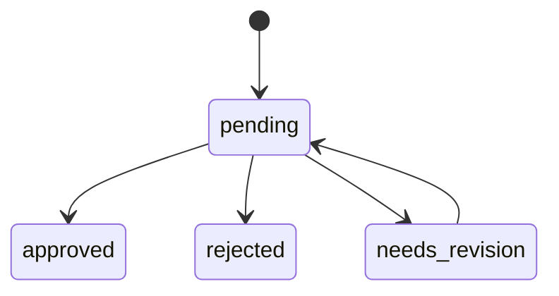

# Benchmark Review Guide

Human review instructions for NRC benchmark query datasets produced by the generation pipeline.

## 1. Overview

### Purpose

This guide defines the quality gate that benchmark queries must pass before they enter an evaluation dataset. The pipeline generates queries automatically; human review exists to catch failure modes that automated validation cannot detect — semantic duplicates, unrealistic phrasing, misclassified answerability, and evidence sets that are too loose to produce meaningful retrieval signal.

A query that passes review is asserting two things: (1) the question is one a real user might ask, and (2) the expected answer and evidence set are correct and tightly scoped.

### Audience

Dataset editors working with JSONL output from a completed pipeline run. No specialized tooling is required for v1. Reviewers edit records in-place in the JSONL file produced by the pipeline.

### Review State Machine

Each query carries a `metadata.review_status` field governed by the following transitions:



- `pending` — initial state set by the pipeline; awaiting reviewer action
- `approved` — query meets all criteria for its class; eligible for eval dataset inclusion
- `rejected` — query cannot be repaired; excluded from the dataset
- `needs_revision` — query has fixable problems; returned to the generator or edited by the reviewer, then re-enters `pending`

> A query set to `needs_revision` must be re-reviewed after the revision is applied. Do not skip back to `approved` without a second pass.

### Scope

v1 review covers two query classes: `citation_lookup` and `unanswerable`. Other classes defined in `QueryClass` (`narrow_factual`, `rule_explanation`, `cross_reference`, `scenario_application`, `robustness_variant`) are not generated at v1 scale and are out of scope for this guide.

---

## 2. Review Criteria — Citation Lookup

`query_class: "citation_lookup"` queries ask about a specific regulatory provision. They are the most common class in v1 and have the strictest structural requirements.

### Citation Specificity

The query text must reference a specific CFR citation at the paragraph or subparagraph level. A citation to a full section (e.g., "10 CFR 50.46") is acceptable only if the question itself is scoped to a single fact within that section. Broad section-level references paired with open-ended questions are a rejection signal.

Check that:

- The citation in `source_citations` is correctly formatted as `10 CFR <part>.<section>(<paragraph>)`. The `10 CFR` prefix is required. A bare `CFR 50.46` or `§ 50.46` is malformed.
- The citation in `source_citations` matches what appears in the query text (if the query mentions a citation explicitly).
- The `critical_evidence` spans map to the cited paragraph, not a different section.

### Answerability from Evidence

The question must be answerable using only the spans listed in `critical_evidence`. Check:

- Read each span referenced in `critical_evidence`. Verify the answer to the question is present in that text.
- If you cannot derive the answer from the listed spans without consulting additional context, the evidence set is incomplete. Set to `needs_revision`.
- `supporting_evidence` and `contextual_evidence` should not be necessary to answer the question. If they are, the wrong spans were classified as critical.

### Evidence Tightness

The v1 target is a median of two or fewer critical spans per query. Queries with three or more critical spans are not automatically rejected, but require justification — the extra spans must each contribute a non-redundant fact required to answer the question.

Check: is each span in `critical_evidence` load-bearing? If removing any single span leaves the question still fully answerable from the remaining spans, that span does not belong in `critical_evidence`.

### Phrasing — No Broad Enumeration

Reject queries that ask the system to enumerate all requirements, list every condition, or summarize an entire section. These are unsuitable for single-answer evaluation.

Indicators of broad phrasing:

- "What are all the requirements..."
- "List every..."
- "Summarize the provisions of..."
- "What does 10 CFR 50.46 say about..." (without a specific sub-question)

A scoped question asks for one fact: a threshold value, a deadline, a named condition, a defined term.

### Difficulty Label

The `difficulty` field must reflect actual retrieval and reasoning complexity, not the length of the answer.

| Label | Expected characteristics |
|-------|-------------------------|
| `easy` | Single span, unambiguous answer, citation stated in query |
| `medium` | Answer requires reading two spans or light inference |
| `hard` | Answer requires synthesis across spans or resolving a cross-reference |

A query labelled `easy` where answering it requires locating two non-adjacent spans, or `hard` where the answer is a single numeric threshold stated in one sentence, is a difficulty mislabel. Set to `needs_revision` and correct the field.

### Semantic Duplicates

Before approving, scan the other queries in the same JSONL file for semantic equivalence. Two queries are duplicates if a correct answer to one is necessarily a correct answer to the other, regardless of surface-level phrasing differences.

Duplicates within a run indicate the generator sampled the same regulatory unit multiple times or the de-duplication step was bypassed. Reject all but one, noting the surviving `qid` in the `metadata` field (see Section 5).

---

## 3. Review Criteria — Unanswerable

`query_class: "unanswerable"` queries are questions a user might plausibly ask that cannot be answered from the NRC corpus. They test whether the system correctly abstains rather than hallucinating an answer.

### Genuine Unanswerability

The question must be genuinely unanswerable from the corpus. This is the most common failure mode for this class: the generator marks a query unanswerable, but a correct answer exists in the corpus.

To verify:

1. Read the `unanswerable_reason` field.
2. Search the corpus for the cited regulation or topic. If you can find a passage that answers the question, the record is misclassified. Reject or revise.
3. Pay particular attention to `near_miss` strategy queries — these are designed to be close to answerable, which means borderline cases are common.

### Unanswerable Reason Accuracy

The `unanswerable_reason` field must accurately describe why the question cannot be answered. It is used downstream in scoring rubrics.

Acceptable reasons:

- The regulation referenced does not exist in the corpus (fabricated citation).
- The corpus contains a related provision but does not address this specific sub-question (near miss).
- The question asks about agency guidance or policy that falls outside the eCFR corpus (domain boundary).

Reject or revise if `unanswerable_reason` is vague ("not in corpus"), incorrect, or inconsistent with the strategy field.

### Strategy Plausibility

The `unanswerable_reason` should be consistent with the generation strategy:

| Strategy | Expected pattern |
|----------|-----------------|
| `near_miss` | A real provision exists nearby; this specific sub-question is not covered |
| `domain_boundary` | The question asks about NRC guidance, case law, or licensee procedure — outside 10 CFR |
| `fabricated_citation` | The cited CFR paragraph does not exist |

A query whose strategy is `fabricated_citation` but whose `unanswerable_reason` says "the rule changed in 2024" is inconsistent. Set to `needs_revision`.

### Realism

The query must sound like something a real user would ask. Reviewers should apply the test: "Would an NRC licensee engineer or compliance analyst type this into the RAG system?"

Reject if:

- The query is phrased in a way that signals it was constructed to be unanswerable (e.g., "Is there a rule in 10 CFR 50.9999 about...").
- The query copies regulatory text verbatim (see Section 4, example 5).
- The query is so narrowly constructed that no real user would formulate it this way.

### Evidence Span IDs

For `unanswerable` queries, `evidence_span_ids` (and by extension `critical_evidence`) must be empty. An unanswerable query with populated evidence spans is a pipeline bug. Reject and file a defect.

---

## 4. Common Rejection Reasons

### Example 1 — Malformed Citation

**Query text:** "What peak cladding temperature limit does CFR 50.46 establish for ECCS acceptance criteria?"

**Rejection reason:** The citation is missing the `10` prefix. `CFR 50.46` is not a valid citation format for this dataset. All citations must be prefixed `10 CFR`.

**Corrected version:** "What peak cladding temperature limit does 10 CFR 50.46 establish for ECCS acceptance criteria?"

Also verify the `source_citations` array uses the same corrected format. Both the query text and `source_citations` must agree.

---

### Example 2 — Too Broad

**Query text:** "What are all the requirements in 10 CFR 50.46?"

**Rejection reason:** The question asks for a full enumeration of a section. 10 CFR 50.46 contains multiple subsections covering different acceptance criteria. This question cannot be evaluated against a single answer or evidence span — it would require the system to produce an exhaustive list, which is outside the scope of `citation_lookup` scoring.

**Corrected version:** Scope the question to one fact from one subsection, for example: "What is the maximum peak cladding temperature permitted under the ECCS acceptance criteria in 10 CFR 50.46(b)(1)?"

---

### Example 3 — Semantic Duplicate

**Query A (qid: reg_fact_000041):** "What is the maximum allowable peak cladding temperature under 10 CFR 50.46(b)(1)?"

**Query B (qid: reg_fact_000078):** "Under 10 CFR 50.46(b)(1), what temperature limit applies to peak cladding during a LOCA?"

**Rejection reason:** Both queries ask for the same numeric threshold from the same paragraph. A correct answer to A (2200°F) is a correct answer to B. These are semantic duplicates regardless of different surface wording. Reject one; retain the better-phrased query. Note the surviving `qid` in the rejected record's `metadata`.

**Resolution:** Reject `reg_fact_000078`. In its metadata, add a note: `"rejection_note": "semantic duplicate of reg_fact_000041"`.

---

### Example 4 — Misclassified Unanswerable

**Query text:** "Does 10 CFR 50.55a require licensees to use ASME Code Section XI for inservice inspection?"

**`is_unanswerable`: true**

**`unanswerable_reason`:** "The corpus does not contain requirements for ASME code compliance."

**Rejection reason:** 10 CFR 50.55a does reference ASME Boiler and Pressure Vessel Code requirements. The `unanswerable_reason` is factually incorrect for the eCFR corpus. This query is answerable; its classification is wrong.

**Resolution:** Either reclassify as `citation_lookup` with the correct evidence spans populated, or reject and flag the pipeline's answerability classifier for this provision.

---

### Example 5 — Leaking Statutory Language

**Query text:** "The calculated changes in core reactivity values, coolant pressures, coolant flow rates, reactor vessel water level, and fuel and clad temperatures shall be compared to the applicable limits — what regulation states this?"

**Rejection reason:** The query body is copied verbatim from the regulation text (10 CFR 50.46 or similar). This is statutory language, not a user question. A real user would not search by pasting regulatory text. Queries like this inflate retrieval scores because the query and the evidence share exact lexical overlap, which does not reflect real-world retrieval difficulty.

**Corrected version:** Restate as a genuine question: "What parameters must be compared against applicable limits in the ECCS evaluation analysis under 10 CFR 50.46?" This removes verbatim overlap while preserving the interrogative intent.

---

## 5. JSONL Review Workflow

### Locating the File

The review target is the final stage output from the pipeline run directory:

```
benchmark_runs/<run_id>/stage_5a_validated.jsonl
```

Each line is a single JSON object. One object per query.

### Fields to Update

Set the following three fields inside the `metadata` object for every record you review:

| Field | Type | Values |
|-------|------|--------|
| `metadata.review_status` | string | `"approved"`, `"rejected"`, `"needs_revision"` |
| `metadata.reviewed_by` | string | Your reviewer identifier (e.g., `"jsmith"`) |
| `metadata.reviewed_at` | string | ISO 8601 datetime in UTC, e.g., `"2026-03-24T14:30:00Z"` |

Do not modify any other top-level fields during the review pass. If you identify a field that needs correction (e.g., a malformed citation in `source_citations`), set `review_status` to `needs_revision` and note the required correction in an added `metadata.revision_notes` string field. The correction itself is applied separately before re-review.

### Before/After Example

**Before review** (as produced by the pipeline):

```json
{
  "schema_version": "1.0",
  "qid": "reg_fact_000123",
  "query": "What is the maximum peak cladding temperature allowed by the ECCS acceptance criteria?",
  "query_class": "citation_lookup",
  "difficulty": "easy",
  "source_citations": ["10 CFR 50.46(b)(1)"],
  "critical_evidence": [
    {
      "span_id": "span_abc",
      "citation": "10 CFR 50.46(b)(1)",
      "char_start": 1204,
      "char_end": 1292,
      "chunk_ids": ["chunk_17", "chunk_18"]
    }
  ],
  "is_unanswerable": false,
  "unanswerable_reason": null,
  "metadata": {
    "generator_version": "qgen_v1",
    "validator_version": "qval_v1",
    "review_status": "pending",
    "reviewed_by": null,
    "reviewed_at": null
  }
}
```

**After approval:**

```json
{
  "schema_version": "1.0",
  "qid": "reg_fact_000123",
  "query": "What is the maximum peak cladding temperature allowed by the ECCS acceptance criteria?",
  "query_class": "citation_lookup",
  "difficulty": "easy",
  "source_citations": ["10 CFR 50.46(b)(1)"],
  "critical_evidence": [
    {
      "span_id": "span_abc",
      "citation": "10 CFR 50.46(b)(1)",
      "char_start": 1204,
      "char_end": 1292,
      "chunk_ids": ["chunk_17", "chunk_18"]
    }
  ],
  "is_unanswerable": false,
  "unanswerable_reason": null,
  "metadata": {
    "generator_version": "qgen_v1",
    "validator_version": "qval_v1",
    "review_status": "approved",
    "reviewed_by": "jsmith",
    "reviewed_at": "2026-03-24T14:30:00Z"
  }
}
```

**After rejection with note:**

```json
{
  "metadata": {
    "generator_version": "qgen_v1",
    "validator_version": "qval_v1",
    "review_status": "rejected",
    "reviewed_by": "jsmith",
    "reviewed_at": "2026-03-24T14:32:00Z",
    "rejection_note": "semantic duplicate of reg_fact_000041"
  }
}
```

### Counting Review Progress

```bash
# Count records by review_status
./scripts/py -c "
import json, sys
from collections import Counter
counts = Counter()
for line in open(sys.argv[1]):
    rec = json.loads(line)
    counts[rec['metadata']['review_status']] += 1
for status, n in sorted(counts.items()):
    print(f'{status}: {n}')
" benchmark_runs/<run_id>/stage_5a_validated.jsonl
```

### Workflow Sequence

The recommended order for a review pass:

1. Run the count command above to confirm all records start as `pending`.
2. Work through records sequentially. Do not skip records; an un-reviewed record retains `pending` status and will be ambiguous in downstream counts.
3. For `needs_revision` records, open a separate tracking note with the `qid` and the required correction. Do not leave `needs_revision` records untracked.
4. After completing the pass, run the count command again to verify no `pending` records remain.
5. Hand off `needs_revision` records to the generator operator with the correction notes. After re-generation, the corrected records re-enter `pending` and require a second reviewer pass.

---

## 6. Answer-Core Promotion Criteria (Preview for M5)

This section previews the additional gate that `approved` queries must pass before being promoted to the answer-core dataset used in scored evaluation. Answer-core promotion is not part of the v1 review pass; it is planned for M5.

A query approved in the review pass is eligible for promotion, but promotion requires three additional checks:

**Evidence sufficiency check.** The `critical_evidence` spans, when retrieved by the production retriever, must appear in the top-k results. A query whose evidence spans are not retrievable cannot be scored fairly. This check is run programmatically against the current index.

**Gold answer quality.** The `gold_answer`, `acceptable_answer_variants`, `required_points`, and `forbidden_errors` fields must be complete and internally consistent. A spot audit by a second reviewer is required for this check. Rubric quality failures at this stage are treated as `needs_revision` on the gold answer fields, not on the query itself.

**Contamination probe clean.** The `contamination_probes` field must show a `false` result for each tested model, indicating the model does not have the answer in its parametric memory independent of retrieval. Queries with `true` contamination probe results are excluded from answer-core because they cannot distinguish retrieval capability from memorization.

Queries that pass all three checks are written to the answer-core dataset file. Queries that fail one check remain in the approved pool but are not scored in eval runs until the failure is resolved.
