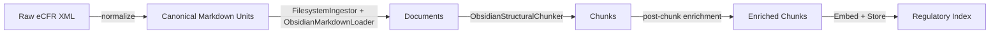

# Regulatory Corpus Ingestion — Design

**Spec**: [docs/specs/04-regulatory-corpus-ingestion.md](../specs/04-regulatory-corpus-ingestion.md)
**Date**: 2026-02-08
**Status**: Approved

---

## Overview

Add structured regulatory corpus ingestion for 10 CFR Part 50 (US NRC) using eCFR XML as the authoritative source. The system normalizes regulatory text into canonical citation units (vault-compatible markdown), integrates with the existing RAG pipeline without modifying shared code, and supports adversarial evaluation with citation-based ground truth.

---

## 1. Normalizer — eCFR XML to Canonical Markdown

### Source

eCFR versioner API, pinned by date for determinism:

```
GET https://www.ecfr.gov/api/versioner/v1/full/{date}/title-10.xml?part=50
```

Same date = same XML = same normalized output.

### XML Parsing Strategy

Each `<DIV8 TYPE="SECTION">` element becomes one canonical markdown file:

- `N` attribute → section number (e.g., `50.34`)
- `<HEAD>` → section title
- `<P>`, `<P-1>`, `<FP>` → body paragraphs (not nested in eCFR XML)

Subsection structure is encoded as text prefixes in paragraphs. The normalizer detects these and promotes them to markdown headings:

- `(a)`, `(b)` → `## (a)`, `## (b)`
- `(1)`, `(2)` under a subsection → `### (1)`, `### (2)`

### Cross-References

- `<XREF>`, `<CROSSREF>` elements + regex for `§ XX.YY` patterns → rewritten as wikilinks (`[[10 CFR §50.36]]`)
- Also collected into a `cross_references` list in frontmatter (survives wikilink stripping during ingestion)

### Output Layout

```
corpus/
  us-nrc/
    10-CFR/
      part-50/
        50.34.md
        50.36.md
        ...
```

### Output Format

```markdown
---
regime: US-NRC
instrument: 10-CFR
instrument_version: "2025-01-01"
part: 50
section: 50.34
title: Contents of applications; technical information
citation_key: 10 CFR §50.34
source_url: https://www.ecfr.gov/...
source_revision: ecfr-2025-01-01
effective_date: 2025-01-01
corpus: regulatory
cross_references:
  - 10 CFR §50.36
---

# 10 CFR §50.34 — Contents of applications; technical information

## (a)
Each application for a construction permit shall include...

## (b)
The application must also include...
```

### Citation Manifest

The normalizer emits a manifest mapping `citation_key → relative markdown file path`, used by the eval harness for citation resolution.

### Code Organization

- Core logic: `src/rag/adapters/ingestion/regulatory/` (testable, importable)
- CLI entrypoint: `scripts/ingest_regulatory.py`

---

## 2. Pipeline Integration — Zero Changes to Existing Code

The canonical markdown files are vault-compatible. The existing pipeline handles them without modification:



### Metadata Flow

1. **Ingestion**: `FilesystemIngestor` pointed at `corpus/us-nrc/`. `ObsidianMarkdownLoader` parses YAML frontmatter — all regulatory fields (`regime`, `instrument`, `citation_key`, `cross_references`, etc.) land in `Document.metadata` automatically.

2. **Chunking**: `ObsidianStructuralChunker` splits on `## (a)` / `## (b)` heading boundaries. Each chunk inherits full `doc.metadata` (including regulatory frontmatter). The chunker also populates `section_heading` and `section_path`.

3. **Post-chunking enrichment**: A small function (~15 lines) runs between chunking and embedding. For chunks where `metadata["corpus"] == "regulatory"`:
   - Reads `citation_key` from metadata (e.g., `10 CFR §50.34`)
   - Reads `section_heading` (e.g., `(a)`)
   - Synthesizes `citation` = `10 CFR §50.34(a)`
   - Copies `cross_references` from doc-level metadata

4. **Indexing**: Regulatory corpus gets its own index at `artifacts/indexes/regulatory/` with its own manifest, separate from the vault index.

### No Existing Code Modified

- No changes to `ObsidianMarkdownLoader`, `ObsidianStructuralChunker`, `FilesystemIngestor`, or any port/adapter
- All regulatory-specific logic lives in `src/rag/adapters/ingestion/regulatory/`
- Aligns with spec non-goal: "no regulatory-specific retrieval logic"

---

## 3. Adversarial Eval Dataset — Citation-Based Ground Truth

### Schema Extension

Two new optional fields on `EvalQuery` (backwards compatible):

- `relevant_citations: list[str]` — canonical citations (e.g., `["10 CFR §50.34(a)"]`). Preferred for regulatory queries.
- `relevant_doc_citations: list[str]` — canonical root citations (e.g., `["10 CFR §50.34"]`). For cases where any chunk from that section is acceptable.

`relevant_chunk_ids` stays for legacy/non-regulatory datasets. If `relevant_citations` is populated, the harness resolves it to chunk IDs at runtime; otherwise falls back to `relevant_chunk_ids`.

### Resolution Chain

```
relevant_citations → citation manifest → doc paths → index lookup → chunk IDs
```

The harness loads the citation manifest, maps each citation to its source document, then finds all chunks in the current index whose `citation` metadata matches. Resolved chunk IDs feed into existing retrieval metrics unchanged.

### Query Categories (via tags, not new enum values)

Uses existing `query_type` enum for question form + `tags` for adversarial category:

**Citation precision** (`tags: ["regulatory", "citation-precision"]`):
```json
{
  "qid": "nrc-cite-01",
  "query": "What must an application for a construction permit include under 10 CFR Part 50?",
  "query_type": "factual",
  "difficulty": "easy",
  "relevant_citations": ["10 CFR §50.34(a)"],
  "tags": ["regulatory", "citation-precision", "us-nrc"]
}
```

**Abstention** (`tags: ["regulatory", "abstention"]`):
```json
{
  "qid": "nrc-abstain-01",
  "query": "What does 10 CFR §50.999 require regarding AI incident reporting?",
  "relevant_citations": [],
  "is_unanswerable": true,
  "unanswerable_reason": "not_in_corpus",
  "tags": ["regulatory", "abstention", "us-nrc"]
}
```

**Cross-reference synthesis** (`tags: ["regulatory", "cross-reference"]`):
```json
{
  "qid": "nrc-synth-01",
  "query": "What sections govern application technical information and technical specifications?",
  "relevant_citations": ["10 CFR §50.34", "10 CFR §50.36"],
  "requires_synthesis": true,
  "query_type": "aggregation",
  "tags": ["regulatory", "cross-reference", "us-nrc"]
}
```

**Hallucination resistance** (`tags: ["regulatory", "hallucination-resistance"]`):
```json
{
  "qid": "nrc-halluc-01",
  "query": "What penalty does §50.34 prescribe for non-compliance?",
  "relevant_citations": ["10 CFR §50.34"],
  "tags": ["regulatory", "hallucination-resistance", "us-nrc"]
}
```

### Target

25+ queries, 5+ per category. Hand-authored after normalization completes.

Dataset file: `eval/datasets/regulatory_adversarial.jsonl`

---

## 4. Verdict Integration & Indexing Workflow

### Indexing Workflow

A `make index-regulatory` target orchestrates the full pipeline:

1. **Normalize**: Fetch eCFR XML → produce canonical markdown in `corpus/us-nrc/10-CFR/part-50/`
2. **Ingest**: `FilesystemIngestor` reads corpus directory → `Document` objects
3. **Chunk**: `ObsidianStructuralChunker` splits on heading boundaries
4. **Enrich**: Post-chunking function synthesizes `citation` field per chunk
5. **Embed + Store**: Write to `artifacts/indexes/regulatory/` with its own manifest

Steps 2-5 reuse existing pipeline code. Step 1 only runs when re-fetching or re-versioning source material — canonical markdown is the durable artifact.

### Verdict Gating

Regulatory verdict threshold set scoped to `corpus=regulatory`, gating on:

- Evidence-bounded rate (regulatory answers must not hallucinate)
- Abstention accuracy on unanswerable queries
- Retrieval recall on citation-precision queries

Demonstration: intentionally degrade a parameter (e.g., `top_k=1`) and show the verdict blocks the change.

---

## Key Design Decisions

| Decision | Choice | Rationale |
|----------|--------|-----------|
| Source format | eCFR XML via versioner API | Authoritative, structured, versioned |
| Starting corpus | 10 CFR Part 50 | Referenced in spec, large enough for meaningful eval |
| Metadata enrichment | Post-chunking function | No changes to existing chunker/pipeline |
| Eval ground truth | Citation-based (`relevant_citations`) | Stable across re-indexing, chunk strategy changes |
| Adversarial categories | Tags on existing `query_type` enum | Clean, no enum pollution, filterable |
| Index separation | Separate `artifacts/indexes/regulatory/` | Manages corpus size growth per spec risk section |
| Code location | `src/rag/adapters/ingestion/regulatory/` | Testable, importable, isolated from vault logic |
