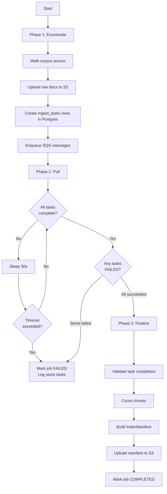

# Phase 4: ECS/Fargate Deployment — Design

**Date**: 2026-02-13
**Phase**: 4 of distributed-architecture-plan.md
**Status**: Design approved, pending implementation

---

## Overview

Extend the existing ECS/Fargate scaffolding with two new run-to-completion task
definitions (ingest-orchestrator, query-eval), launcher scripts for triggering
them, and S3 layout for eval data and index manifests.

### What already exists

- **Ingest worker** ECS service + task definition (long-running, polls SQS)
- **Qdrant** ECS service + task definition (Cloud Map discovery)
- **RAG App** ECS service + task definition
- **RDS Postgres** with ingest_jobs, ingest_tasks, document_records, chunk_index tables
- **SQS** main queue + dead letter queue
- **S3 bucket** with corpus/ and chunks-regulatory/ prefixes
- **Worker code**: enumerator, worker, worker_loop, finalize_job
- **IAM roles** with S3, SQS, SSM permissions

### What this phase adds

- `ingest-orchestrator` ECS task definition
- `query-eval` ECS task definition
- 3 new Python scripts (orchestrator, remote eval, remote query)
- 3 launcher shell scripts (with auto-scaling)
- 4 Make targets
- S3 prefix conventions for eval data and manifests

---

## ECS Task Definitions

### `ingest-orchestrator` (run-to-completion)

Combines the enumerate → poll-for-completion → finalize lifecycle into a single
ECS task. Launched via `aws ecs run-task`, not a persistent service.

| Property | Value |
|---|---|
| Command | `["python", "scripts/run_orchestrator.py"]` |
| CPU / Memory | 256 / 512 (configurable) |
| Log group | `/${project_name}/ingest-orchestrator` |
| IAM task role | Same as ingest-worker (S3 rw, SQS send, RDS rw, SSM read) |

**Environment variables** (superset of worker env vars):
- `QDRANT_URL`, `QDRANT_BACKEND`
- `DISTRIBUTED_INGESTION_ENABLED=true`
- `SQS_QUEUE_URL`
- `CORPUS_S3_BUCKET`, `CORPUS_S3_PREFIX`
- `CHUNK_S3_BUCKET`, `CHUNK_S3_PREFIX`
- `MANIFESTS_S3_PREFIX`
- Secrets: `OPENAI_API_KEY`, `RDS_DSN` (from SSM)

**Lifecycle**:



### `query-eval` (run-to-completion)

Supports two modes via command override: eval harness or ad-hoc query.

| Property | Value |
|---|---|
| Default command | `["python", "scripts/run_remote_eval.py"]` |
| Query override | `["python", "scripts/run_remote_query.py"]` |
| CPU / Memory | 256 / 512 (configurable) |
| Log group | `/${project_name}/query-eval` |
| IAM task role | S3 read (chunks + eval queries), S3 write (eval results), Qdrant read, RDS read, SSM read |

**Environment variables**:
- `QDRANT_URL`, `QDRANT_BACKEND`
- `CORPUS_S3_BUCKET`
- `CHUNK_S3_PREFIX`
- `EVAL_S3_PREFIX`
- `MANIFESTS_S3_PREFIX`
- Secrets: `OPENAI_API_KEY`, `RDS_DSN` (from SSM)

---

## New Python Scripts

### `scripts/run_orchestrator.py`

Single script managing the full ingest lifecycle:

1. **Enumerate**: Reuses logic from `scripts/start_ingestion.py` — walks corpus,
   uploads raw docs to S3, creates ingest_tasks, enqueues SQS messages
2. **Poll**: Queries Postgres `ingest_tasks` table every 30s. Logs progress
   (e.g., `"47/120 tasks complete"`). Configurable timeout (default: 2 hours)
3. **Finalize**: Reuses logic from `scripts/finalize_job.py` — validates tasks,
   counts chunks, builds IndexManifest, uploads to S3, marks job COMPLETED
4. **Failure handling**: If tasks are stuck in FAILED past max retries, marks job
   FAILED and logs which documents failed

### `scripts/run_remote_eval.py`

Eval harness runner for remote backends:

1. Download eval query set from S3 (`s3://bucket/eval/queries/{query_set}/`)
   to a temp directory
2. Build a `Container` wired to remote backends via env vars (Qdrant, S3 chunk
   store)
3. Run the existing eval harness (`src/rag/eval/harness.py`)
4. Upload results to S3 (`s3://bucket/eval/runs/{run_id}/`)
5. Print summary to stdout (visible in CloudWatch logs)

### `scripts/run_remote_query.py`

Ad-hoc query runner:

1. Accept query string via `--query` CLI arg or `QUERY` env var
2. Build a `Container` wired to remote backends
3. Run the query pipeline (retrieve → rerank → context → generate)
4. Print the answer to stdout (CloudWatch-visible)

---

## ECS Launcher Scripts

Shell scripts wrapping `aws ecs run-task` with convenience features.

### `scripts/ecs_run_ingest.sh`

Full ingest lifecycle with auto-scaling:

1. Scale `ingest-worker` service to desired count (default 3, override with `--workers N`)
2. Launch `ingest-orchestrator` task via `aws ecs run-task`
3. Stream CloudWatch logs to terminal
4. When orchestrator task exits, scale workers back to 0

### `scripts/ecs_run_eval.sh`

1. Launch `query-eval` task via `aws ecs run-task`
2. Accept optional overrides: `--query-set`, `--run-label`
3. Stream CloudWatch logs

### `scripts/ecs_run_query.sh`

1. Launch `query-eval` task with command override to `run_remote_query.py`
2. Accept query string as argument
3. Tail CloudWatch logs to display the answer

---

## Make Targets

| Target | Script | Description |
|---|---|---|
| `make ingest-remote WORKERS=5` | `ecs_run_ingest.sh` | Auto-scale workers, run orchestrator, scale down |
| `make eval-remote` | `ecs_run_eval.sh` | Run eval harness on ECS |
| `make query-remote QUERY="..."` | `ecs_run_query.sh` | Ad-hoc query on ECS |
| `make upload-eval-queries` | `aws s3 sync` | Sync local eval/ to S3 eval/queries/ |

---

## S3 Layout

Extending the existing `obsidian-rag-corpus` bucket:

```
s3://obsidian-rag-corpus/
  corpus/                  # existing — raw docs
  chunks-regulatory/       # existing — chunk blobs

  eval/
    queries/               # golden dataset (synced from local eval/ dir)
      default/             # named query sets
        queries.json
    runs/
      {run_id}/            # e.g., "2026-02-13T14-30-00_regulatory_v1"
        metrics.json
        results.jsonl
        traces.jsonl
        config.json        # snapshot of settings used

  manifests/
    {index_id}/
      manifest.json
      build_meta.json
```

- `eval/queries/` mirrors local `eval/` structure
- `eval/runs/` mirrors local `eval/runs/` — same filenames for future
  Streamlit compatibility
- `manifests/` stores immutable, versioned index build records

---

## Terraform Changes

### `modules/ecs/main.tf`

Two new `aws_ecs_task_definition` resources:

- `ingest_orchestrator` — task definition only, no service
- `query_eval` — task definition only, no service

Both reuse the existing ECR image. Each gets its own CloudWatch log group
(30-day retention).

### `modules/ecs/variables.tf`

New variables:
- `orchestrator_cpu` (default: 256)
- `orchestrator_memory` (default: 512)
- `query_eval_cpu` (default: 256)
- `query_eval_memory` (default: 512)
- `eval_s3_prefix` (default: `"eval"`)
- `manifests_s3_prefix` (default: `"manifests"`)

### `modules/ecs/outputs.tf`

New outputs:
- `orchestrator_task_definition_arn`
- `query_eval_task_definition_arn`

### Root `outputs.tf`

Pass through the new task definition ARNs (needed by launcher scripts).

### No changes needed to

S3 module (prefixes are key paths, not resources), SQS module, RDS module,
Secrets module.

---

## Artifact Summary

| Artifact | Type | Purpose |
|---|---|---|
| `ingest-orchestrator` task def | Terraform | Enumerate → poll → finalize |
| `query-eval` task def | Terraform | Eval harness or ad-hoc query |
| `scripts/run_orchestrator.py` | Python | Orchestrator lifecycle script |
| `scripts/run_remote_eval.py` | Python | Remote eval runner |
| `scripts/run_remote_query.py` | Python | Ad-hoc query runner |
| `scripts/ecs_run_ingest.sh` | Shell | Launch orchestrator + auto-scale workers |
| `scripts/ecs_run_eval.sh` | Shell | Launch eval task |
| `scripts/ecs_run_query.sh` | Shell | Launch query task |
| Make targets | Makefile | `ingest-remote`, `eval-remote`, `query-remote`, `upload-eval-queries` |
| S3 prefixes | Convention | `eval/queries/`, `eval/runs/`, `manifests/` |
