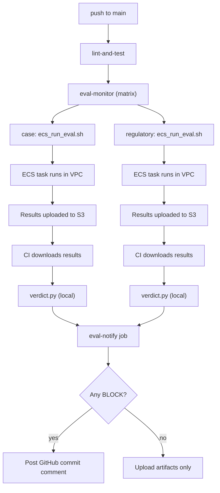

# CI Eval Monitor Redesign

**Date:** 2026-02-24
**Status:** Implemented

## Problem

The current `eval-gate` job in `.github/workflows/ci.yml` is broken:

1. References `eval/datasets/curated_queries.jsonl`, which no longer exists.
2. Runs against a local JSONL index (`artifacts/indexes/obsidian`), but the project now uses Qdrant with S3-backed distributed ingestion.
3. Compares against a stale `eval/runs/baseline/` directory.
4. Gates PRs via `--fail-on-block`, which is overly aggressive for a system whose corpora are still maturing.

The underlying eval infrastructure (harness, verdict computation, threshold system) is sound. The CI orchestration needs to be redesigned to match the current project state.

## Design

### Trigger

- **`push` to `main`** — post-merge monitoring, not PR gating.
- **`workflow_dispatch`** — manual runs for ad-hoc evaluation.

### Architecture: ECS-delegated eval

Qdrant runs inside the VPC with no public endpoint. Rather than exposing it, CI delegates evaluation to the existing `query-eval` ECS task definition, which runs in-VPC with full access to Qdrant and S3.



### Matrix configuration

```yaml
strategy:
  fail-fast: false
  matrix:
    dataset:
      - { name: "case", query_set: "case", scope: "case" }
      - { name: "regulatory", query_set: "regulatory", scope: "regulatory" }
```

Adding a new dataset requires: a new S3 query-set directory, a new matrix entry, and an optional `[eval.verdict.<scope>]` section in `settings.toml`.

### Per-job steps

1. Checkout + configure AWS credentials + setup Python 3.11.
2. Install: `pip install -e ".[dev,aws]"` (only needs aws + verdict deps, not openai/qdrant).
3. Trigger ECS eval task via `scripts/ecs_run_eval.sh`:
   ```
   scripts/ecs_run_eval.sh \
     --query-set ${{ matrix.dataset.query_set }} \
     --run-name "ci-${{ github.sha }}-${{ matrix.dataset.name }}" \
     --run-generation --use-llm-judge
   ```
4. Download results from S3:
   ```
   aws s3 cp s3://{bucket}/eval/runs/{run-name}/ eval/runs/ci-current/ --recursive
   ```
5. Run verdict locally (no Qdrant needed):
   ```
   python eval/scripts/verdict.py \
     --current eval/runs/ci-current/ \
     --output eval/verdicts \
     --scope ${{ matrix.dataset.scope }}
   ```
6. Upload `eval/verdicts/` as artifact `eval-verdict-${{ matrix.dataset.name }}`.

### ECS task polling fix

The `scripts/ecs_run_eval.sh` launcher had a bug: `aws ecs wait tasks-stopped` has a hard-coded 10 minute timeout. When eval takes longer, the script silently proceeds and reports `None` as the exit code. Fixed by replacing `aws ecs wait` with an explicit poll loop (configurable via `EVAL_TIMEOUT`, default 30 min).

### Notification

A `notify` job runs after all matrix jobs complete (`if: always()`):

1. Downloads verdict artifacts from each matrix job.
2. Parses each `verdict.json` for `decision: "block"`.
3. If any BLOCK: posts a commit comment via `gh api repos/{owner}/{repo}/commits/{sha}/comments`.
4. If all PASS: artifacts are available in the workflow run page — no comment posted.

### Per-dataset thresholds

The verdict system already supports scoped thresholds via `--scope`. New sections in `settings.toml`:

```toml
[eval.verdict.case]
min_recall_at_10 = 0.50
min_mrr = 0.30
# ... tuned for case corpus

[eval.verdict.regulatory]
min_recall_at_10 = 0.60
min_mrr = 0.40
# ... tuned for regulatory corpus
```

The existing `[eval.verdict]` section remains as the global fallback.

### Baseline comparison

Removed for now. The verdict checks absolute thresholds only.

## Changes required

### Modified files

| File | Change |
|------|--------|
| `.github/workflows/ci.yml` | Replace `eval-gate` with `eval-monitor` (ECS-delegated matrix) + `eval-notify` |
| `settings.toml` | Add `[eval.verdict.case]` and `[eval.verdict.regulatory]` sections |
| `scripts/ecs_run_eval.sh` | Fix polling: replace `aws ecs wait` with explicit poll loop + proper exit code handling |

### No changes needed

| File | Reason |
|------|--------|
| `scripts/run_remote_eval.py` | ECS task entry point, works as-is |
| `eval/scripts/verdict.py` | Already supports `--scope` and optional baseline |
| `src/rag/eval/verdict_thresholds.py` | Already supports scoped thresholds |

### Removed

- Reference to non-existent `curated_queries.jsonl`
- `--fail-on-block` in CI (verdict is informational)
- `--baseline eval/runs/baseline/` in CI (no regression detection)
- Direct Qdrant connection from CI (delegated to ECS)

## Prerequisites

- **S3 query sets:** Split `eval/queries/default/` into `eval/queries/case/` and `eval/queries/regulatory/` (one JSONL per directory).
- **GitHub secrets:** `AWS_ACCESS_KEY_ID` and `AWS_SECRET_ACCESS_KEY` must already be configured (used by `docker.yml`).

## Risks and follow-ups

- **ECS task availability:** If the ECS cluster or Qdrant service is down, the eval task will fail. CI will report the failure via the notify job.
- **Cost:** Each push to main incurs ECS Fargate compute + OpenAI API costs. Consider limiting concurrency or adding a path filter to only trigger on relevant changes.
- **Threshold tuning:** Per-dataset thresholds need initial calibration. Run eval manually per dataset and set thresholds ~10% below observed metrics.
- **Future:** Re-introduce rolling baseline comparison when eval stability improves.
