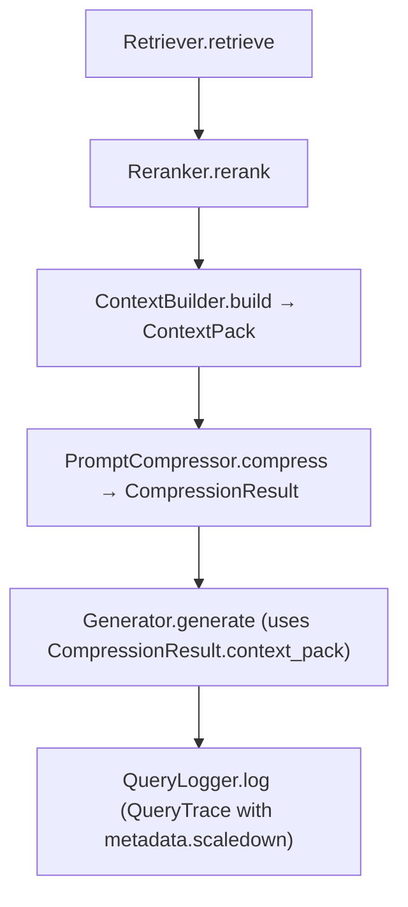

# ScaleDown Context Compression — Design

**Date:** 2026-03-04
**Status:** Approved for implementation
**Spec:** `docs/specs/scaledown-context-compress.md`

---

## Problem

LLM generation cost and latency scale with input token count. The `rendered_context` string
produced by `ContextBuilder` can be large relative to the final answer required. ScaleDown
is a third-party API that compresses prompt context before it reaches the LLM, reducing
token usage while preserving the information needed to answer the query.

---

## Approach

Insert an optional **compression stage** between `ContextBuilder` and `Generator` in the
`run_query` pipeline. The stage is backed by a new `PromptCompressor` port and satisfies
the hexagonal boundary: the orchestration layer sees only the protocol, never the HTTP
adapter.

---

## Pipeline Change



When compression is disabled, `Container.compressor` is a `NoOpCompressor` that returns the
`ContextPack` unchanged with 0 savings recorded.

---

## New Domain Type: `CompressionResult`

**Location:** `src/rag/domain/models.py`

```python
@dataclass(frozen=True, slots=True)
class CompressionResult:
    context_pack: ContextPack   # updated rendered_context + tokens_used_est
    successful: bool
    tokens_before: int
    tokens_after: int
    savings_pct: float
    latency_ms: int
    adapter: str                # "scaledown" | "noop"
    extra: Mapping[str, Any]    # raw adapter response fields
```

`context_pack` carries the (possibly compressed) `rendered_context` and an updated
`tokens_used_est` reflecting the post-compression token count. `query_runner` uses
`result.context_pack` for generation and records `result` metrics in the trace.

`QueryRunResult` gains an optional `compression: dict[str, Any] | None = None` field so
compression metrics flow to `EvalResult` for aggregation.

---

## New Port: `PromptCompressor`

**Location:** `src/rag/ports/compressor.py`

```python
class PromptCompressor(Protocol):
    @property
    def name(self) -> str: ...

    def compress(
        self,
        context_pack: ContextPack,
        *,
        query: str,
        metadata: Mapping[str, object] | None = None,
    ) -> CompressionResult: ...
```

---

## New Adapters

**`src/rag/adapters/compression/noop.py`** — `NoOpCompressor`
Returns `CompressionResult` with the original `ContextPack` unchanged and `savings_pct=0.0`.
Used when `compression.enabled = false`.

**`src/rag/adapters/compression/scaledown.py`** — `ScaleDownCompressor`
- POST to `compression.api_url` with `context`, `prompt`, and `scaledown.rate`
- `prompt` is rendered from `compression.prompt_template` (default: `"{query}"`)
- Returns `CompressionResult` with compressed `rendered_context` and token metrics
- On any exception: logs failure, returns original `ContextPack` (`fail_open=true` default)

Both are `@dataclass(frozen=True, slots=True)` per codebase convention.

---

## Settings

**`src/rag/settings.py`** — new `Compression` section:

| Field | Type | Default | Notes |
|---|---|---|---|
| `enabled` | `bool` | `False` | Master switch |
| `backend` | `Literal["scaledown", "noop"]` | `"noop"` | Adapter selector |
| `api_url` | `str` | `"https://api.scaledown.xyz/compress/raw/"` | |
| `rate` | `str` | `"auto"` | Passed as `scaledown.rate` |
| `prompt_template` | `str` | `"{query}"` | Jinja-less: only `{query}` interpolated |
| `timeout_s` | `float` | `10.0` | |
| `max_retries` | `int` | `2` | |
| `fail_open` | `bool` | `True` | Fall back to uncompressed on error |

**`src/rag/settings.py`** — `Secrets` gains:

```python
scaledown_api_key: str | None   # from env SCALEDOWN_API_KEY
```

Asserted present in `build_container()` only when `compression.enabled = true`.

---

## Pipeline Wiring (`query_runner.py`)

`run_query` gains an optional `compressor: PromptCompressor | None = None` parameter.
When `None`, the compression stage is skipped entirely (backward compatibility for callers
that haven't been updated). When provided, the stage runs between context build and generation:

```python
t_compress_start = time.perf_counter()
compression_result = compressor.compress(context, query=query, metadata=metadata)
t_compress_ms = int((time.perf_counter() - t_compress_start) * 1000)
context = compression_result.context_pack
```

`timing_ms` gains a `"compress"` key. `metadata["scaledown"]` records the compression metrics
dict. `QueryRunResult.compression` carries the same dict for eval aggregation.

---

## Trace Storage

`QueryTrace.metadata["scaledown"]` stores:

```json
{
  "adapter": "scaledown",
  "successful": true,
  "tokens_before": 150,
  "tokens_after": 65,
  "savings_pct": 0.5667,
  "latency_ms": 234,
  "rate": "auto",
  "prompt_length": 425,
  "compressed_prompt_length": 189
}
```

`QueryTrace.metadata["timing_ms"]["compress"]` records the wall-clock compression latency.

---

## Eval Integration

### `EvalResult` (`src/rag/eval/models.py`)
Gains `compression: dict[str, Any] | None = None`. Populated from `QueryRunResult.compression`
in `harness.py`. Persisted to `results.jsonl`.

### `EvalAggregates` (`src/rag/eval/models.py`)
Gains `compression: dict[str, float] | None = None`. `from_flat_dict` reads `"compression"` key.

### `aggregate_results` (`src/rag/eval/harness.py`)
New block mirroring the `latency_ms` block:

| Key | Computation |
|---|---|
| `success_rate` | fraction of queries where `successful=True` |
| `tokens_before_avg/p50/p95` | over all queries |
| `tokens_after_avg/p50/p95` | over all queries |
| `savings_pct_avg/p50/p95` | over successful compressions |
| `compress_latency_ms_avg/p50/p95` | over all queries |

### `save_run` (`src/rag/eval/harness.py`)
`metrics_payload` gains `"compression": run.aggregates.compression`.

---

## Results Analyzer

**`eval/app/results/adapters/filesystem_loader.py`**
`_parse_aggregates` passes `metrics_data` to `EvalAggregates.from_flat_dict`, which already
reads `"compression"` once that key is added to `from_flat_dict`.

**`eval/app/results/ui/metrics_table.py`**
New `_render_compression_table()` function; called from `render_metrics_table()` after latency,
guarded by `if loaded_run.aggregates.compression:`.

**`eval/app/results_analyzer.py`**
Raw Data tab gains a `"compression"` expander block alongside the existing `"latency_ms"` block.

---

## Files Changed

| File | Change |
|---|---|
| `src/rag/domain/models.py` | Add `CompressionResult`; add `compression` field to `QueryRunResult` |
| `src/rag/ports/compressor.py` | New `PromptCompressor` protocol |
| `src/rag/ports/__init__.py` | Re-export `PromptCompressor` |
| `src/rag/adapters/compression/__init__.py` | New package init |
| `src/rag/adapters/compression/noop.py` | `NoOpCompressor` |
| `src/rag/adapters/compression/scaledown.py` | `ScaleDownCompressor` |
| `src/rag/settings.py` | Add `Compression` dataclass; add `scaledown_api_key` to `Secrets`; parse in `load_settings`; add `compression` to `Settings` |
| `settings.toml` | Add `[compression]` block |
| `src/rag/app/container.py` | Add `compressor: PromptCompressor` to `Container`; wire in `build_container` |
| `src/rag/app/query_runner.py` | Add `compressor` param; insert compression stage; update trace metadata and `QueryRunResult` |
| `scripts/ask.py` | Pass `compressor=container.compressor` |
| `scripts/run_remote_query.py` | Pass `compressor=container.compressor` |
| `src/rag/eval/models.py` | Add `compression` to `EvalResult` and `EvalAggregates` |
| `src/rag/eval/harness.py` | Pass compressor; populate `EvalResult.compression`; aggregate; serialize |
| `eval/app/results/ui/metrics_table.py` | Add `_render_compression_table` |
| `eval/app/results_analyzer.py` | Add compression block in Raw Data tab |
| `eval/app/results/adapters/filesystem_loader.py` | `from_flat_dict` already handles it via `EvalAggregates`; no change needed unless loader needs explicit handling |
| `pyproject.toml` | Add `scaledown` optional extra with `httpx` |

---

## Out of Scope (Follow-up)

- Verdict threshold gating (`max_scaledown_latency_p95_ms`, `min_scaledown_success_rate`)
- Trend/comparison view updates for compression metrics
- Query Explorer table columns (`Savings%`, `Compressed tokens`)
