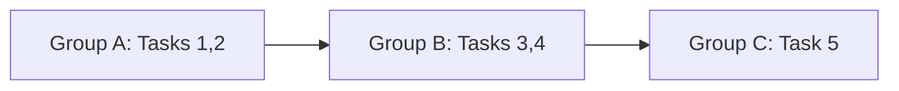

# `milestone-workflow` Skill — Design Document

_Brainstormed 2026-03-22. Orchestrates milestone implementation with GitHub issues, worktrees, and PRs._

---

## Problem

The current development workflow has several disconnected tools:

- **`writing-plans`** creates detailed step-by-step plans saved to `docs/plans/`
- **`using-git-worktrees`** creates isolated worktrees for feature work
- **`executing-plans`** runs through plan tasks in batches
- **`.gh-pm.yml`** configures GitHub Projects v2 with Priority/Status fields

No integration exists between plan steps and GitHub sub-issues, between task execution and worktrees, or between worktree completion and PR creation. Documentation tasks called out in design docs (ADRs, runbooks) are never surfaced as actionable work items and are routinely skipped.

---

## Design decisions

| Decision | Choice | Rationale |
|---|---|---|
| Sub-issue granularity | Hybrid: Tasks = sub-issues, Steps = checklists in issue body | Keeps GitHub manageable while preserving fine-grained TDD steps |
| Worktree/PR mapping | One worktree + one branch + one PR per task **group** | Minimizes PR review overhead; parallel-safe tasks share a group |
| PR → issue lifecycle | Auto-close via `Closes #N` in PR body | Native GitHub behavior, no explicit gh-pm status updates needed |
| Parent issue creation | Flexible: provide existing issue number or auto-create from plan header | Supports both pre-planned and ad-hoc milestones |
| Sub-issue creation timing | At plan creation time (Phase 1) | Full backlog visibility before execution begins |
| Documentation handling | First-class tasks extracted from design doc | ADRs and operational docs become sub-issues, blocking milestone completion |
| Skill location | `~/.claude/skills/milestone-workflow/SKILL.md` | Custom skill, not modifying third-party superpowers plugin |
| Delegation | Orchestrates existing superpowers skills | Reuses `writing-plans`, `using-git-worktrees`, `executing-plans`, `finishing-a-development-branch` |

---

## Skill identity

**Name:** `milestone-workflow`

**Location:** `~/.claude/skills/milestone-workflow/SKILL.md`

**Trigger:** After brainstorming produces a design doc, or when a plan is ready in `docs/plans/`.

**CLI interface:**

```
milestone-workflow — Orchestrate milestone implementation with GitHub issues, worktrees, and PRs

USAGE:
  /milestone-workflow [options]

PHASES:
  1. Plan & Provision  — create/load plan, create parent + sub-issues
  2. Execute           — worktree per group, TDD, PRs with auto-close
  3. Complete          — verify all sub-issues closed, close parent

OPTIONS:
  --help                Show this help message
  --plan <path>         Path to existing plan file (skips plan creation)
  --design <path>       Path to design doc (scanned for documentation tasks)
  --issue <number>      Existing parent issue to attach sub-issues to
  --resume <path>       Resume from a .milestone-state.json file
  --dry-run             Show what would be created (issues, branches) without doing it

EXAMPLES:
  /milestone-workflow
    Interactive — brainstorm, plan, provision, execute

  /milestone-workflow --plan docs/plans/2026-03-22-m0-ecfr-cross-references.md
    Skip planning, provision issues and begin execution

  /milestone-workflow --resume docs/plans/.milestone-state-m0.json
    Resume interrupted milestone

  /milestone-workflow --plan docs/plans/m1.md --design docs/plans/2026-03-21-nrc-benchmark-generation-design.md
    Use explicit design doc for documentation task extraction

  /milestone-workflow --dry-run --plan docs/plans/m1.md
    Preview issues and branches without creating anything
```

---

## Phase 1: Plan & Provision

### Step 1: Resolve the plan

If `--plan` is provided, read it. If not, invoke `superpowers:writing-plans` to produce one. Parse the plan header (`Goal`, `Architecture`, `Tech Stack`) and extract the list of Tasks with their steps.

### Step 2: Extract documentation tasks

Scan the design document (from `--design` or linked in the plan header) for documentation requirements:

- `> **ADR needed:**` callouts → "Write ADR" tasks
- `> **Documentation needed:**` callouts → "Write operational doc" tasks
- Tables with "Create by milestone" columns → filtered to the current milestone
- References to existing docs that may need updating

Each documentation item becomes a plan task with the same structure as code tasks.

### Step 3: Analyze task dependencies

Build a dependency DAG from each task's `Files:` section:

- **Task A depends on Task B** if A modifies or imports a file that B creates, or if A's test imports symbols defined in B's implementation.
- **Tasks are independent** if their file sets don't overlap and neither imports from the other.

Group tasks by dependency depth. Tasks at the same depth with no mutual dependencies form a **parallel group**. Each group gets one worktree, one branch, and one PR.

The dependency graph is rendered as a Mermaid diagram in the plan document:



**Branching strategy for dependent groups:**

- Independent groups branch from `main`
- Dependent groups branch from their parent group's branch
- When the parent PR merges, the child PR is rebased (via `gh pr update-branch` or manual rebase with confirmation)

### Step 4: Create or resolve parent milestone issue

If `--issue` is provided, fetch it via `gh issue view`. If not, create one:

```bash
gh issue create \
  --title "M0: eCFR Cross-References" \
  --body "## Goal\n<from plan header>\n\n## Plan\n<link to plan file>\n\n## Tasks\n- [ ] #201 Task 1: ...\n- [ ] #202 Task 2: ...\n..."
```

Labels: `pm-tracked`, plus any milestone-specific label.

### Step 5: Create task sub-issues

For each task, create a sub-issue:

```bash
gh issue create \
  --title "M0-T3: Detect textual CFR cross-references" \
  --body "## Steps\n- [ ] Write failing test\n- [ ] Run test, verify failure\n- [ ] Implement minimal code\n- [ ] Run test, verify pass\n- [ ] Commit\n\n## Files\n- Create: src/rag/...\n- Modify: src/rag/...\n- Test: tests/...\n\nParent: #100"
```

Sub-issues are linked to the parent issue. Naming convention: `M<milestone>-T<task>` for easy scanning.

### Step 6: Persist the mapping

Write `.milestone-state-<id>.json` to the plan directory:

```json
{
  "milestone": "m0",
  "parent_issue": 100,
  "plan_file": "docs/plans/2026-03-22-m0-ecfr-cross-references.md",
  "design_file": "docs/plans/2026-03-21-nrc-benchmark-generation-design.md",
  "groups": [
    {
      "id": "A",
      "tasks": [1, 2],
      "branch": "milestone/m0/group-a-types",
      "base": "main",
      "pr": null,
      "sub_issues": [201, 202],
      "status": "pending"
    },
    {
      "id": "B",
      "tasks": [3, 4],
      "branch": "milestone/m0/group-b-detectors",
      "base": "milestone/m0/group-a-types",
      "pr": null,
      "sub_issues": [203, 204],
      "status": "pending"
    }
  ]
}
```

---

## Phase 2: Execute

Iterate through task groups in dependency order.

### For each group:

**Step 1: Create worktree.**
Invoke `superpowers:using-git-worktrees` logic. Branch naming: `milestone/<milestone-id>/group-<id>-<slug>`.

```
.worktrees/m0-group-b-detectors/
```

Base branch is determined by the dependency graph — either `main` or the parent group's branch.

**Step 2: Execute tasks.**
Within the worktree, execute each task in the group sequentially following the plan steps (TDD cycle: write test → verify fail → implement → verify pass → commit). Delegates to `superpowers:executing-plans` scoped to the current group's tasks.

As steps complete, update the corresponding sub-issue's checklist via:

```bash
gh issue edit <sub-issue-number> --body "<updated body with checked items>"
```

**Step 3: Create PR.**
Once all tasks in the group pass, create a PR:

```bash
gh pr create \
  --title "M0 Group B: Detect cross-references" \
  --base main \
  --body "## Summary\n<group description>\n\nCloses #203\nCloses #204\n\nPart of #100"
```

Multiple `Closes #N` lines handle auto-close for all sub-issues in the group. `Part of #N` provides traceability to the parent milestone.

**Step 4: Clean up worktree.**
After PR creation, remove the worktree (branch persists on remote).

**Step 5: Update state.**
Mark the group as `pr_created` in `.milestone-state.json`. Move to next group.

**Between groups:** Pause and ask whether to continue, review, or stop. This is the natural checkpoint.

---

## Phase 3: Completion

**Milestone completion check:** The orchestrator verifies all task sub-issues are closed (via merged PRs). When the last sub-issue closes, the parent milestone issue body is updated with a summary and the parent issue is closed.

**Error recovery:** If a PR has merge conflicts (because a dependency group's PR was updated), the orchestrator detects this via `gh pr view` and offers to rebase. It does not force-push without confirmation.

---

## Session resumability

If a session is interrupted mid-milestone, a new session invokes:

```
/milestone-workflow --resume docs/plans/.milestone-state-m0.json
```

The orchestrator reads the state file, skips completed groups, and picks up where it left off. The state file is the single source of truth for progress.

---

## Documentation task extraction — details

**Sources scanned in the design document:**

| Pattern | Task type |
|---|---|
| `> **ADR needed:** <path> — <description>` | Write ADR |
| `> **Documentation needed:** <path> — <description>` | Write operational doc |
| "Required ADRs and documentation" table rows with matching milestone | Write ADR or doc |
| CLAUDE.md-referenced docs (CONFIGURATION.md, ARCHITECTURE.md) when behavior changes | Update existing doc |

**Grouping:** Documentation tasks typically have no file overlap with code tasks, so the dependency analysis naturally groups them into their own parallel group — docs can be worked on simultaneously with code in a separate worktree/PR.

**Enforcement:** The parent milestone issue won't close until all sub-issues (including doc tasks) are resolved.

---

## Delegation to existing skills

| Phase | Delegates to | What the orchestrator adds |
|---|---|---|
| Plan creation | `superpowers:writing-plans` | Documentation task extraction, dependency analysis, group formation |
| Worktree setup | `superpowers:using-git-worktrees` | Branch naming convention, base branch from dependency graph |
| Task execution | `superpowers:executing-plans` | Scoped to current group, sub-issue checklist updates |
| Branch completion | `superpowers:finishing-a-development-branch` | PR creation with `Closes #N`, state file updates |
| Brainstorming (optional) | `superpowers:brainstorming` | Links design doc to plan for doc task extraction |
