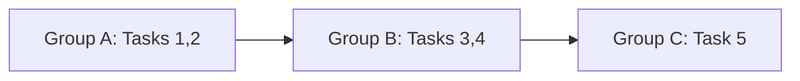

# milestone-workflow Skill Implementation Plan

> **For Claude:** REQUIRED SUB-SKILL: Use superpowers:executing-plans to implement this plan task-by-task.

**Goal:** Create a `milestone-workflow` skill that orchestrates plan creation, GitHub issue tracking, git worktrees, and PR lifecycle for milestone implementation.

**Architecture:** Single SKILL.md file at `~/.claude/skills/milestone-workflow/SKILL.md` that delegates to existing superpowers skills (`writing-plans`, `using-git-worktrees`, `executing-plans`, `finishing-a-development-branch`) while adding GitHub issue/PR glue and dependency-based task grouping.

**Tech Stack:** Claude Code skill (Markdown), `gh` CLI for GitHub operations, `git worktree` for isolation, JSON for state persistence.

**Design doc:** `docs/plans/2026-03-22-milestone-workflow-design.md`

---

### Task 1: Create skill directory and SKILL.md skeleton

**Files:**
- Create: `~/.claude/skills/milestone-workflow/SKILL.md`

**Step 1: Create the directory**

Run: `mkdir -p ~/.claude/skills/milestone-workflow`
Expected: directory created

**Step 2: Write SKILL.md with frontmatter, overview, and argument parsing**

Write `~/.claude/skills/milestone-workflow/SKILL.md` with:

```markdown
---
name: milestone-workflow
description: Use when implementing a milestone from a design doc or plan — orchestrates GitHub sub-issues, worktrees, and PRs for each task group
---

# Milestone Workflow

## Overview

Orchestrate milestone implementation by connecting plans to GitHub issues, git worktrees, and PRs. Each task group gets its own worktree, branch, and PR that auto-closes its sub-issues on merge.

**Core principle:** Plan → Issues → Worktrees → PRs → Done. One skill, three phases.

**Announce at start:** "I'm using the milestone-workflow skill to orchestrate this milestone."

## Arguments

| Argument | Description | Default |
|----------|-------------|---------|
| `--help` | Show usage and exit | — |
| `--plan <path>` | Path to existing plan file | Invoke `writing-plans` |
| `--design <path>` | Design doc to scan for documentation tasks | Inferred from plan header |
| `--issue <number>` | Existing parent GitHub issue | Auto-create from plan |
| `--resume <path>` | Resume from `.milestone-state-*.json` | — |
| `--dry-run` | Preview issues/branches without creating | — |

**If `--help` is passed, print this table and the phase summary below, then stop.**

## Phases

```
Phase 1: Plan & Provision — parse plan, extract doc tasks, analyze deps, create issues
Phase 2: Execute          — worktree per group, TDD execution, PRs with auto-close
Phase 3: Complete         — verify all sub-issues closed, close parent issue
```
```

**Step 3: Verify the skill is discoverable**

Run: `ls ~/.claude/skills/milestone-workflow/SKILL.md`
Expected: file exists

**Step 4: Commit**

```bash
cd ~/.claude/skills
git init milestone-workflow 2>/dev/null || true
```

Note: `~/.claude/skills/` is not a git repo — the skill file is standalone. No commit needed here. The plan and design doc in the project repo track the work.

---

### Task 2: Write Phase 1 — Plan Resolution and Documentation Task Extraction

**Files:**
- Modify: `~/.claude/skills/milestone-workflow/SKILL.md`

**Step 1: Add Phase 1 section — plan resolution**

Append to SKILL.md after the Phases section:

```markdown
## Phase 1: Plan & Provision

### Step 1: Resolve the plan

If `--plan` is provided, read it. Otherwise, invoke `superpowers:writing-plans` to create one.

Parse the plan header to extract:
- **Goal** — used for parent issue title
- **Task list** — each `### Task N: [Name]` block
- **Files per task** — from the `**Files:**` section of each task

### Step 2: Extract documentation tasks from design doc

If `--design` is provided, read it. Otherwise, look for a design doc reference in the plan header (e.g., `**Design doc:**` field).

Scan the design document for documentation requirements due for this milestone:

| Pattern to scan for | Task type |
|---|---|
| `> **ADR needed:** <path> — <description>` | Write ADR |
| `> **Documentation needed:** <path> — <description>` | Write operational doc |
| Tables with "Create by milestone" column matching current milestone | Write ADR or doc |

For each match, create a plan task:
- Title: "Write ADR: <name>" or "Write doc: <name>"
- Files: Create: `<path from the callout>`
- Steps: Read relevant design section → Write document → Commit

Append these tasks to the task list extracted in Step 1.
```

**Step 2: Verify skill file is well-formed**

Run: `wc -w ~/.claude/skills/milestone-workflow/SKILL.md`
Expected: word count displayed (track growth — target < 500 words total)

---

### Task 3: Write Phase 1 — Dependency Analysis and Task Grouping

**Files:**
- Modify: `~/.claude/skills/milestone-workflow/SKILL.md`

**Step 1: Add dependency analysis section**

Append after Step 2 in Phase 1:

```markdown
### Step 3: Analyze task dependencies and form groups

Build a dependency graph from each task's `**Files:**` section:

**Rules:**
- Task A depends on Task B if A modifies or tests a file that B **creates**
- Tasks are independent if their file sets don't overlap

**Grouping:**
- Tasks at the same depth in the DAG with no mutual dependencies form a **group**
- Each group gets one worktree, one branch, one PR
- Name groups alphabetically: A, B, C, ...

**Branch strategy:**
- Groups with no dependencies branch from `main`
- Groups that depend on another group branch from that group's branch

**Output:** A Mermaid dependency diagram. Print it for user review before proceeding.



**Ask:** "Does this grouping look right? Any tasks that should be moved?"
```

**Step 2: Verify skill file is well-formed**

Run: `wc -w ~/.claude/skills/milestone-workflow/SKILL.md`

---

### Task 4: Write Phase 1 — GitHub Issue Creation and State File

**Files:**
- Modify: `~/.claude/skills/milestone-workflow/SKILL.md`

**Step 1: Add issue creation section**

Append after Step 3 in Phase 1:

```markdown
### Step 4: Create parent milestone issue

If `--issue` is provided, fetch it with `gh issue view <number>`. Otherwise, create:

```bash
gh issue create \
  --title "<Milestone ID>: <Goal from plan header>" \
  --label "pm-tracked" \
  --body "$(cat <<'EOF'
## Goal
<goal from plan header>

## Plan
<link to plan file>

## Tasks
- [ ] Task 1: ...
- [ ] Task 2: ...
EOF
)"
```

Record the issue number.

### Step 5: Create task sub-issues

For each task, create a sub-issue:

```bash
gh issue create \
  --title "<Milestone>-T<N>: <Task name>" \
  --label "pm-tracked" \
  --body "$(cat <<'EOF'
## Steps
- [ ] Step 1: ...
- [ ] Step 2: ...

## Files
- Create: `path/...`
- Modify: `path/...`
- Test: `tests/...`

Part of #<parent-issue>
EOF
)"
```

After creating each sub-issue, update the parent issue body to include `- [ ] #<sub-issue> <task name>`.

### Step 6: Write state file

Write `.milestone-state-<id>.json` next to the plan file:

```json
{
  "milestone": "<id>",
  "parent_issue": <number>,
  "plan_file": "<path>",
  "design_file": "<path or null>",
  "groups": [
    {
      "id": "A",
      "tasks": [1, 2],
      "branch": "milestone/<id>/group-a-<slug>",
      "base": "main",
      "pr": null,
      "sub_issues": [<numbers>],
      "status": "pending"
    }
  ]
}
```

**If `--dry-run`:** Print what would be created (issues, branches, groups) and stop here. Do not create issues or write state file.
```

**Step 2: Verify skill file word count**

Run: `wc -w ~/.claude/skills/milestone-workflow/SKILL.md`

---

### Task 5: Write Phase 2 — Execution Loop

**Files:**
- Modify: `~/.claude/skills/milestone-workflow/SKILL.md`

**Step 1: Add Phase 2 section**

Append after Phase 1:

```markdown
## Phase 2: Execute

Iterate through groups in dependency order. For each group:

### Step 1: Create worktree

**REQUIRED SUB-SKILL:** Use superpowers:using-git-worktrees

Branch naming: `milestone/<id>/group-<letter>-<slug>`
Base branch: `main` or parent group's branch (from state file)

### Step 2: Execute tasks

**REQUIRED SUB-SKILL:** Use superpowers:executing-plans

Scope execution to only the current group's tasks. Follow the plan's TDD steps.

As each step completes, update the sub-issue checklist:

```bash
# Read current body, check off completed step, update
gh issue edit <sub-issue> --body "<updated body>"
```

### Step 3: Create PR

```bash
gh pr create \
  --title "<Milestone> Group <Letter>: <description>" \
  --base <base-branch> \
  --body "$(cat <<'EOF'
## Summary
<group description>

Closes #<sub-issue-1>
Closes #<sub-issue-2>

Part of #<parent-issue>
EOF
)"
```

### Step 4: Update state and clean up

- Update group status to `pr_created` in state file
- Update PR number in state file
- Remove worktree (branch persists on remote)

### Between groups

**Ask:** "Group <Letter> PR created (#<number>). Continue to Group <Letter+1>, or pause here?"

If the next group depends on the current group's branch (not `main`), note:
"Group <next> branches from Group <current>'s branch. It can proceed before the PR merges."
```

**Step 2: Verify skill file word count**

Run: `wc -w ~/.claude/skills/milestone-workflow/SKILL.md`

---

### Task 6: Write Phase 3 — Completion and Resume Logic

**Files:**
- Modify: `~/.claude/skills/milestone-workflow/SKILL.md`

**Step 1: Add Phase 3 and resume section**

Append after Phase 2:

```markdown
## Phase 3: Complete

After all groups have PRs:

1. Check all sub-issues are closed: `gh issue list --state open --label pm-tracked | grep "<Milestone>-T"`
2. If all closed: update parent issue body with summary, close parent issue
3. If some open: report which sub-issues are still open and their PR status

## Resuming

If `--resume <path>` is provided:

1. Read the state file
2. Skip groups with status `merged` or `pr_created`
3. For groups with status `pr_created`, check if PR is merged:
   - If merged: update status to `merged`, continue
   - If open with conflicts: offer to rebase (`gh pr update-branch` or manual)
4. Resume execution from the first `pending` group

## Error Recovery

| Situation | Action |
|---|---|
| PR has merge conflicts | Offer rebase, don't force-push without confirmation |
| Sub-issue already exists | Skip creation, link to existing |
| Worktree already exists | Ask: reuse or recreate? |
| State file missing | Scan for matching issues/branches, reconstruct or start fresh |

## Integration

**Delegates to:**
- `superpowers:writing-plans` — plan creation (Phase 1)
- `superpowers:using-git-worktrees` — worktree setup (Phase 2)
- `superpowers:executing-plans` — task execution (Phase 2)
- `superpowers:finishing-a-development-branch` — PR creation (Phase 2)

**Called after:**
- `superpowers:brainstorming` — when design is approved

## Common Mistakes

| Mistake | Fix |
|---|---|
| Creating sub-issues without dependency analysis | Always run Step 3 (grouping) first |
| Branching all groups from `main` | Dependent groups branch from parent group |
| Skipping documentation tasks | Scan design doc — docs are first-class tasks |
| Force-pushing on conflicts | Ask user, offer rebase |
| Proceeding without user confirmation on grouping | Always show Mermaid diagram and ask |
```

**Step 2: Verify final skill file word count**

Run: `wc -w ~/.claude/skills/milestone-workflow/SKILL.md`
Expected: aim for < 500 words. If over, look for sections to compress or move to a reference file.

**Step 3: Commit plan to worktree**

```bash
git add docs/plans/2026-03-22-milestone-workflow-skill.md
git commit -m "docs(plans): add milestone-workflow skill implementation plan"
```

---

### Task 7: Assemble and verify the complete SKILL.md

**Files:**
- Modify: `~/.claude/skills/milestone-workflow/SKILL.md`

**Step 1: Read the complete SKILL.md**

Read the full file and verify:
- Frontmatter has only `name` and `description`
- Description starts with "Use when..." and doesn't summarize the workflow
- All phases are present and complete
- `--help`, `--dry-run`, `--resume` logic is covered
- Sub-skill references use `**REQUIRED SUB-SKILL:**` format
- No narrative storytelling — all actionable instructions

**Step 2: Check word count**

Run: `wc -w ~/.claude/skills/milestone-workflow/SKILL.md`

If over 500 words: the skill is an orchestration workflow, so it's expected to be longer than typical skills. Compare to `subagent-driven-development` (240 lines) and `systematic-debugging` (296 lines) — complex workflow skills are naturally larger. Aim to stay under 400 lines.

**Step 3: Dry-run test**

Invoke `/milestone-workflow --dry-run --plan docs/plans/2026-03-22-m0-ecfr-cross-references.md --design docs/plans/2026-03-21-nrc-benchmark-generation-design.md` and verify it:
- Parses the plan's 10 tasks
- Extracts documentation tasks from the design doc for M0
- Shows a dependency grouping diagram
- Prints what issues and branches would be created
- Does NOT actually create anything

**Step 4: Report results**

Report: skill location, word count, dry-run output, any issues found.
