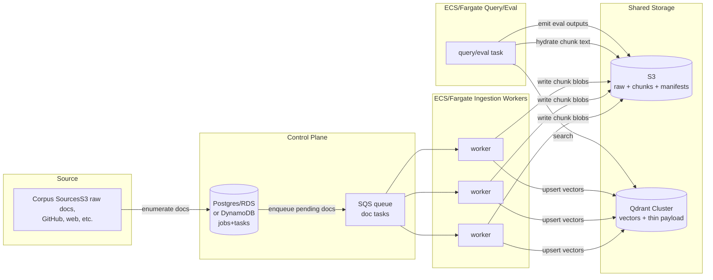

ou need to split “the corpus” into 3 independent, remotely hosted layers:

1. **Raw document store (remote, durable)**

   * Put raw source files (or normalized documents) into **S3** (or equivalent).
   * Stop treating the local filesystem as the corpus-of-record.

2. **Chunk/content store (remote, durable, separate from vector DB)**

   * Store chunk text + metadata in an object store (S3) and index it via a small DB.
   * Keep Qdrant payloads *thin* (IDs + minimal metadata) so Qdrant holds “vectors + pointers,” not your whole corpus.

3. **Remote vector index (Qdrant cluster / managed)**

   * Use your existing `QdrantVectorStore` against a **remote cluster** (Qdrant Cloud or self-managed), not local disk.

Then add the missing “production ingestion” pieces:

4. **Resumable, parallel ingestion**

   * Convert “walk files, index sequentially” into a **job + task** model:

     * enumerate docs → enqueue doc tasks → workers chunk/embed/upsert → commit checkpoints
   * Workers run on ECS/Fargate and can be scaled horizontally.

5. **Shared state + coordination**

   * A small DB (Postgres/RDS or DynamoDB) to track job state, doc status, chunk manifests, and idempotency.
   * A queue (SQS) for work distribution + retry.

6. **Eval against remote corpus**

   * Eval harness continues to run exactly as today, except it uses:

     * remote Qdrant for retrieval
     * chunk store for text hydration when building context
   * Results Analyzer stays intact because output files remain `eval/runs/...` (or you add an S3-backed run loader without breaking the UI).

---

## 3) Target architecture (concrete, minimal, “founder-convincing”)

### Data-plane diagram



This is “multi-machine” in a way a technical founder immediately recognizes: **shared object store + queue + workers + remote vector DB**.

---

## 4) Concrete artifacts you asked for

### A) S3 layout (bucket + prefixes)

Assume bucket: `rag-prod-artifacts`

**1) Raw documents (corpus-of-record)**

```
s3://rag-prod-artifacts/corpus/{corpus_id}/raw/
  source=filesystem/ingested_at=YYYY-MM-DD/
    uri_hash_prefix=ab/uri_hash=<...>.json
```

Each raw doc object is **normalized JSON** (not a .md file). Example:

```json
{
  "corpus_id": "regulations_v1",
  "source": "filesystem",
  "uri": "/nrc/10cfr/50/50.46.md",
  "doc_id": "abc123...",
  "content_sha256": "def456...",
  "metadata": {...},
  "text": "full normalized text..."
}
```

**2) Chunk store (separate from Qdrant)**
Two practical options:

**Option 1 (simple, JSONL shards):**

```
s3://rag-prod-artifacts/corpus/{corpus_id}/chunks/{chunking_strategy}/
  shard=0000/part-00000.jsonl.gz
  shard=0001/part-00000.jsonl.gz
```

Each record:

```json
{
  "chunk_id": "doc123:obsidian_structural_v1:7:12000-15200",
  "doc_id": "doc123",
  "uri": "/nrc/10cfr/50/50.46.md",
  "start_char": 12000,
  "end_char": 15200,
  "section_path": "50 > 50.46 > (b)",
  "metadata": {...},
  "text": "chunk text..."
}
```

**Option 2 (more “big-data”, Parquet):**
Same prefixing, but Parquet with columns (`chunk_id`, `doc_id`, `text`, `uri`, …). This is excellent for analytics, but JSONL is faster to implement first.

**3) Index manifest (immutable, versioned)**

```
s3://rag-prod-artifacts/indexes/{index_id}/manifest.json
s3://rag-prod-artifacts/indexes/{index_id}/build_meta.json
```

`index_id` should be something like:
`regulations_v1__obsidian_structural_v1__text-embedding-3-large__2026-02-11T...`

Manifest includes:

* corpus_id
* chunker strategy
* embedder model name
* qdrant collection name
* counts (docs, chunks)
* s3 prefixes for raw+chunks
* build git sha + settings snapshot

This aligns with your existing “reproducibility + stable IDs” goal.

---

### B) Database schema changes (minimal but production-shaped)

I’ll show Postgres DDL (RDS). DynamoDB can mirror the same fields, but Postgres is easier to reason about in interviews.

#### 1) `corpora`

```sql
create table corpora (
  corpus_id text primary key,
  description text,
  created_at timestamptz not null default now()
);
```

#### 2) `documents`

Tracks raw doc ingestion, content hashing, idempotency.

```sql
create table documents (
  corpus_id text not null references corpora(corpus_id),
  doc_id text not null,
  source text not null,
  uri text not null,
  content_sha256 text not null,
  s3_raw_key text not null,
  metadata jsonb not null default '{}'::jsonb,
  updated_at timestamptz not null default now(),
  primary key (corpus_id, doc_id),
  unique (corpus_id, source, uri, content_sha256)
);
```

#### 3) `chunks`

Stores chunk pointers (text lives in S3 shard files), plus fast lookup for hydration.

```sql
create table chunks (
  corpus_id text not null,
  chunk_id text not null,
  doc_id text not null,
  chunking_strategy text not null,
  s3_chunk_blob_key text not null, -- points to JSONL shard object
  byte_offset bigint null,         -- optional: offset for fast seek in uncompressed formats
  start_char int null,
  end_char int null,
  uri text null,
  section_path text null,
  metadata jsonb not null default '{}'::jsonb,
  primary key (corpus_id, chunk_id)
);
create index chunks_doc_id_idx on chunks(corpus_id, doc_id);
```

#### 4) `ingest_jobs` and `ingest_tasks` (resumable parallel ingestion)

```sql
create table ingest_jobs (
  job_id uuid primary key,
  corpus_id text not null,
  index_id text not null,
  chunking_strategy text not null,
  embedder_model text not null,
  qdrant_collection text not null,
  status text not null check (status in ('CREATED','RUNNING','COMPLETED','FAILED','CANCELLED')),
  created_at timestamptz not null default now(),
  updated_at timestamptz not null default now(),
  stats jsonb not null default '{}'::jsonb
);

create table ingest_tasks (
  job_id uuid not null references ingest_jobs(job_id),
  task_id uuid primary key,
  doc_id text not null,
  status text not null check (status in ('PENDING','RUNNING','SUCCEEDED','FAILED','RETRYABLE')),
  attempt int not null default 0,
  lease_owner text null,
  lease_expires_at timestamptz null,
  last_error text null,
  updated_at timestamptz not null default now(),
  unique (job_id, doc_id)
);
create index ingest_tasks_status_idx on ingest_tasks(job_id, status);
```

**Why this matters for Everstar’s CEO prompt:** it demonstrates you can run ingestion at scale with retries, leases, and idempotency—exactly what breaks in real systems.

---

### C) Worker partitioning strategy (simple, robust, scalable)

You want **SQS-driven, doc-level partitioning**. A single document is the atomic ingestion unit.

**Partition key:** `doc_id` (already stable).
**Sharding:** `hash(doc_id) mod N` only if you need deterministic assignment; otherwise SQS naturally load-balances.

**Recommended approach**

* **Step 1 (enumerator task):**

  * reads corpus sources
  * writes raw docs to S3
  * upserts `documents`
  * creates one `ingest_tasks` row per doc
  * enqueues one SQS message per doc: `{job_id, corpus_id, doc_id}`

* **Step 2 (worker tasks, N replicas):**

  * pull SQS message
  * acquire lease in DB (`lease_owner`, `lease_expires_at`)
  * load raw doc from S3
  * chunk locally (your existing chunkers)
  * embed in batches (your existing embedder; caching changes below)
  * write chunk blobs to S3 shard files
  * upsert chunk pointers to `chunks`
  * upsert vectors to Qdrant with payload: `{corpus_id, doc_id, chunk_id, chunking_strategy, uri, section_path, start_char, end_char}`
  * mark task succeeded

**Resumability rules**

* If a worker dies mid-doc:

  * lease expires → doc becomes eligible again
* Upserts are idempotent because:

  * `doc_id`/`chunk_id` are stable
  * Qdrant upsert by point ID (you already hash chunk IDs to UUIDs) 
  * DB primary keys prevent duplicates

---

### D) How eval runs operate against the remote corpus (without breaking your analyzer)

You keep the **eval output format exactly the same** (`eval/runs/.../metrics.json`, `results.jsonl`, `traces.jsonl`), so the Results Analyzer stays unchanged.

What changes is *how the query pipeline retrieves chunk text*:

#### Retrieval stage

* Use `QdrantVectorStore.search()` remotely (already exists).

#### Hydration stage (new)

Today, your candidates contain `Chunk` objects with full text. With thin Qdrant payloads, you’ll likely return:

* `Candidate` with `chunk_id`, `doc_id`, metadata, and possibly **no text**

So add a new port + adapter:

**New Port:** `ChunkStore`

```python
class ChunkStore(Protocol):
    def get_chunks(self, *, corpus_id: str, chunk_ids: Sequence[str]) -> list[Chunk]:
        ...
```

**New Adapter:** `S3ChunkStore`

* Uses DB `chunks` table to map `chunk_id -> s3_chunk_blob_key (+ offset)`
* Fetches chunk records from S3 shard object(s)
* Returns full `Chunk` objects (text + provenance fields)

Then update your retrieval pipeline composition:

* Retriever returns `Candidate` with minimally populated `Chunk` (or a `ChunkRef`)
* ContextBuilder calls `ChunkStore.get_chunks(...)` to hydrate before rendering

This preserves:

* your existing `ContextBuilder` behavior and citation formatting expectations
* your trace model (still logs packed chunk IDs)
* your eval metric computations (they depend on chunk IDs, not where text came from)

#### Where eval data lives

Two options:

1. **Keep local eval/runs** (fastest) and optionally sync to S3 after.
2. Add `S3RunLoader` implementing the same interface as `FilesystemRunLoader` so the Streamlit UI can load runs from S3 prefixes (nice “production” flex, but optional). 

---

## 5) Step-by-step migration plan (keeps eval UI + metrics intact)

### Phase 0 — Lock in index identity + manifests (1–2 PRs)

* Add `index_id` concept (string) derived from: corpus_id + chunker strategy + embedder model + timestamp/gitsha.
* Emit `manifest.json` alongside existing index builds (even local).
  This sets you up to treat an “index build” as a versioned artifact.

### Phase 1 — Switch vectorstore from JSONL to **remote Qdrant** (low risk)

* Configure `vectorstore.backend=qdrant` with a remote `qdrant_url` (Cloud or cluster).
* Keep everything else the same initially (still local corpus, local chunk text inside payloads).
* Acceptance: `ask.py` and `run_eval.py` work unchanged, but retrieval is remote.

### Phase 2 — Add the **separate chunk/content store** (core requirement)

* Introduce `ChunkStore` port + `S3ChunkStore` adapter.
* Thin Qdrant payloads to store **IDs + metadata**, not text.
* Update query pipeline so context building hydrates chunk text from chunk store.
* Acceptance: eval metrics unchanged; traces still show same chunk IDs; results analyzer still loads.

### Phase 3 — Move corpus-of-record to S3 + add DB-backed ingestion jobs (big “exceeds one machine” step)

* Add “enumerator” step: write normalized raw docs to S3 and upsert into `documents`.
* Add DB tables + SQS queue.
* Add worker service that processes SQS messages and indexes docs in parallel.
* Acceptance: you can ingest a corpus larger than your laptop disk because the corpus lives in S3; workers scale horizontally.

### Phase 4 — ECS/Fargate deployment (you already have most scaffolding)

Extend it with:

* `ingest-enumerator` task definition (run-to-completion)
* `ingest-worker` service (desired_count=N)
* `query/eval` task definition (run-to-completion)
* RDS Postgres (or DynamoDB) + SQS
* S3 buckets for `corpus/`, `chunks/`, `eval-runs/`, `manifests/`

### Phase 5 — “High traffic / availability” story (small but important)

Even if your repo is a portfolio project, you can still *demonstrate* the shape:

* Qdrant Cloud or multi-replica Qdrant behind service discovery
* ECS service autoscaling for query API (if you choose to make it an HTTP service)
* CloudWatch metrics + alarms on p95 latency and error rate
  (You already log well; adding metrics is the natural next step.)

---

## 6) Acceptance criteria that convincingly demonstrate “exceeds one machine”

These are designed to be **auditable** in an interview: screenshots, CloudWatch logs, Qdrant collection stats, S3 inventory, and your eval analyzer outputs.

### Corpus scale / storage

1. **Corpus-of-record is remote:**

   * Raw docs stored in S3 under `corpus/{corpus_id}/raw/...`
   * Demonstrate corpus size (e.g., `>200 GB` or “> local disk free space”) via S3 metrics/inventory.

2. **Chunk store is separate from vector index:**

   * Chunk text is not stored in Qdrant payloads (or only tiny snippets).
   * Hydration happens from S3 chunk blobs.

### Distributed ingestion / resumability

3. **Parallel ingestion:**

   * Run ingestion with `N>=10` worker tasks on ECS; show throughput scaling roughly linearly from N=1 to N=10.
4. **Resumable:**

   * Kill workers mid-run (stop tasks) and show the job completes anyway.
   * Evidence: task table shows retries; Qdrant point counts stabilize at expected total.

### Remote vector index

5. **Remote Qdrant cluster in use:**

   * Qdrant URL is remote; ECS tasks access it via private networking/Cloud Map.
6. **Index build is reproducible:**

   * `manifest.json` includes all identity parameters (chunking strategy, embedding model, corpus version).
   * Re-running the build yields same `doc_id`/`chunk_id` set for unchanged content.

### Eval integrity (keeping your current strengths intact)

7. **Eval harness unchanged in outputs:**

   * `eval/runs/...` structure still produced; Results Analyzer can compare runs before vs after migration.
8. **Metrics parity:**

   * For a fixed corpus + index_id, retrieval metrics remain within a tight tolerance (e.g., Recall@10 delta ≤ 0.01) across the refactor (because retrieval logic didn’t change, only storage/hydration did).

---

## 7) The one change I’d *strongly* recommend for interview optics

Right now, your deployment doc explicitly says Qdrant data on Fargate is ephemeral and rebuilt from artifacts. That’s a smart cost-saving choice, but for **“high availability requirements”** you want a cleaner story:

* **Use Qdrant Cloud** (managed) *or* add **EFS** persistence for self-managed Qdrant.
* Keep your rebuild-from-S3 path as a disaster-recovery story, not the primary persistence story.

