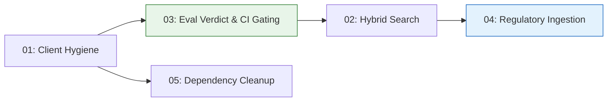

# Revised Action Plan

## Date: 2026-02-05
## Status: ACTIVE
## Supersedes: phase4-phase5-recommendations-action-plan.md

---

## Context

The original phase 1-5 analysis identified genuine gaps but prescribed solutions misaligned with this project's nature. Recommendations like Prometheus endpoints, Locust load testing, PII detection, and circuit breakers assume a multi-tenant HTTP service. This is a CLI-first personal RAG system where the value proposition is **evaluation rigor, architectural clarity, and production discipline** — not SaaS infrastructure.

This revision recenters on what actually signals production-grade engineering.

---

## What Already Works Well

The eval system is more mature than the original analysis credited:

- **OutcomeLabel taxonomy** — `SUCCESS_GROUNDED`, `SUCCESS_UNGROUNDED`, `SAFE_MISS`, `UNSAFE_MISS`, `ABSTAIN_OK`, `ABSTAIN_BAD` already captures behavioral failure modes
- **AnswerQualityMetrics** — composite `quality_score` with guardrails for hallucination, groundedness, and correctness
- **Groundedness judge** — claim-level analysis with core/peripheral role classification, evidence bounding
- **Gold judge** — correctness, completeness, and relevance scoring (metrics are sound)
- **Results analyzer** — single-run, comparison, and trending views in Streamlit
- **CI pipeline** — lint, typecheck, test via GitHub Actions; Docker builds push to ECR
- **Infrastructure** — ECS Fargate with Qdrant service discovery, S3 artifacts, Secrets Manager

## What's Missing

The system produces rich metrics but doesn't **act** on them. There is no verdict, no gate, no threshold. Evaluation is observational, not operational. The corpus is forgiving (personal notes), so retrieval weaknesses aren't stressed.

---

## Priorities

### P0 — Eval Verdict & CI Release Gating

Turn evaluation from observation into decision. Add a verdict layer that compares eval runs against configurable thresholds and baselines, produces human-readable reports with failure-mode distributions, and gates CI on behavioral regressions.

This is the centerpiece. It operationalizes the existing eval infrastructure.

**Spec:** [03-eval-verdict-release-gating.md](../specs/03-eval-verdict-release-gating.md)

### P1 — Regulatory Corpus Ingestion & Adversarial Eval

Transition from personal notes to adversarial regulatory text (GDPR, CFR). Regulatory documents demand strict citation discipline, abstention correctness, and grounded answers — properties the verdict layer can now enforce. Includes a structured ingestion pipeline with canonical citations and an adversarial eval dataset.

**Spec:** [04-regulatory-corpus-ingestion.md](../specs/04-regulatory-corpus-ingestion.md)

### P1 — Hybrid Search

Add keyword retrieval with RRF fusion to improve recall on exact matches, acronyms, and rare terms. Uses the existing port pattern with a new `BM25Retriever` adapter. Zero new dependencies.

**Spec:** [02-hybrid-search.md](../specs/02-hybrid-search.md)

### P2 — OpenAI Client Hygiene

Fix the client-per-call pattern in `OpenAIEmbedder` and `OpenAIChatGenerator`. Add timeouts and enable the SDK's built-in exponential backoff retry. Small scope, high signal.

**Spec:** [01-openai-client-hygiene.md](../specs/01-openai-client-hygiene.md)

### P2 — Dependency Cleanup

Remove dead dependencies (`llama-index`, `chromadb`, `torch`, etc.) from `pyproject.toml`. Cuts ~3GB from the Docker image.

**Spec:** [05-dependency-cleanup.md](../specs/05-dependency-cleanup.md)

---

## Implementation Sequence

1. **Client hygiene (01)** — small, no dependencies, immediate improvement
2. **Eval verdict & CI gating (03)** — builds on existing eval infrastructure; establishes the gate that subsequent changes are measured against
3. **Hybrid search (02)** — improves retrieval quality; the new verdict layer measures the impact
4. **Regulatory ingestion (04)** — new corpus + adversarial eval dataset; verdicts enforce citation discipline
5. **Dependency cleanup (05)** — housekeeping, do anytime

---

## What Was Dropped (and Why)

| Original Recommendation | Why Dropped |
|---|---|
| Async embedder rewrite | Solves a concurrency problem for HTTP servers; CLI doesn't need it. Batching and client reuse (spec 01) capture the real win. |
| Prometheus / Grafana | No HTTP server to scrape. `QueryTrace` already captures per-stage timing. |
| Load testing with Locust | No HTTP server to test against. |
| PII detection / input sanitization | Personal tool, single user, no public API surface. |
| Rate limiting | Same. |
| Circuit breaker | Appropriate for long-running services, not CLI tools. SDK retry covers transient failures. |
| Distributed caching (Redis) | SQLite cache is appropriate for single-user. |
| Judge calibration | Eval metrics are sound; `KNOWN_ISSUES` needs cleanup, not the judge. |
| Semantic query cache | Marginal benefit for single-user CLI. |

---

## Success Criteria

After implementation, the system should demonstrate:

| Signal | How It's Demonstrated |
|---|---|
| Evaluation as release gate | CI blocks PRs that regress retrieval or behavioral metrics |
| Human-readable verdicts | Every eval run produces a ship/block decision with rationale |
| Behavioral failure taxonomy | OutcomeLabel distribution reported in verdicts; UNSAFE_MISS and ABSTAIN_BAD rates are gating criteria |
| Citation discipline | Regulatory eval dataset tests precise provenance with canonical citations |
| Retrieval depth | Hybrid search improves recall on keyword-heavy queries, measured by verdict layer |
| Operational hygiene | Dead deps removed, API clients properly configured, timeouts in place |
