# RAG Evaluation Results Analyzer

A comprehensive Streamlit application for analyzing, comparing, and trending RAG evaluation runs.

## Overview

The Results Analyzer provides interactive visualization and exploration of evaluation runs generated by the RAG evaluation harness. It supports three primary modes of operation:

- **Single Run Analysis**: Deep-dive into individual evaluation runs with metrics, charts, and query-level exploration
- **Two-Run Comparison**: Side-by-side comparison of runs with delta highlighting and regression detection
- **Multi-Run Trending**: Time-series analysis across multiple runs to track performance evolution

## Quick Start

```bash
# Launch the application
streamlit run eval/app/results_analyzer.py

# Or via Makefile
make results
```

The application expects evaluation runs in `eval/runs/` by default, with each run directory containing:
- `metrics.json` - Aggregated metrics and run configuration
- `results.jsonl` - Per-query evaluation results (includes `groundedness_result` with per-claim details when LLM judge is enabled)
- `traces.jsonl` (optional) - Detailed pipeline execution traces

## Architecture

The Results Analyzer follows the hexagonal architecture pattern used throughout the RAG system:

```
eval/app/results/
├── domain/
│   └── models.py          # Data models (RunSummary, LoadedRun, etc.)
├── ports/
│   └── run_loader.py      # Protocol interfaces
├── adapters/
│   ├── filesystem_loader.py  # Load runs from disk
│   └── repository.py         # In-memory run management
├── services/
│   ├── comparison_service.py # Two-run comparison logic
│   ├── filter_service.py     # Query filtering
│   └── trend_service.py      # Multi-run trending
└── ui/
    ├── run_selector.py       # Run selection widgets
    ├── metrics_table.py      # Metrics display
    ├── query_explorer.py     # Query-level exploration
    ├── delta_table.py        # Comparison deltas
    ├── comparison_chart.py   # Side-by-side charts
    ├── trend_chart.py        # Time-series charts
    └── trace_viewer.py       # Pipeline trace display
```

### Data Flow

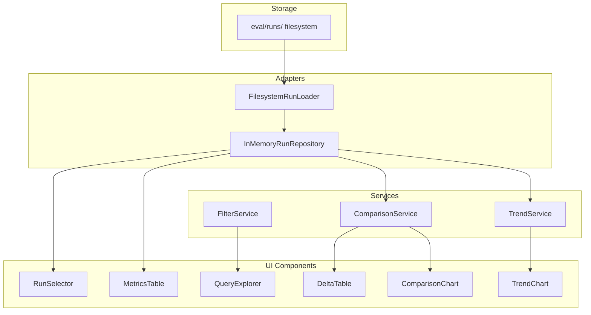

---

## User Interface

### Application Layout

The application uses a sidebar for navigation and view mode selection, with the main content area displaying the selected analysis view.

<!-- SCREENSHOT: Full application layout showing sidebar and main content area -->
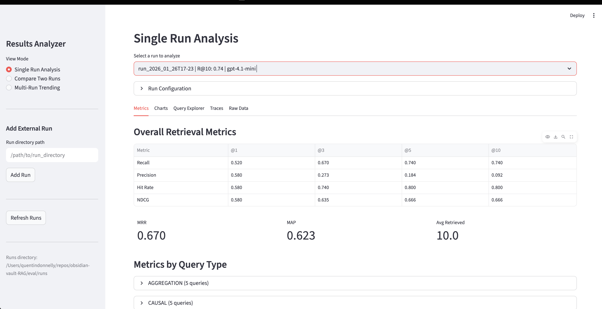

### Sidebar Controls

The sidebar provides:

1. **View Mode Selection**: Radio buttons to switch between Single Run, Comparison, and Trending views
2. **Add External Run**: Text input to add runs from non-standard locations
3. **Refresh Button**: Reload available runs from disk
4. **Runs Directory Info**: Shows the configured runs directory path

<!-- SCREENSHOT: Sidebar with view mode selection and controls -->
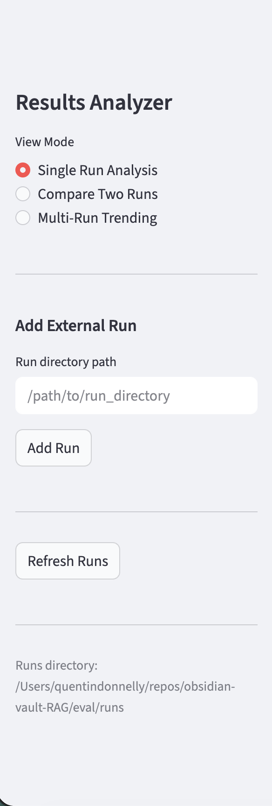

---

## View Modes

### Single Run Analysis

Provides comprehensive analysis of a single evaluation run with five tabs:

#### Run Selection

Select a run from the dropdown to analyze. Runs are displayed with their timestamp, Recall@10 score, and generator model name.

<!-- SCREENSHOT: Run selector dropdown showing available runs -->
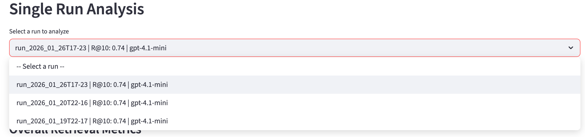

#### Run Configuration Expander

Shows detailed run configuration including:
- Run ID, timestamp, and display name
- Top K and token budget settings
- Generation and LLM judge flags
- Generator, embedder, and reranker model names
- Custom notes

<!-- SCREENSHOT: Expanded run configuration panel -->
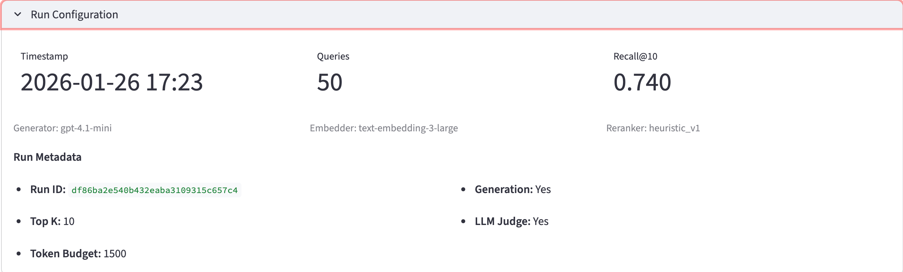

#### Metrics Tab

Displays retrieval metrics in tabular format:

**Overall Retrieval Metrics Table**
| Metric | @1 | @3 | @5 | @10 |
|--------|-----|-----|-----|------|
| Recall | 0.xxx | 0.xxx | 0.xxx | 0.xxx |
| Precision | 0.xxx | 0.xxx | 0.xxx | 0.xxx |
| Hit Rate | 0.xxx | 0.xxx | 0.xxx | 0.xxx |
| NDCG | 0.xxx | 0.xxx | 0.xxx | 0.xxx |

Plus global metrics (MRR, MAP, Avg Retrieved) and breakdowns by:
- Query Type (factual, conceptual, procedural, etc.)
- Difficulty Level (easy, medium, hard)

<!-- SCREENSHOT: Metrics tab showing overall retrieval metrics table -->
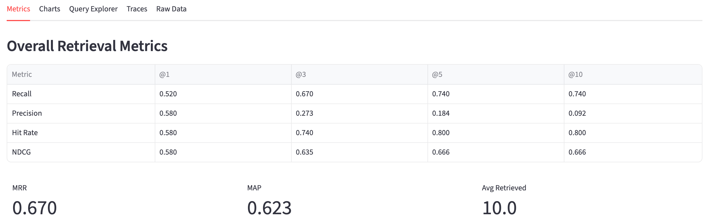

<!-- SCREENSHOT: Metrics by query type expandable sections -->
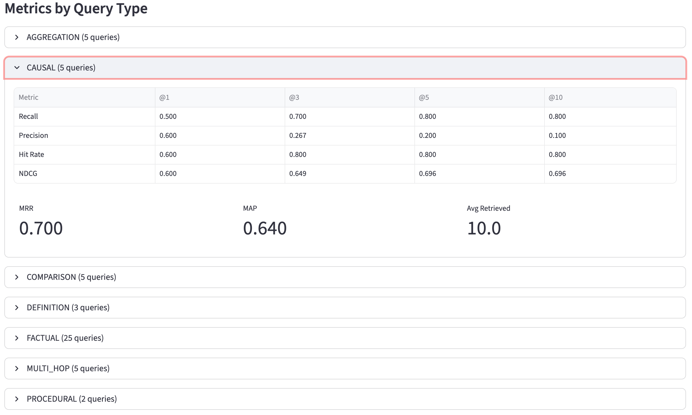

**Answer Quality Metrics** (if generation was enabled):
- Average/Median Quality Score
- Correctness (0-5 scale)
- Citation Coverage
- Hallucination Severity

**Latency Statistics**:
- Average, Median (P50), and P95 latency in milliseconds

#### Charts Tab

Interactive Plotly visualizations:

1. **Retrieval Metrics by K**: Grouped bar chart comparing Recall, Precision, and NDCG at different K values

<!-- SCREENSHOT: Bar chart showing Recall, Precision, NDCG by K value -->
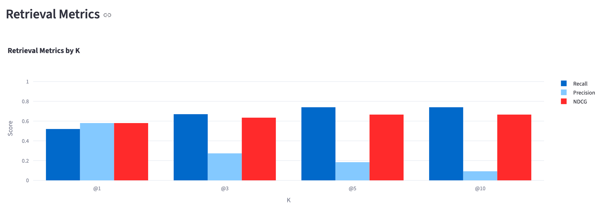

2. **Recall@10 by Query Type**: Bar chart breaking down recall performance by query category

<!-- SCREENSHOT: Bar chart showing Recall@10 broken down by query type -->
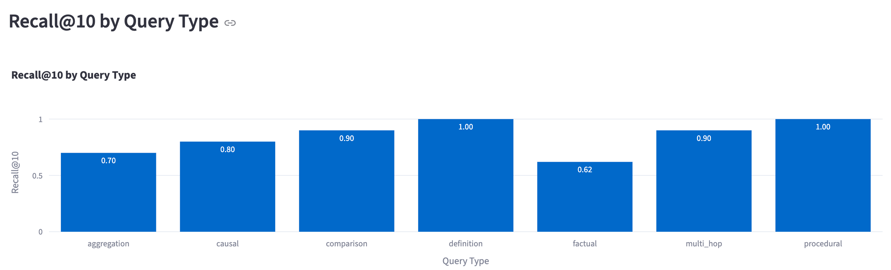

#### Query Explorer Tab

Interactive filtering and exploration of individual query results:

**Filter Controls**:
- Query Type multi-select
- Difficulty level multi-select
- Pass/Fail filter (threshold: recall >= 0.5)
- Text search across query strings

<!-- SCREENSHOT: Query explorer filter controls row -->
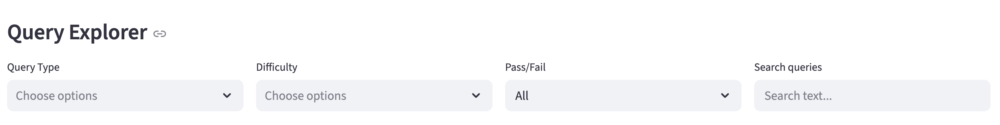

**Results Table**:
| Status | QID | Query | Type | Difficulty | Recall@10 | Latency |
|--------|-----|-------|------|------------|-----------|---------|
| Pass/Fail | ... | ... | ... | ... | 0.xx | xxxms |

<!-- SCREENSHOT: Query explorer results table with status indicators -->
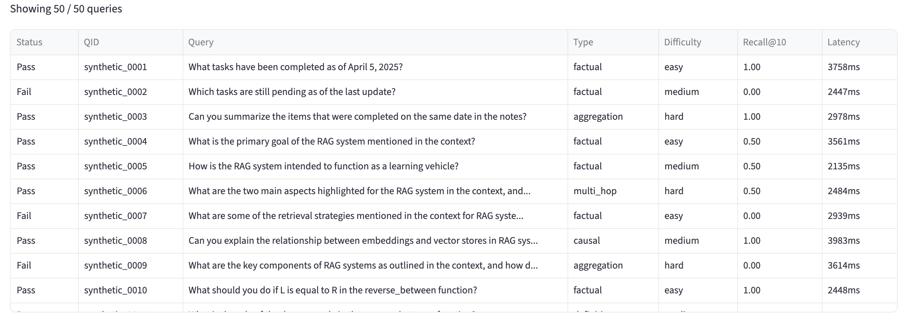

**Query Detail View**:
Select a query to see:
- Full query text and metadata
- Retrieval results breakdown (retrieved vs relevant chunks)
- Matched chunks (retrieved AND relevant) - shown in green
- Missed chunks (relevant but not retrieved) - shown in red
- Extra retrieved chunks (retrieved but not relevant) - shown in yellow
- Generated answer text and citations (if available)
- Answer quality metrics (if available)
- Groundedness claims with per-claim support status (if available)
- Full pipeline trace (if available)

<!-- SCREENSHOT: Query detail view showing retrieval breakdown -->
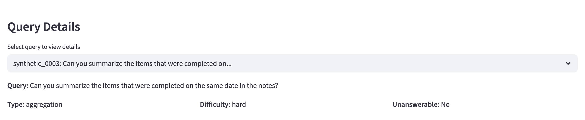

<!-- SCREENSHOT: Query detail showing matched/missed/extra chunks -->
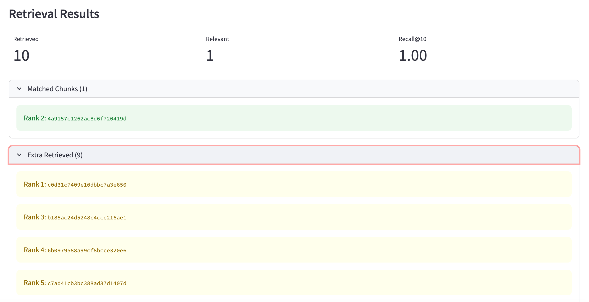

**Groundedness Claims** (if LLM judge was enabled):

When the groundedness judge runs, it extracts individual claims from the generated answer and evaluates whether each claim is supported by the retrieved context. This section displays:

- **Summary metrics**: Total claims, supported count, unsupported count
- **Per-claim expanders**: Each claim shown with:
  - Support status (✓ supported / ✗ unsupported)
  - Chunk ID that supports the claim (if supported)
  - Quote from the chunk (if available)
  - Judge's note explaining the evaluation

Unsupported claims are auto-expanded for easier debugging of hallucinations.

<!-- SCREENSHOT: Groundedness claims section showing supported and unsupported claims -->


#### Traces Tab

Browse and search pipeline execution traces:

**Trace List**:
- Search traces by query text
- Select individual traces to view details

**Trace Detail View**:
- Trace ID and query text
- Timestamp and latency
- Retrieval stage: top_k, retrieved candidates with scores and chunk text
- Reranking stage: reranker name, keep_k, reranked order with original and rerank scores
- Context building stage: token budget, packed chunk IDs
- Generation stage: model name, generated answer, citations
- Raw trace data JSON viewer

<!-- SCREENSHOT: Trace viewer showing pipeline stages -->
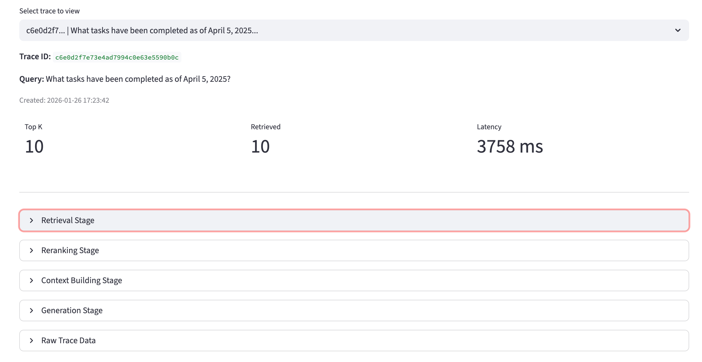

<!-- SCREENSHOT: Expanded retrieval stage showing candidates -->
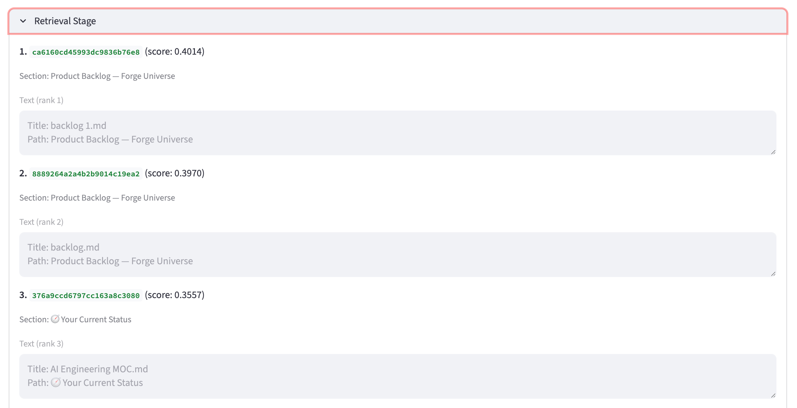

#### Raw Data Tab

View the raw `metrics.json` contents organized by section:
- Run Metadata
- Overall Metrics
- Metrics by Query Type
- Metrics by Difficulty
- Answer Quality Metrics
- Latency Statistics

Includes a download button for the complete JSON file.

<!-- SCREENSHOT: Raw data tab with expandable JSON sections -->
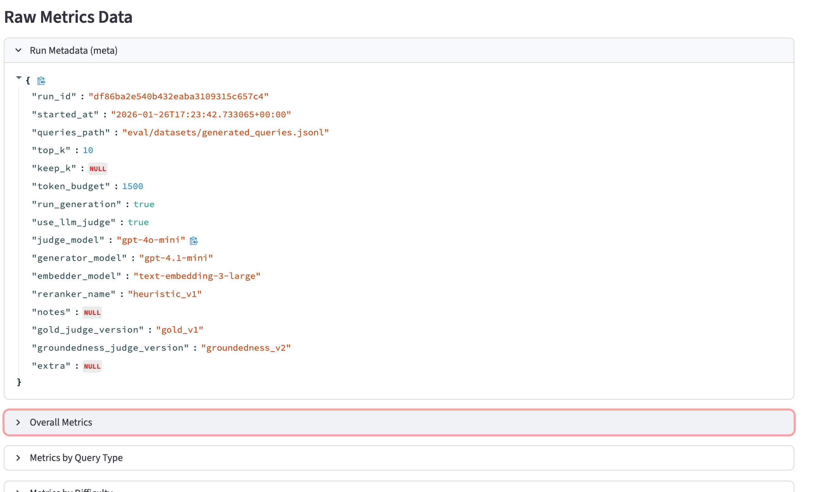

---

### Two-Run Comparison

Side-by-side comparison of two evaluation runs to identify improvements and regressions.

#### Run Selection

Two column layout for selecting:
- **Run A (Baseline)**: The reference/older run
- **Run B (Comparison)**: The experimental/newer run

<!-- SCREENSHOT: Two-column run selection for comparison view -->
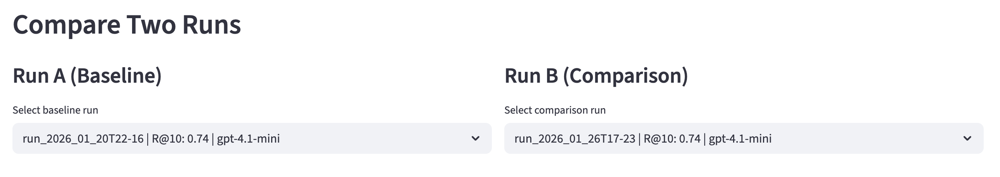

#### Summary Metrics

Four key metrics displayed with delta indicators:
- Recall@10 with change from baseline
- NDCG@10 with change from baseline
- MRR with change from baseline
- Quality Score with change from baseline (if available)

<!-- SCREENSHOT: Summary metrics row with delta indicators -->
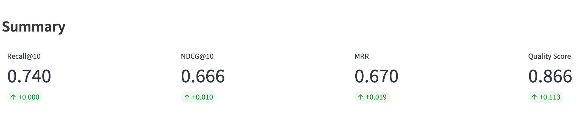

#### Query-Level Changes Summary

Three metrics showing query-level impact:
- Improved Queries (recall increased by > 5%)
- Regressed Queries (recall decreased by > 5%)
- Unchanged Queries

<!-- SCREENSHOT: Query changes summary showing improved/regressed/unchanged counts -->
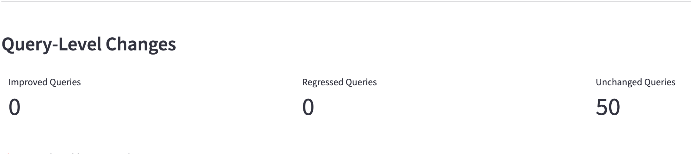

#### Charts Tab

**Recall@K Comparison**: Side-by-side bar chart comparing Run A and Run B recall at each K value

<!-- SCREENSHOT: Recall@K comparison bar chart -->
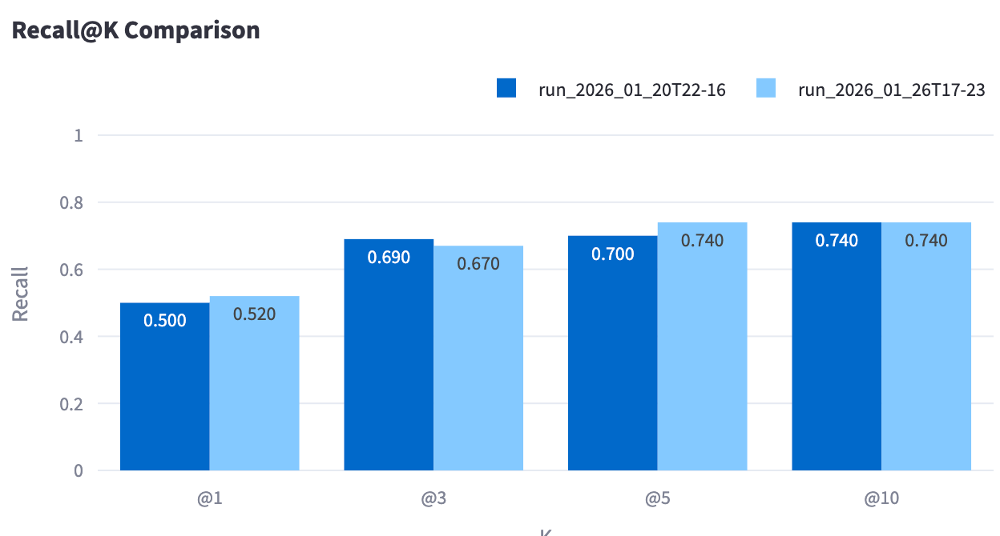

**NDCG@K Comparison**: Side-by-side bar chart comparing NDCG scores

**Global Metrics Comparison**: Bar chart comparing MRR and MAP between runs

<!-- SCREENSHOT: Global metrics comparison chart -->
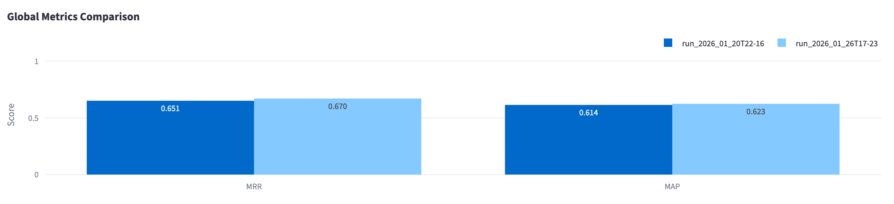

#### Delta Table Tab

Comprehensive table showing all metric differences:

| Metric | Run A | Run B | Delta | Change |
|--------|-------|-------|-------|--------|
| Recall@1 | 0.xxx | 0.xxx | +0.xxx | Better/Worse/Same |
| Recall@3 | ... | ... | ... | ... |
| ... | ... | ... | ... | ... |
| Avg Latency (ms) | xxx | xxx | +/-xxx | ... |

Color coding:
- **Better**: Positive change for metrics (negative for latency)
- **Worse**: Negative change for metrics (positive for latency)
- **Same**: Change within threshold (1% for metrics, 10ms for latency)

<!-- SCREENSHOT: Delta table showing all metric comparisons -->
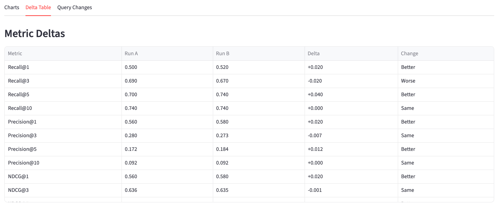

#### Query Changes Tab

Detailed lists of improved and regressed queries:

**Improved Queries Section**:
Lists queries where recall improved by > 5%, showing:
- Query ID
- Query text (truncated)
- Recall change (e.g., "0.40 -> 0.80")

<!-- SCREENSHOT: Improved queries list with recall changes -->


**Regressed Queries Section**:
Lists queries where recall dropped by > 5%, with same format

<!-- SCREENSHOT: Regressed queries list -->


---

### Multi-Run Trending

Analyze performance trends across multiple evaluation runs over time.

#### Run Selection

Multi-select dropdown to choose 2+ runs for trend analysis. Runs are automatically sorted by timestamp.

<!-- SCREENSHOT: Multi-select run picker for trending -->
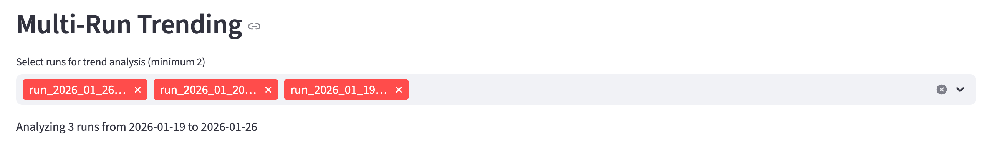

#### Metric Selector

Dropdown to select the metric to visualize:
- Recall, Precision, NDCG (with K value selector)
- MRR, MAP
- Quality Score
- Latency

<!-- SCREENSHOT: Metric and K value selectors -->
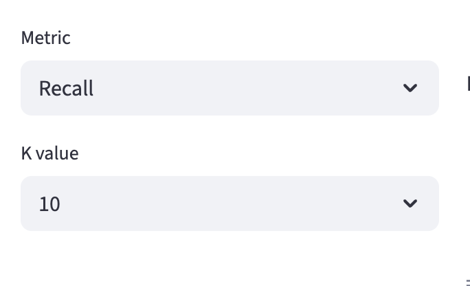

#### Single Metric Trend Chart

Line chart showing the selected metric over time with:
- X-axis: Run timestamps (formatted as MM/DD HH:MM)
- Y-axis: Metric value (0-1 for normalized metrics, auto-scaled for latency)
- Hover tooltips with exact values

<!-- SCREENSHOT: Single metric trend line chart -->
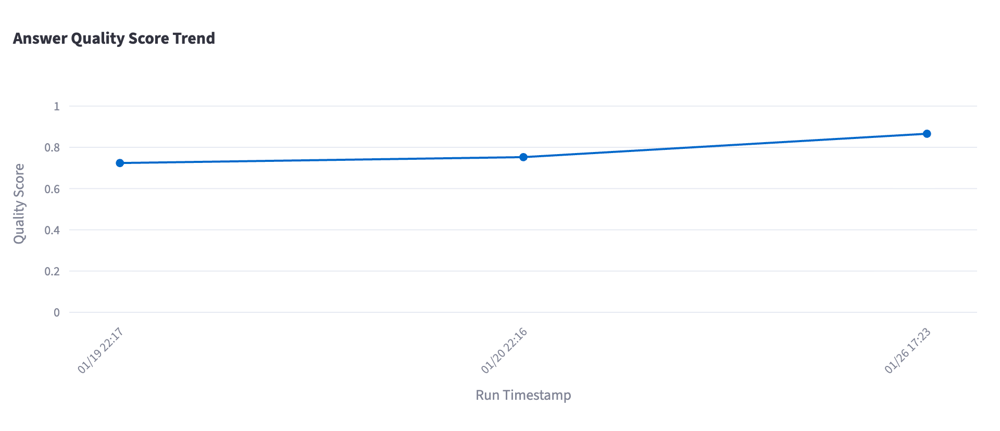

#### Multi-Metric Trend Chart

Combined line chart showing Recall, Precision, and NDCG (all at the selected K value) on the same axes for easy comparison.

<!-- SCREENSHOT: Multi-metric trend chart with three lines -->
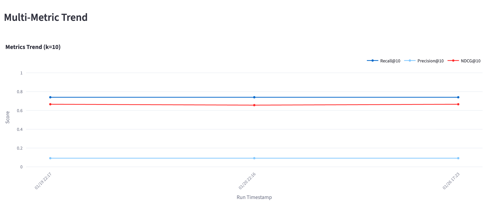

#### Run Summary Table

Tabular summary of all selected runs:

| Timestamp | Run | Recall@10 | NDCG@10 | MRR | Queries | Quality | Latency (ms) |
|-----------|-----|-----------|---------|-----|---------|---------|--------------|
| YYYY-MM-DD HH:MM | run_name | 0.xxx | 0.xxx | 0.xxx | N | 0.xxx | xxx |

<!-- SCREENSHOT: Run summary table in trending view -->
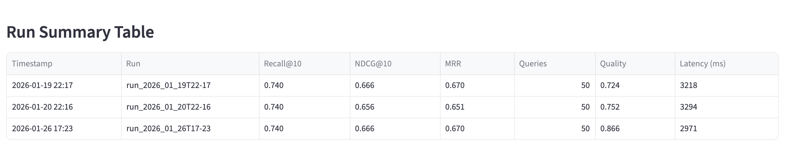

---

## Domain Models

### RunSummary

Lightweight metadata for run listing and selection without loading full results.

```python
@dataclass(frozen=True)
class RunSummary:
    run_id: str                    # Unique identifier (directory name)
    timestamp: datetime            # Run start time
    display_name: str              # Human-readable name
    run_dir: Path                  # Path to run directory

    # Quick stats
    num_queries: int               # Number of evaluation queries
    run_generation: bool           # Whether generation was enabled
    generator_model: str | None    # Generator model name
    embedder_model: str | None     # Embedder model name
    reranker_name: str | None      # Reranker name

    # Top-level metrics for filtering/sorting
    overall_recall_at_10: float | None
    overall_ndcg_at_10: float | None
    avg_quality_score: float | None
    avg_latency_ms: float | None
```

### LoadedRun

Complete evaluation run with all data loaded.

```python
@dataclass(frozen=True, slots=True)
class LoadedRun:
    summary: RunSummary            # Quick metadata
    meta: EvalRunMeta              # Full run configuration
    aggregates: EvalAggregates     # Aggregated metrics
    results: tuple[EvalResult, ...]  # Per-query results
    traces: dict[str, QueryTrace]  # Pipeline traces by ID
    raw_metrics: dict[str, Any]    # Raw metrics.json data

    # Helper methods
    def get_results_by_type(self, query_type: str) -> list[EvalResult]
    def get_results_by_difficulty(self, difficulty: str) -> list[EvalResult]
    def get_passing_results(self, threshold: float = 0.5) -> list[EvalResult]
    def get_failing_results(self, threshold: float = 0.5) -> list[EvalResult]
```

### QueryTrace

Detailed pipeline execution trace for a single query.

```python
@dataclass(frozen=True, slots=True)
class QueryTrace:
    trace_id: str
    query: str
    created_at: datetime | None

    # Retrieval
    top_k: int
    retrieved_candidates: tuple[dict[str, Any], ...]

    # Reranking
    reranked_candidates: tuple[dict[str, Any], ...] | None
    keep_k: int | None
    reranker: str | None

    # Context
    token_budget: int | None
    packed_chunk_ids: tuple[str, ...] | None

    # Generation
    model: str | None
    answer_text: str | None
    answer_abstained: bool | None
    citations: tuple[dict[str, Any], ...] | None

    latency_ms: int | None
    raw_data: dict[str, Any]
```

### RunComparison

Comparison results between two runs.

```python
@dataclass(frozen=True, slots=True)
class RunComparison:
    run_a: LoadedRun               # Baseline
    run_b: LoadedRun               # Comparison

    # Metric deltas (b - a, positive = improvement)
    recall_delta: dict[int, float]
    precision_delta: dict[int, float]
    ndcg_delta: dict[int, float]
    mrr_delta: float
    map_delta: float
    quality_delta: float | None
    latency_delta: float | None

    # Per-query changes
    improved_queries: tuple[str, ...]   # Query IDs
    regressed_queries: tuple[str, ...]
    unchanged_queries: tuple[str, ...]
```

### TrendAnalysis

Multi-run trending data.

```python
@dataclass(frozen=True, slots=True)
class TrendAnalysis:
    runs: tuple[LoadedRun, ...]        # Sorted by timestamp
    timestamps: tuple[datetime, ...]

    # Time series (keyed by K value)
    recall_series: dict[int, tuple[float, ...]]
    precision_series: dict[int, tuple[float, ...]]
    ndcg_series: dict[int, tuple[float, ...]]

    # Global metrics
    mrr_series: tuple[float, ...]
    map_series: tuple[float, ...]

    # Optional metrics (may have None values)
    quality_series: tuple[float | None, ...]
    latency_series: tuple[float | None, ...]

    @property
    def num_runs(self) -> int

    @property
    def date_range(self) -> tuple[datetime, datetime] | None
```

---

## Services

### ComparisonService

Computes metric deltas and identifies query-level changes between two runs.

```python
@dataclass
class ComparisonService:
    change_threshold: float = 0.05  # 5% threshold for improved/regressed

    def compare_runs(
        self,
        run_a: LoadedRun,
        run_b: LoadedRun
    ) -> RunComparison:
        """Generate comprehensive comparison between two runs."""
```

**Comparison Logic**:
- Computes delta for all @k metrics (recall, precision, NDCG)
- Computes deltas for global metrics (MRR, MAP)
- Computes quality and latency deltas if available
- Identifies improved/regressed queries (> 5% recall change)

### FilterService

Provides flexible filtering of evaluation results.

```python
@dataclass
class FilterService:
    pass_threshold: float = 0.5  # Recall threshold for pass/fail

    def filter_results(
        self,
        results: list[EvalResult],
        *,
        query_types: set[QueryType] | None = None,
        difficulties: set[Difficulty] | None = None,
        pass_only: bool = False,
        fail_only: bool = False,
        has_answer: bool | None = None,
        min_recall: float | None = None,
        max_recall: float | None = None,
        min_quality: float | None = None,
        query_search: str | None = None,
    ) -> list[EvalResult]:
        """Apply multiple filters to results."""

    def compute_recall(self, result: EvalResult, k: int = 10) -> float
    def is_passing(self, result: EvalResult) -> bool
    def get_matched_chunks(self, result: EvalResult) -> set[str]
    def get_missed_chunks(self, result: EvalResult) -> set[str]
```

### TrendService

Builds time series data from multiple evaluation runs.

```python
@dataclass
class TrendService:
    def analyze_trends(self, runs: list[LoadedRun]) -> TrendAnalysis:
        """Build trend analysis from multiple runs.

        Raises:
            ValueError: If fewer than 2 runs provided.
        """

    def compute_improvement(
        self,
        trend: TrendAnalysis,
        metric: str = "recall",
        k: int = 10
    ) -> float:
        """Compute overall improvement from first to last run."""

    def find_best_run(
        self,
        trend: TrendAnalysis,
        metric: str = "recall",
        k: int = 10
    ) -> LoadedRun:
        """Find the run with the best value for a given metric."""
```

---

## Adapters

### FilesystemRunLoader

Loads evaluation runs from the filesystem.

**Expected Directory Structure**:
```
eval/runs/
├── run_2024_01_15T10-30/
│   ├── metrics.json
│   ├── results.jsonl
│   └── traces.jsonl (optional)
├── run_2024_01_16T14-00/
│   ├── metrics.json
│   ├── results.jsonl
│   └── traces.jsonl
└── ...
```

**Run Directory Naming**: `run_YYYY_MM_DDTHH-MM`

```python
@dataclass
class FilesystemRunLoader:
    runs_dir: Path

    def discover_runs(self) -> list[RunSummary]:
        """Discover all runs in the runs directory."""

    def load_run(self, run_id: str) -> LoadedRun:
        """Load complete run data by ID."""

    def load_summary(self, run_id: str) -> RunSummary:
        """Load only the summary for a run (faster)."""

    def clear_cache(self) -> None:
        """Clear the in-memory cache."""
```

### InMemoryRunRepository

Manages runs with caching and support for external paths.

```python
@dataclass
class InMemoryRunRepository:
    loader: FilesystemRunLoader
    additional_paths: list[Path]  # Externally added run paths

    def list_runs(self, limit: int | None = None) -> list[RunSummary]:
        """List all available runs from all sources."""

    def get_run(self, run_id: str) -> LoadedRun:
        """Get a run by ID, checking all sources."""

    def add_run_path(self, path: Path) -> RunSummary:
        """Add an external run directory to the repository."""

    def refresh(self) -> None:
        """Refresh all caches."""
```

---

## Configuration

### Default Paths

The application uses these default paths:
- **Runs Directory**: `{project_root}/eval/runs/`
- **Run ID**: Directory name (e.g., `run_2024_01_15T10-30`)

### External Runs

Add runs from non-standard locations via the sidebar:
1. Enter the full path to a run directory
2. Click "Add Run"
3. The run will appear in the selector

Requirements for external runs:
- Directory must contain `metrics.json`
- Optional: `results.jsonl`, `traces.jsonl`

### Dependencies

Required packages:
- `streamlit` - Web application framework
- `pandas` - Data manipulation
- `plotly` - Interactive charts

Install with:
```bash
pip install -e ".[ui]"
```

---

## Metrics Reference

### Retrieval Metrics

| Metric | Description | Range |
|--------|-------------|-------|
| **Recall@K** | Fraction of relevant chunks found in top K | 0-1 |
| **Precision@K** | Fraction of top K chunks that are relevant | 0-1 |
| **Hit Rate@K** | Whether any relevant chunk is in top K | 0-1 |
| **NDCG@K** | Normalized discounted cumulative gain | 0-1 |
| **MRR** | Mean reciprocal rank of first relevant chunk | 0-1 |
| **MAP** | Mean average precision | 0-1 |

### Answer Quality Metrics

| Metric | Description | Range |
|--------|-------------|-------|
| **Quality Score** | Overall answer quality | 0-1 |
| **Correctness** | Factual accuracy rating | 0-5 |
| **Completeness** | Answer completeness rating | 0-5 |
| **Relevance** | Answer relevance rating | 0-5 |
| **Hallucination Severity** | Degree of hallucination | 0-5 |
| **Citation Coverage** | Fraction of claims with citations | 0-1 |
| **Supported Claims** | Number of claims backed by context | integer |
| **Unsupported Claims** | Number of claims not backed by context | integer |

### Groundedness Claims

When the groundedness judge evaluates an answer, it extracts individual claims and checks each against the retrieved context. The full `GroundednessJudgeResult` is persisted on each `EvalResult` and includes:

| Field | Description |
|-------|-------------|
| `answerable_from_context` | Whether the query can be answered from retrieved chunks |
| `evidence_bounded` | Whether the answer stays within evidence bounds |
| `claims` | List of `AnswerClaim` objects with per-claim details |

Each `AnswerClaim` contains:

| Field | Description |
|-------|-------------|
| `claim` | The extracted claim text |
| `supported` | Boolean indicating if claim is supported by context |
| `chunk_id` | ID of the chunk supporting the claim (if supported) |
| `quote` | Relevant quote from the chunk (if available) |
| `note` | Judge's explanation of the evaluation |

---

## Troubleshooting

### No Runs Found

If the application shows "No evaluation runs found":

1. Verify runs exist in `eval/runs/`
2. Check directory naming follows `run_YYYY_MM_DDTHH-MM` pattern
3. Ensure each run directory contains `metrics.json`
4. Click "Refresh Runs" in the sidebar

### Missing Traces

Traces are optional and only generated when:
- Generation is enabled (`run_generation=True`)
- The evaluation harness is configured to output traces

### Charts Not Rendering

If charts don't appear:
1. Verify Plotly is installed: `pip install plotly`
2. Check browser console for JavaScript errors
3. Try refreshing the page

### Slow Loading

For large numbers of runs:
1. Use the limit parameter when listing runs
2. Clear caches with "Refresh Runs" if memory is high
3. Consider archiving old runs to a different directory
