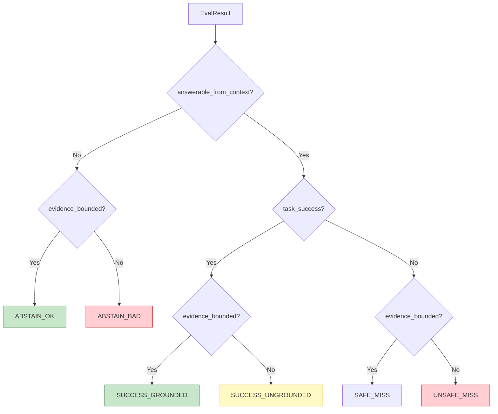

# Spec 03: Eval Verdict Layer & CI Release Gating

## Title
Promote Evaluation to a Release-Gating Mechanism with Human-Readable Verdicts

## Context / Problem

The eval system produces rich metrics — retrieval quality, answer quality, groundedness, hallucination severity, outcome labels — but nothing acts on them. Eval runs are observational. There is no threshold, no baseline comparison, no ship/block decision, and no CI gate.

The infrastructure to support verdicts already exists:

- **OutcomeLabel** taxonomy: `SUCCESS_GROUNDED`, `SUCCESS_UNGROUNDED`, `SAFE_MISS`, `UNSAFE_MISS`, `ABSTAIN_OK`, `ABSTAIN_BAD`
- **AnswerQualityMetrics** with composite `quality_score`, guardrails for hallucination/groundedness/correctness
- **EvalAggregates** with retrieval summaries (`RetrievalSummary`), answer quality metrics, latency percentiles
- **EvalResult** per-query with `outcome_label`, `answer_metrics`, `groundedness_result`

What's missing is the **decision layer** on top.

## Goals
- Define a `Verdict` schema encoding a ship/block decision with rationale
- Implement threshold-based checks against configurable absolute minimums
- Implement regression detection against a versioned baseline
- Surface failure-mode distribution (outcome label rates) as gating criteria
- Produce a human-readable markdown report
- Integrate into CI as a blocking step

## Non-Goals
- Changing existing metrics, judges, or reducers
- Statistical significance testing (follow-up enhancement)
- Automated baseline promotion (manual and intentional)

## Proposed Solution

### New File: `src/rag/eval/verdict.py`

```python
from enum import StrEnum
from dataclasses import dataclass
from datetime import datetime

class Decision(StrEnum):
    SHIP = "ship"
    BLOCK = "block"

@dataclass(frozen=True)
class ThresholdCheck:
    """A single pass/fail check against a threshold."""
    name: str                     # e.g., "recall@10 >= 0.60"
    passed: bool
    current: float
    threshold: float
    baseline: float | None = None

@dataclass(frozen=True)
class RegressionFlag:
    """A metric regression beyond tolerance."""
    metric: str                   # e.g., "recall@10"
    qid: str | None = None        # None for aggregate regressions
    query: str | None = None
    baseline_value: float = 0.0
    current_value: float = 0.0
    delta: float = 0.0

@dataclass(frozen=True)
class OutcomeBucket:
    """Count and rate for one OutcomeLabel."""
    label: str                    # OutcomeLabel.value
    count: int
    rate: float

@dataclass(frozen=True)
class Verdict:
    decision: Decision
    summary: str                  # 1-2 sentence human explanation
    checks: tuple[ThresholdCheck, ...]
    regressions: tuple[RegressionFlag, ...]
    outcome_distribution: tuple[OutcomeBucket, ...]
    current_run_id: str
    baseline_run_id: str | None
    dataset_name: str | None
    created_at: datetime
```

### Core Functions

```python
def compute_verdict(
    current: EvalRun,
    baseline: EvalRun | None,
    thresholds: VerdictThresholds,
) -> Verdict:
    """
    Compare current eval run against thresholds and optional baseline.

    1. Run absolute threshold checks against current.aggregates
    2. Compute outcome_label distribution from current.results
    3. Check behavioral rates (unsafe_miss, abstain_bad) against thresholds
    4. If baseline provided, compute metric deltas and flag regressions
    5. Decision is BLOCK if any check fails or any regression exceeds tolerance
    """

def render_verdict_markdown(verdict: Verdict) -> str:
    """Produce human-readable markdown report."""

def render_verdict_json(verdict: Verdict) -> str:
    """Produce structured JSON for programmatic consumption."""
```

### New File: `src/rag/eval/verdict_thresholds.py`

```python
@dataclass(frozen=True)
class VerdictThresholds:
    # --- Absolute minimums (block if below) ---
    min_recall_at_10: float = 0.60
    min_ndcg_at_10: float = 0.50
    min_mrr: float = 0.40
    max_avg_hallucination_severity: float = 2.5
    min_evidence_bounded_rate: float = 0.70
    max_latency_p95_ms: float = 5000.0

    # --- Behavioral rates (block if exceeded) ---
    max_unsafe_miss_rate: float = 0.10
    max_abstain_bad_rate: float = 0.10

    # --- Regression limits (block if delta exceeds) ---
    max_recall_regression: float = 0.05
    max_quality_regression: float = 0.10
    max_latency_regression_ms: float = 1000.0
```

### Configuration (settings.toml)

```toml
[eval.verdict]
min_recall_at_10 = 0.60
min_ndcg_at_10 = 0.50
min_mrr = 0.40
max_avg_hallucination_severity = 2.5
min_evidence_bounded_rate = 0.70
max_latency_p95_ms = 5000.0
max_unsafe_miss_rate = 0.10
max_abstain_bad_rate = 0.10
max_recall_regression = 0.05
max_quality_regression = 0.10
max_latency_regression_ms = 1000.0
```

### New Script: `eval/scripts/verdict.py`

```bash
# Generate verdict comparing to baseline
./scripts/py eval/scripts/verdict.py \
    --current eval/runs/run_2026-02-05T14-30/ \
    --baseline eval/runs/baseline/ \
    --output eval/verdicts/

# Generate verdict and exit non-zero on BLOCK
./scripts/py eval/scripts/verdict.py \
    --current eval/runs/latest/ \
    --baseline eval/runs/baseline/ \
    --fail-on-block
```

**Outputs:**
- `verdict.json` — structured verdict for programmatic consumption
- `verdict.md` — human-readable report
- Exit code: 0 for SHIP, 1 for BLOCK

### Verdict Report Format

```markdown
## Eval Verdict: SHIP

**Run:** run_2026-02-05T14-30 | **Baseline:** run_2026-02-01T10-00
**Dataset:** curated_queries v1.2 (20 queries)

### Threshold Checks

| Check | Result | Current | Threshold | Baseline |
|-------|--------|---------|-----------|----------|
| recall@10 >= 0.60 | PASS | 0.82 | 0.60 | 0.80 |
| ndcg@10 >= 0.50 | PASS | 0.71 | 0.50 | 0.69 |
| mrr >= 0.40 | PASS | 0.65 | 0.40 | 0.63 |
| hallucination_severity <= 2.5 | PASS | 0.8 | 2.5 | 1.0 |
| evidence_bounded_rate >= 0.70 | PASS | 0.85 | 0.70 | 0.80 |
| latency_p95 <= 5000ms | PASS | 3200 | 5000 | 3100 |
| unsafe_miss_rate <= 0.10 | PASS | 0.05 | 0.10 | 0.05 |
| abstain_bad_rate <= 0.10 | PASS | 0.00 | 0.10 | 0.05 |

### Outcome Distribution

| Outcome | Count | Rate |
|---------|-------|------|
| SUCCESS_GROUNDED | 12 | 60% |
| SAFE_MISS | 4 | 20% |
| ABSTAIN_OK | 2 | 10% |
| SUCCESS_UNGROUNDED | 1 | 5% |
| UNSAFE_MISS | 1 | 5% |
| ABSTAIN_BAD | 0 | 0% |

### Regressions

No regressions beyond tolerance.

### Rationale

All 8 threshold checks passed. No regressions detected.
recall@10: +0.02 from baseline. evidence_bounded_rate: +0.05.
```

### Failure-Mode Taxonomy (Surfaced via Outcome Distribution)

The existing `OutcomeLabel` enum already defines the failure-mode taxonomy. The verdict layer surfaces it as a first-class section:



The verdict gates on the **dangerous** outcomes: `UNSAFE_MISS` (wrong answer + hallucinated) and `ABSTAIN_BAD` (should have abstained but hallucinated instead). `SUCCESS_UNGROUNDED` and `SAFE_MISS` are warnings, not blockers.

### Baseline Management

The baseline is a committed eval run representing the last known-good state:

```
eval/
  runs/
    baseline/             # Symlink or copy of last accepted run
      results.jsonl
      metrics.json
    run_2026-02-05/
    run_2026-02-04/
```

Promoting a new baseline is an intentional manual step:

```bash
cp -r eval/runs/run_2026-02-05/ eval/runs/baseline/
```

### CI Integration

Add to `.github/workflows/ci.yml`:

```yaml
  eval-gate:
    needs: lint-and-test
    runs-on: ubuntu-latest
    steps:
      - uses: actions/checkout@v4
      - uses: actions/setup-python@v5
        with:
          python-version: "3.11"
      - name: Install
        run: pip install -e ".[dev,openai]"
      - name: Run evaluation
        env:
          OPENAI_API_KEY: ${{ secrets.OPENAI_API_KEY }}
        run: |
          ./scripts/py eval/scripts/run_eval.py \
            --queries eval/datasets/curated_queries.jsonl \
            --run-generation --use-llm-judge \
            --run-name "ci-${{ github.sha }}"
      - name: Verdict
        run: |
          ./scripts/py eval/scripts/verdict.py \
            --current eval/runs/latest/ \
            --baseline eval/runs/baseline/ \
            --fail-on-block
      - name: Upload verdict
        if: always()
        uses: actions/upload-artifact@v4
        with:
          name: eval-verdict
          path: eval/verdicts/
```

## Acceptance Criteria

- [ ] `Verdict` dataclass encodes decision, checks, regressions, outcome distribution
- [ ] `compute_verdict()` compares current `EvalRun` against thresholds and optional baseline
- [ ] Threshold checks cover: retrieval metrics, hallucination severity, evidence_bounded_rate, behavioral outcome rates, latency
- [ ] Regression detection compares aggregate metrics against baseline with configurable tolerances
- [ ] Outcome distribution computed from per-result `OutcomeLabel` values
- [ ] `render_verdict_markdown()` produces the report format shown above
- [ ] `verdict.py` script exits 0 for SHIP, 1 for BLOCK
- [ ] CI workflow runs eval and gates on verdict
- [ ] Thresholds are configurable via `settings.toml`
- [ ] Verdict works without a baseline (first run checks absolute thresholds only)

## Test Plan

```python
def test_verdict_ship_when_all_pass():
    """All thresholds met, no regressions -> SHIP."""

def test_verdict_block_on_low_recall():
    """recall@10 below min_recall_at_10 -> BLOCK."""

def test_verdict_block_on_regression():
    """recall@10 drops > max_recall_regression from baseline -> BLOCK."""

def test_verdict_block_on_high_unsafe_miss_rate():
    """UNSAFE_MISS rate > max_unsafe_miss_rate -> BLOCK."""

def test_verdict_block_on_high_abstain_bad_rate():
    """ABSTAIN_BAD rate > max_abstain_bad_rate -> BLOCK."""

def test_verdict_no_baseline_checks_absolute_only():
    """First run with no baseline skips regression checks."""

def test_outcome_distribution_computed_correctly():
    """Counts and rates match per-result outcome_labels."""

def test_render_markdown_includes_all_sections():
    """Markdown includes checks, outcomes, regressions, rationale."""

def test_render_json_roundtrips():
    """JSON output can be deserialized back to Verdict."""
```

## Risks

| Risk | Mitigation |
|---|---|
| CI eval costs (OpenAI API per PR) | Use small curated dataset (~20 queries); cache embeddings; skip judge on draft PRs |
| Flaky verdicts from LLM judge variance | Set judge temperature to 0; use tolerant thresholds; consider running judge twice and taking consensus |
| Baseline goes stale | Log baseline age in verdict; warn if >30 days old |
| Thresholds too strict initially | Start with conservative (loose) thresholds; tighten as baseline improves |

## Follow-ups

- Statistical significance testing (bootstrap CI for metric deltas)
- Automated baseline promotion on merge to main
- Per-query regression drill-down in verdict report
- Verdict history tracking and trend analysis
