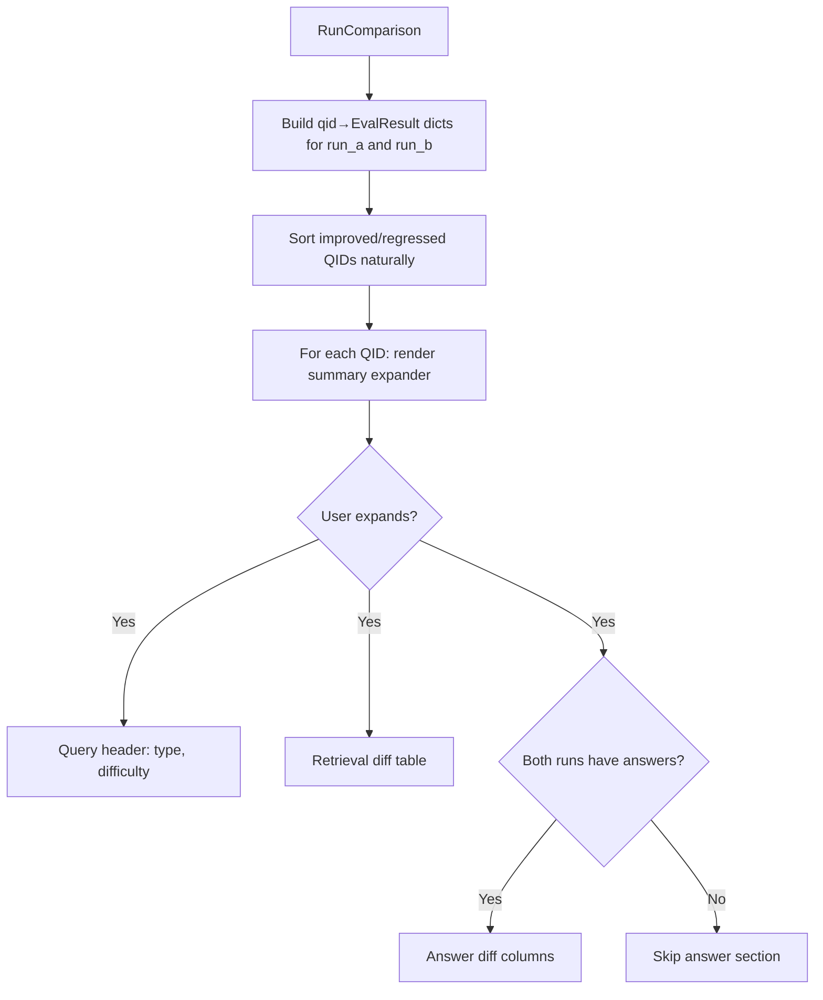

# Spec 06: Query Change Diagnostics in Results Analyzer

## Context / Problem

When comparing two evaluation runs, the "Query Changes" tab shows which queries improved or regressed — but only as a flat list of QIDs with recall deltas. There is no way to drill into a query and understand *why* it changed.

Diagnosing a regression currently requires manually cross-referencing results JSONL files to answer questions like:
- Which retrieved chunks were gained or lost between runs?
- Was the lost chunk a relevant one (true positive lost) or irrelevant (no impact)?
- Did chunks just shuffle rank positions, or did the result set change entirely?
- How did the generated answer change?
- Is this a hard multi-hop query or an easy factual one that shouldn't be regressing?

This makes the comparison view useful for detecting regressions but not for understanding them.

## Goals

- Per-query drill-down showing retrieval diff, answer diff, and quality metrics
- Chunk-level relevance labeling (TP/FP) and rank movement between runs
- Query metadata (type, difficulty) visible in both summary and detail views
- Sorted display with natural ordering of query IDs

## Non-Goals

- Chunk text content display (chunk IDs are sufficient for identification)
- Editing queries or results from this view
- Exporting or CSV download (future enhancement)
- Custom session state management — use Streamlit's native `st.expander`

## Proposed Solution

### Architecture

The change is isolated to `_render_query_changes` in [results_analyzer.py](eval/app/results_analyzer.py) and new private helper functions in the same file. No new files, no model changes.

Build a `{qid: EvalResult}` lookup dict once per run at the top of `_render_query_changes` to avoid O(n) linear scans per query.

### 1. Query Summary Row

Each query in the improved/regressed list shows a one-line summary inside a `st.expander`:

```
[q_012] "How does uranium enrichment..." | factual · medium | Recall: 0.40 → 0.80 (+0.40)
```

Fields: **QID**, truncated query text, **query type**, **difficulty**, recall delta.

Natural sort by QID so `q_2` < `q_10` < `q_100` (regex-based numeric extraction).

### 2. Detail View (inside expander)

Expanding a query row reveals three sections:

#### a) Query Header

| Field | Value |
|-------|-------|
| Query | Full text (not truncated) |
| Type | `query_type.value` (e.g. "factual", "multi_hop") |
| Difficulty | `difficulty.value` (e.g. "easy", "medium", "hard") |
| Unanswerable | `is_unanswerable` flag |

#### b) Retrieval Diff Table

A single unified table showing all chunks that appeared in either run's top-k results. Each row shows:

| Chunk ID | Relevant | Rank A | Rank B | Status |
|----------|----------|--------|--------|--------|
| `chunk_abc` | Yes | 2 | — | **TP lost** |
| `chunk_def` | No | 5 | 3 | Moved up |
| `chunk_ghi` | Yes | — | 1 | **TP gained** |
| `chunk_jkl` | No | — | 7 | FP gained |

Column definitions:
- **Relevant**: chunk ID is in `relevant_chunk_ids` (ground truth)
- **Rank A / Rank B**: 1-indexed position in `retrieved_chunk_ids`, or "—" if absent
- **Status**: derived from presence/absence and relevance:
  - `TP lost` — relevant chunk in A, not in B (regression signal)
  - `TP gained` — relevant chunk in B, not in A (improvement signal)
  - `FP lost` — irrelevant chunk in A, not in B (neutral/good)
  - `FP gained` — irrelevant chunk in B, not in A (neutral/bad)
  - `Moved up` / `Moved down` — present in both, rank changed
  - `Unchanged` — same rank in both

Sort order: TP lost first (most diagnostic), then TP gained, then rank movers, then the rest.

Use `st.dataframe` for the table so it's scannable without per-row markdown overhead.

#### c) Answer Diff (conditional)

Only rendered when both `result_a.answer` and `result_b.answer` are not None.

Two-column layout:

| | Run A | Run B |
|---|---|---|
| **Answer text** | `answer.text` | `answer.text` |
| **Quality score** | `answer_metrics.quality_score` | `answer_metrics.quality_score` (with delta) |
| **Correctness** | `answer_metrics.correctness` / 5 | with delta |
| **Hallucination** | `answer_metrics.hallucination_severity` / 5 | with delta |
| **Grounded** | `answer_metrics.evidence_bounded` | |

Use `st.text_area(disabled=True)` for answer text, `st.metric` for scores (which renders deltas natively).

### 3. Sorting and Display Limits

- Natural sort via regex split: `re.split(r'(\d+)', qid)`, converting numeric parts to `int` for comparison.
- Default display limit of 20 queries per category, with `st.caption` showing overflow count.
- No configurable limit widget — the default of 20 is sufficient. If it isn't, revisit.

## Data Flow



## Acceptance Criteria

- [ ] Queries sorted by natural ID order (q_2 before q_10)
- [ ] Summary row shows query type and difficulty
- [ ] Expanding a query shows full query text, type, difficulty, unanswerable status
- [ ] Retrieval diff table shows all chunks from either run with rank, relevance, and status
- [ ] TP lost / TP gained chunks are visually distinct (sort order or styling)
- [ ] Answer diff renders side-by-side when both runs have answers
- [ ] Quality score, correctness, hallucination severity shown with deltas
- [ ] No O(n) per-query scans — dict lookup used
- [ ] Display limit of 20 per category with overflow caption

## Test Plan

```python
def test_natural_sort_key():
    """q_2 < q_10 < q_100, handles mixed alpha-numeric."""

def test_retrieval_diff_identifies_tp_lost():
    """Chunk in relevant_chunk_ids, retrieved in A but not B → TP lost."""

def test_retrieval_diff_identifies_tp_gained():
    """Chunk in relevant_chunk_ids, retrieved in B but not A → TP gained."""

def test_retrieval_diff_rank_movement():
    """Chunk in both runs at different ranks → correct rank delta."""

def test_retrieval_diff_sort_order():
    """TP lost sorted before FP changes."""
```

The Streamlit rendering itself is validated manually by running `make results` against two comparison runs.

## Risks

| Risk | Mitigation |
|------|------------|
| Large result sets slow down rendering | Default limit of 20; `st.dataframe` handles tabular data efficiently |
| Query type/difficulty not populated in older runs | Show "—" when `None`; no crash |
| Answer metrics partially populated | Guard each field with `is not None` checks |

## Rollback

All changes are in `_render_query_changes` and new private helpers in the same file. Revert the function to restore prior behavior.
