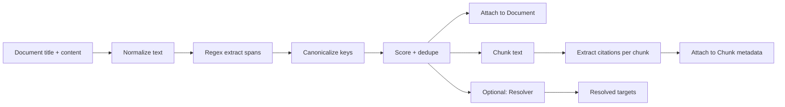

# First-pass approach

## What we’re optimizing for

1. **High recall on the citation types you care about** (CFR sections, parts, dockets, accession numbers, NUREG/RG/RIS/GL/IN)
2. **Canonical keys** so the same thing always normalizes the same way
3. **Spans + evidence** so you can debug and (later) cite precisely
4. **Resolution hooks** so you can link citations to your corpus (CFR text, ADAMS docs, etc.)
5. **Coverage metrics** so you can iterate scientifically

## Core idea

A citation pipeline that runs during ingestion:

**text → normalize → extract spans → canonicalize → dedupe → (optional) resolve → attach to doc + chunks**

You do *not* depend on ADAMS `DocumentType` etc. You mine from the content you actually have.

---

# Obsidian spec document

## 📌 Citation Extraction & Normalization Spec (First Pass)

### Goals

* Extract citations from CFR text and ADAMS case/correspondence docs with **high recall**.
* Normalize each citation to a stable **canonical key** for linking and filtering.
* Attach extracted citations to both **Document** and **Chunk** metadata.
* Provide **coverage + quality metrics** to guide iteration.

---

## Scope

### Target citation kinds (v1)

| Kind            | Examples                                      | Canonical key                                                    |
| --------------- | --------------------------------------------- | ---------------------------------------------------------------- |
| CFR section     | `10 CFR 2.1013(c)(1)`                         | `cfr:10:2.1013(c)(1)`                                            |
| CFR part        | `10 CFR Part 2`                               | `cfrpart:10:2`                                                   |
| CFR appendix    | `10 CFR Part 50, Appendix B`                  | `cfrapp:10:50:appendix-b`                                        |
| Docket          | `05000247`, `50-247`, `Docket No. 50-247`     | `docket:50-247` (or `docket:05000247` if you prefer fixed-width) |
| ADAMS accession | `ML021910673`, legacy numerics (`8111110271`) | `adams:ML021910673` / `adamslegacy:8111110271`                   |
| NUREG           | `NUREG-0800`, `NUREG/BR-0073`                 | `nureg:0800` / `nureg:BR-0073`                                   |
| RIS/GL/IN       | `RIS 2001-05`, `Generic Letter 95-07`         | `ris:2001-05`, `gl:95-07`, `in:97-10`                            |

### Explicitly *not* in v1

* ASME section citations
* SECY/COMSECY references
* Case law citations
* Multi-hop CFR ranges (`§§ 50.46–50.48`) — we’ll detect but treat as “range” and optionally expand later

---

## Data model

### `CitationSpan` (structured)

```python
@dataclass(frozen=True)
class CitationSpan:
    kind: str                      # "cfr" | "cfrpart" | "cfrapp" | "docket" | "adams" | "nureg" | "ris" | ...
    raw: str                       # exact matched text
    key: str                       # canonical key (stable)
    start: int                     # span start in normalized text
    end: int                       # span end in normalized text
    confidence: float              # 0..1 (deterministic scoring)
    source_field: str              # "title" | "content" | "metadata"
    context: str | None            # short context window for debugging/UI
    attrs: dict[str, object]       # parsed structure (title/part/section/subsections/appendix/etc.)
```

### Attachment points

* **Document metadata**

  * `citations: list[CitationSpan]`
  * `citation_keys: list[str]` (flattened, deduped)
* **Chunk metadata**

  * `citation_keys: list[str]` (keys present in that chunk’s text)
  * (optional) `citations: list[CitationSpan]` (if you want spans per chunk)

---

## Pipeline stages

### Stage 0 — Inputs

* Document fields:

  * `title`
  * `content` (may be empty)
  * selected metadata fields (docket numbers, accession, etc.)

### Stage 1 — Text normalization

Goal: improve regex recall across PDF extraction/OCR quirks.

**Transformations**

* Unicode normalization (quotes/dashes)
* Collapse whitespace to single spaces
* Fix common “C F R” OCR splits
* Remove hard line breaks (preserve paragraph boundaries if needed)
* Normalize “C.F.R.” / “CFR” / “Code of Federal Regulations” → consistent `CFR`

Output:

* `text_norm`
* mapping back to raw is optional in v1 (we can store context windows instead)

### Stage 2 — Span extraction (regex families)

We run multiple extractors over `title` and `content`.

#### CFR extractors

**Strong CFR refs (preferred)**

* `10 CFR 2.1013(c)(1)`
* `10 C.F.R. 2.1013(c)(1)`
* `10CFR2.1013(c)(1)` (rare but exists)

We treat this as:

* `title=10`
* `part=2`
* `section=1013`
* `subsections=["c","1"]`

Also capture:

* `10 CFR Part 2`
* `10 CFR 2.108` (no subsections)

**Weak CFR refs**

* `2.1013(c)(1)` *only when* near an anchor like “10 CFR” within a window (e.g., 200 chars)

  * In v1 we can skip weak refs to avoid ambiguity, or include with lower confidence.

#### Docket extractors

* `Docket No. 50-247`
* `05000247`
* `50-247` (careful—appears inside report numbers too)

#### ADAMS accession extractors

* `ML\d{2}[A-Z]\d{5}` (general shape, refine with observed)
* legacy numeric `\b\d{10}\b` *only if* doc indicates legacy context or field suggests accession

#### NUREG/RG/RIS/GL/IN extractors

* `NUREG-\d{4}` and `NUREG/BR-\d{4}`
* `RG 1.174` / `Reg(ulatory)? Guide 1.174`
* `RIS 2001-05`
* `Generic Letter 95-07`
* `Information Notice 97-10`

### Stage 3 — Canonicalization

Each match yields a stable `key`. Canonicalization rules:

* CFR:

  * normalize spacing and punctuation
  * subsection tokens:

    * accept `a-z`, digits, roman numerals (`i`, `ii`, `iv`, etc.)
  * key format:

    * `cfr:10:{part}.{section}{(subsections...)}`
    * ex: `cfr:10:2.1013(c)(1)`
* Part-only:

  * `cfrpart:10:{part}`
* Appendix:

  * `cfrapp:10:{part}:appendix-{letter_lower}`
* ADAMS:

  * `adams:{ACCESSION_UPPER}`
  * legacy numeric: `adamslegacy:{digits}`
* Docket:

  * choose **one** canonical:

    * either fixed width: `docket:05000247`
    * or hyphen: `docket:50-247` (recommended for readability)
* NUREG:

  * `nureg:{series}` (`0800`, `BR-0073`)
* RIS/GL/IN:

  * `ris:YYYY-NN`, `gl:NN-NN`, `in:NN-NN`

### Stage 4 — Scoring + dedupe

We keep deterministic scores (no ML needed).

Example scoring:

* CFR with explicit “10 CFR” anchor: `0.95`
* CFR without anchor but within anchor window: `0.70`
* docket in known patterns: `0.85`
* accession `ML...`: `0.90`
* legacy numeric accession: `0.60` (raise if corroborated by metadata fields)

Dedupe:

* dedupe by `key` (keep highest-confidence span)
* keep all spans optionally if you want multiple contexts

### Stage 5 — Resolution (optional in v1, but design for it)

Resolvers map keys → internal corpus targets.

* `cfr:*` resolves to CFR corpus doc IDs/anchors
* `adams:*` resolves to ADAMS content store location (if ingested)
* `docket:*` resolves to a docket “group” object or filter predicate

Output:

* `resolved_target: {doc_id, anchor, url}?`

In v1: store unresolved citations too (still valuable for filtering + query-gen).

---

## Integration into ingestion

### Where it runs

* After you have `Document.content` (or whatever text you’re storing)
* Before chunking, so you can:

  * attach doc-level citations
  * optionally propagate citations into chunks

### Chunk propagation strategy

Two modes:

1. **Re-extract per chunk** (more precise, slightly slower)
2. **Doc-level extract + substring assignment** (faster, approximate)

Recommendation:

* v1: **re-extract per chunk** using the same regex families, because it keeps spans local and reduces false propagation.

Chunk metadata:

* `citation_keys: list[str]` (keys found in the chunk text)

---

## Metrics & acceptance criteria (so we can iterate sanely)

### Metrics to record per ingestion batch

* `docs_total`
* `docs_with_content`
* `docs_with_any_citations`
* `citations_per_doc_p50/p90`
* by kind:

  * `cfr_count`, `docket_count`, `adams_count`, `nureg_count`, ...
* `unresolved_rate` (if resolution enabled)
* `weak_match_rate` (matches without explicit anchors)

### First-pass acceptance criteria

* ≥ 70% of docs containing “10 CFR” have ≥ 1 extracted CFR citation
* false positives manageable:

  * spot check 50 citations: ≥ 90% are valid references
* stable canonical keys (same raw citation always maps to same key)

---

## Test plan

### Unit tests

* canonicalization:

  * `10 CFR 2.1013(c)(1)` → `cfr:10:2.1013(c)(1)`
  * `10 C.F.R. 2.1013 (c) (1)` → same key
* docket normalization:

  * `05000247` and `50-247` normalize consistently (choose one canonical)
* NUREG:

  * `NUREG/BR-0073` → `nureg:BR-0073`

### Golden-file tests

Run extractor against a fixed set of sample docs and snapshot:

* total citations by kind
* top 20 keys
* ensure changes are intentional (diff-based review)

---

## How this enables query generation

Once citations are extracted:

* Generate candidate queries from citations:

  * “What does **{cfr key}** require?”
  * “Where in the case record is **{cfr key}** discussed?”
  * “Which documents reference **{nureg key}** and why?”
* Stratify query types by citation kind for better eval balance.

---

## Implementation notes

* Build extractors as composable functions:

  * `extract_cfr(text_norm) -> list[CitationSpan]`
  * `extract_docket(text_norm) -> ...`
  * etc.
* Keep `raw` and `context` for debugging.
* Never throw on parse failures; return best-effort with confidence.

---

## Mermaid overview



---

## Next step

Implement v1 with:

* CFR (strong refs only)
* dockets
* ADAMS accession numbers
* NUREG + RIS/GL/IN

Then run it on 200–500 documents and inspect:

* top false positives
* missed patterns

Iterate regex + normalization in small steps