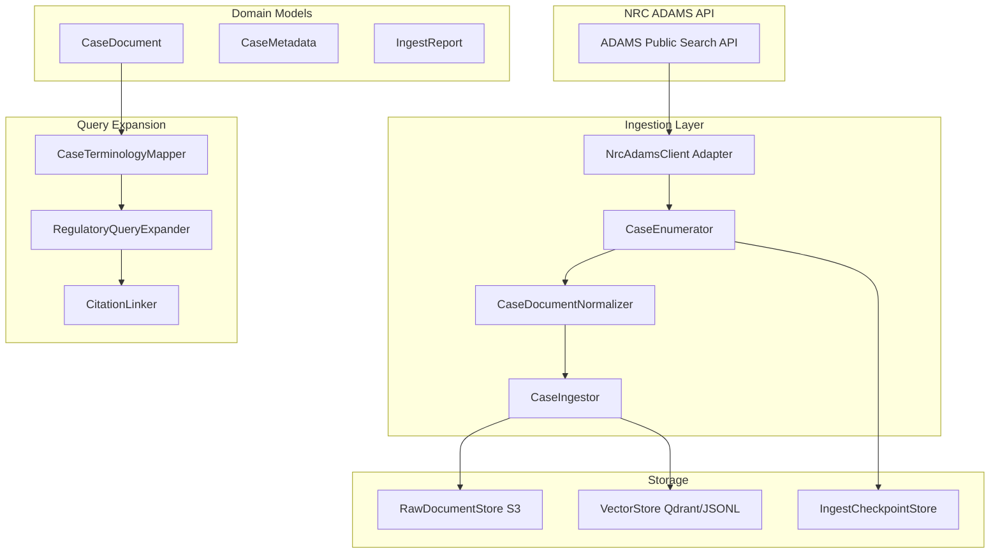
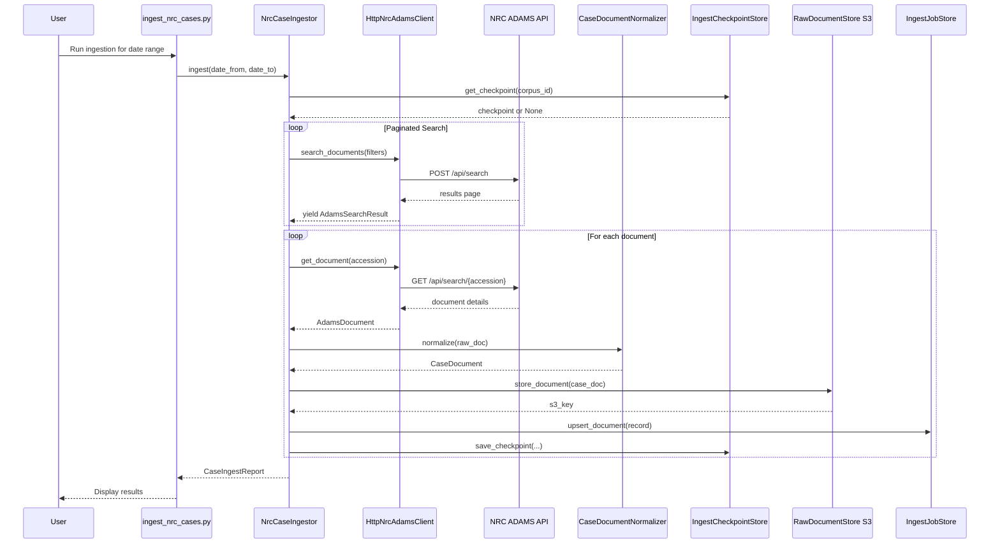

# NRC Case Document Ingestion & Query Expansion System Design

## Executive Summary

This document outlines the design for a system to ingest Nuclear Regulatory Commission (NRC) case documents via the ADAMS Public Search API, normalize heterogeneous document structures, and leverage the case corpus to generate semantically-grounded queries against the regulatory corpus with query expansion techniques.

## System Goals

1. **Ingest NRC Case Documents**: Fetch case records from the ADAMS Public Search API
2. **Normalize Document Structures**: Handle heterogeneous formats (inspection reports, correspondence, Part 21 reports, etc.)
3. **Enable Case-to-Regulatory Querying**: Map case terminology and patterns to relevant regulatory provisions
4. **Support Incremental Updates**: Track document additions and updates over time
5. **Handle API Failures Gracefully**: Implement robust error handling and retry logic

---

## NRC ADAMS API Overview

Based on the [APS API Guide](docs/APS-API-Guide.pdf):

### Authentication
- **Endpoint**: `https://adams-api.nrc.gov/aps/api/`
- **Header**: `Ocp-Apim-Subscription-Key: {subscription_key}`
- **Registration**: Required via https://adams-api-developer.nrc.gov/

### Key Endpoints

#### 1. Search Document Library (POST)
```
POST https://adams-api.nrc.gov/aps/api/search
```

**Request Body**:
```json
{
  "q": "safety valve",
  "filters": [
    {"field": "DocumentType", "value": "Inspection Report", "operator": "equals"},
    {"field": "DocumentDate", "value": "(DocumentDate ge '2024-01-01')"}
  ],
  "anyFilters": [],
  "legacyLibFilter": true,
  "mainLibFilter": true,
  "sort": "DocumentDate",
  "sortDirection": 1,
  "skip": 0
}
```

**Key Document Properties**:
- `AccessionNumber` - Unique identifier (e.g., ML12345A678)
- `DocumentTitle` - Document title
- `AuthorName` / `AuthorAffiliation` - Author information
- `DocumentDate` - Document date
- `DocumentType` - Type (Inspection Report, Letter, Part 21 Correspondence, etc.)
- `DocketNumber` - NRC docket number
- `content` - Full text content
- `Url` - Direct link to PDF

#### 2. Get Document by Accession Number (GET)
```
GET https://adams-api.nrc.gov/aps/api/search/{accessionNumber}
```

### Document Types of Interest for Cases
- `Inspection Report` - Operating reactor inspection reports
- `Part 21 Correspondence` - Component defect reports
- `Letter` - Regulatory correspondence
- `Safety Evaluation` - Safety evaluation reports
- `License Amendment` - License amendment requests

---

## System Architecture

### Hexagonal Architecture Alignment

Following the existing RAG system's hexagonal pattern:



---

## Component Design

### 1. Port: `NrcAdamsClient` (New)

**Location**: `src/rag/ports/nrc_adams_client.py`

```python
from typing import Protocol, runtime_checkable
from datetime import date
from collections.abc import Iterator

@runtime_checkable
class NrcAdamsClient(Protocol):
    """Port for NRC ADAMS Public Search API interactions."""
    
    def search_documents(
        self,
        query: str = "",
        filters: list[dict] | None = None,
        any_filters: list[dict] | None = None,
        date_from: date | None = None,
        date_to: date | None = None,
        document_types: list[str] | None = None,
        docket_numbers: list[str] | None = None,
        include_legacy: bool = False,
        sort_by: str = "DocumentDate",
        sort_desc: bool = True,
    ) -> Iterator[AdamsSearchResult]:
        """Search for documents with pagination handling."""
        ...
    
    def get_document(self, accession_number: str) -> AdamsDocument | None:
        """Fetch a single document by accession number."""
        ...
    
    def get_document_types(self) -> list[str]:
        """Return available document types."""
        ...
```

### 2. Adapter: `HttpNrcAdamsClient` (New)

**Location**: `src/rag/adapters/nrc_adams/http_client.py`

```python
@dataclass(frozen=True, slots=True)
class HttpNrcAdamsClient:
    """HTTP implementation of NrcAdamsClient with retry logic."""
    
    subscription_key: str
    base_url: str = "https://adams-api.nrc.gov/aps/api"
    timeout: float = 30.0
    max_retries: int = 3
    retry_delay: float = 1.0
    page_size: int = 100  # API pagination limit
    
    def search_documents(self, ...) -> Iterator[AdamsSearchResult]:
        # Implement pagination with exponential backoff
        # Handle rate limiting (429 responses)
        # Yield results as they arrive
        ...
    
    def _make_request(self, method: str, endpoint: str, **kwargs) -> dict:
        # Core request logic with retry
        # Log API interactions
        # Handle errors gracefully
        ...
```

### 3. Domain Models: Case Documents (New)

**Location**: `src/rag/domain/case_documents.py`

```python
@dataclass(frozen=True, slots=True)
class CaseDocument:
    """A normalized NRC case document."""
    
    doc_id: str  # Stable hash of accession_number
    accession_number: str  # ML12345A678
    title: str
    document_type: str
    document_date: date | None
    date_added: datetime | None
    authors: list[str]
    author_affiliations: list[str]
    addressees: list[str]
    addressee_affiliations: list[str]
    docket_numbers: list[str]
    license_numbers: list[str]
    keywords: list[str]
    content: str  # Full text
    url: str
    estimated_pages: int | None
    
    # Case-specific metadata
    case_metadata: CaseMetadata
    
    # Provenance
    source: str = "nrc_adams"
    ingestion_timestamp: datetime = field(default_factory=lambda: datetime.now(UTC))


@dataclass(frozen=True, slots=True)
class CaseMetadata:
    """Extracted case-specific metadata."""
    
    # Document categorization
    category: CaseCategory  # INSPECTION, ENFORCEMENT, LICENSING, etc.
    
    # Regulatory references extracted from content
    cited_regulations: list[str]  # ["10 CFR 50.46", "10 CFR 50.36"]
    
    # Facility/reactor information
    facility_name: str | None
    reactor_type: str | None  # PWR, BWR, etc.
    
    # Inspection-specific
    inspection_type: str | None  # Biennial, Problem ID, etc.
    inspection_report_number: str | None
    
    # Part 21 specific
    component_type: str | None
    defect_description: str | None
    
    # Enforcement-specific
    violation_ids: list[str]
    severity_level: str | None


class CaseCategory(Enum):
    INSPECTION = "inspection"
    ENFORCEMENT = "enforcement"
    LICENSING = "licensing"
    PART_21 = "part_21"
    CORRESPONDENCE = "correspondence"
    SAFETY_EVAL = "safety_evaluation"
    GENERIC = "generic"
```

### 4. Adapter: `CaseDocumentNormalizer` (New)

**Location**: `src/rag/adapters/ingestion/case/normalizer.py`

```python
@dataclass(frozen=True, slots=True)
class CaseDocumentNormalizer:
    """Normalizes raw ADAMS documents into canonical CaseDocument format."""
    
    # Regex patterns for extracting citations
    _cfr_citation_re: ClassVar[Pattern] = re.compile(
        r"(\d+)\s*CFR\s*§?\s*(\d+\.\d+[A-Za-z0-9-]*)"
    )
    
    def normalize(self, raw_document: AdamsDocument) -> CaseDocument:
        """Convert ADAMS API response to normalized CaseDocument."""
        ...
    
    def _extract_cited_regulations(self, content: str) -> list[str]:
        """Extract CFR citations from document content."""
        ...
    
    def _categorize_document(self, doc_type: str, title: str) -> CaseCategory:
        """Determine case category from document metadata."""
        ...
    
    def _extract_facility_info(self, title: str, content: str) -> tuple[str | None, str | None]:
        """Extract facility name and reactor type."""
        ...
```

### 5. Adapter: `NrcCaseIngestor` (New)

**Location**: `src/rag/adapters/ingestion/case/case_ingestor.py`

```python
@dataclass(frozen=True, slots=True)
class NrcCaseIngestor:
    """Ingestor for NRC case documents from ADAMS API."""
    
    adams_client: NrcAdamsClient
    normalizer: CaseDocumentNormalizer
    checkpoint_store: IngestCheckpointStore | None = None
    
    def ingest(
        self,
        document_types: list[str] | None = None,
        date_from: date | None = None,
        date_to: date | None = None,
        docket_numbers: list[str] | None = None,
        resume_from_checkpoint: bool = True,
    ) -> tuple[list[CaseDocument], CaseIngestReport]:
        """
        Ingest case documents with incremental update support.
        
        Uses checkpoint store to resume interrupted ingestion.
        """
        ...
    
    def ingest_by_accession_numbers(
        self,
        accession_numbers: list[str],
    ) -> tuple[list[CaseDocument], CaseIngestReport]:
        """Ingest specific documents by accession number."""
        ...


@dataclass(frozen=True, slots=True)
class CaseIngestReport:
    """Report for case document ingestion run."""
    
    total_found: int
    successfully_ingested: int
    failed: int
    skipped_already_present: int
    by_document_type: dict[str, int]
    date_range: tuple[date, date] | None
    checkpoint_id: str | None
    errors: list[str]
```

### 6. Port: `IngestCheckpointStore` (New)

**Location**: `src/rag/ports/checkpoint_store.py`

```python
@runtime_checkable
class IngestCheckpointStore(Protocol):
    """Stores and retrieves ingestion checkpoints for resumable operations."""
    
    def save_checkpoint(
        self,
        checkpoint_id: str,
        last_accession_number: str,
        last_document_date: date,
        metadata: dict[str, object],
    ) -> None:
        ...
    
    def get_checkpoint(self, checkpoint_id: str) -> IngestCheckpoint | None:
        ...
    
    def list_checkpoints(self, corpus_id: str) -> list[IngestCheckpoint]:
        ...


@dataclass(frozen=True, slots=True)
class IngestCheckpoint:
    checkpoint_id: str
    last_accession_number: str
    last_document_date: date
    created_at: datetime
    metadata: dict[str, object]
```

### 7. Query Expansion: `CaseToRegulatoryQueryExpander` (New)

**Location**: `src/rag/adapters/query_expansion/case_regulatory_mapper.py`

```python
@dataclass(frozen=True, slots=True)
class CaseToRegulatoryQueryExpander:
    """
    Expands case-based queries to target relevant regulatory provisions.
    
    Uses case document metadata to enhance regulatory corpus queries.
    """
    
    # Terminology mappings
    case_term_mappings: dict[str, list[str]] = field(default_factory=dict)
    
    def expand_query(
        self,
        case_query: str,
        case_context: CaseDocument | None = None,
    ) -> ExpandedQuery:
        """
        Expand a case-focused query for regulatory corpus retrieval.
        
        Example:
            Input: "What are the ECCS requirements for this violation?"
            With case citing 10 CFR 50.46
            Output: Expanded query targeting 10 CFR 50.46 and related sections
        """
        ...
    
    def generate_queries_from_case(
        self,
        case_doc: CaseDocument,
    ) -> list[GeneratedQuery]:
        """
        Generate high-quality queries from a case document.
        
        Creates queries that map case facts to regulatory requirements.
        """
        ...


@dataclass(frozen=True, slots=True)
class ExpandedQuery:
    original_query: str
    expanded_query: str
    target_citations: list[str]  # Specific CFR sections to target
    suggested_filters: list[dict]  # Vector store filters
    query_type: QueryType  # FACTUAL, INTERPRETIVE, COMPARATIVE


@dataclass(frozen=True, slots=True)
class GeneratedQuery:
    query_text: str
    relevant_citations: list[str]
    query_type: str
    difficulty: str
    expected_answer_focus: str
    source_case_id: str
```

---

## Data Flow: Full Ingestion Pipeline



---

## Error Handling & Resilience

### API Failure Handling

```python
class AdamsApiError(Exception):
    """Base exception for ADAMS API errors."""
    pass

class AdamsRateLimitError(AdamsApiError):
    """Rate limit exceeded (429)."""
    pass

class AdamsAuthError(AdamsApiError):
    """Authentication failed (401/403)."""
    pass

class AdamsNotFoundError(AdamsApiError):
    """Document not found (404)."""
    pass


@dataclass(frozen=True, slots=True)
class RetryConfig:
    """Configuration for retry behavior."""
    max_retries: int = 3
    base_delay: float = 1.0
    max_delay: float = 60.0
    exponential_base: float = 2.0
    retryable_statuses: set[int] = field(default_factory=lambda: {429, 500, 502, 503, 504})
```

### Retry Strategy

1. **Exponential Backoff**: `delay = min(base_delay * (2 ** attempt), max_delay)`
2. **Jitter**: Add randomness to prevent thundering herd
3. **Circuit Breaker**: Track consecutive failures, pause after threshold
4. **Checkpointing**: Save progress after each successful batch

---

## Incremental Update Strategy

### Approach: Date-Based Checkpointing

```python
def run_incremental_ingestion():
    """Fetch only new documents since last run."""
    checkpoint = checkpoint_store.get_checkpoint("nrc_cases")
    
    if checkpoint:
        date_from = checkpoint.last_document_date
    else:
        date_from = DEFAULT_START_DATE  # e.g., 1999-11-01
    
    date_to = date.today()
    
    # Use DateAddedTimestamp filter for incremental fetch
    filters = [{
        "field": "DateAddedTimestamp",
        "value": f"(DateAddedTimestamp ge '{date_from.isoformat()}')"
    }]
    
    documents = ingestor.ingest(
        date_from=date_from,
        date_to=date_to,
        filters=filters,
    )
```

### Idempotency

- Documents identified by `accession_number` (stable)
- Content hash check before re-processing
- Upsert semantics in document store

---

## Query Expansion: Case-to-Regulatory Mapping

### Terminology Mapping

```python
CASE_TO_REGULATORY_TERMS = {
    "safety valve": ["10 CFR 50.46", "ECCS", "emergency core cooling"],
    "reactor coolant pump": ["10 CFR 50.46", "loss of coolant accident", "LOCA"],
    "containment isolation": ["10 CFR 50.46", "containment integrity"],
    "technical specification": ["10 CFR 50.36", "limiting condition for operation"],
    "LCO": ["10 CFR 50.36", "limiting condition for operation"],
    "surveillance requirement": ["10 CFR 50.36"],
    "50.59": ["10 CFR 50.59", "license amendment"],
    "part 21": ["10 CFR 21", "defect reporting"],
}
```

### Query Generation from Cases

```python
def generate_queries_from_inspection_report(case: CaseDocument) -> list[GeneratedQuery]:
    """Generate queries from an inspection report case."""
    queries = []
    
    # Query 1: Direct citation lookup
    for citation in case.cited_regulations:
        queries.append(GeneratedQuery(
            query_text=f"What are the requirements of {citation}?",
            relevant_citations=[citation],
            query_type="factual",
            difficulty="easy",
            expected_answer_focus=f"Regulatory text from {citation}",
            source_case_id=case.doc_id,
        ))
    
    # Query 2: Violation interpretation
    if case.case_metadata.violation_ids:
        queries.append(GeneratedQuery(
            query_text=f"What regulatory requirements were violated in {case.title}?",
            relevant_citations=case.cited_regulations,
            query_type="interpretive",
            difficulty="hard",
            expected_answer_focus="Connection between findings and regulations",
            source_case_id=case.doc_id,
        ))
    
    return queries
```

---

## Configuration

### settings.toml Additions

```toml
# -------------------------------------------------------------------
# NRC ADAMS API Configuration
# -------------------------------------------------------------------
[nrc_adams]
enabled = false
subscription_key = ""  # Set via env var NRC_ADAMS_API_KEY
base_url = "https://adams-api.nrc.gov/aps/api"
timeout = 30.0
max_retries = 3
page_size = 100

# -------------------------------------------------------------------
# Case Document Ingestion
# -------------------------------------------------------------------
[case_ingestion]
corpus_id = "nrc-cases"
output_dir = "corpus/nrc-cases"
checkpoint_store = "postgres"  # "postgres" | "jsonl"
default_date_from = "1999-11-01"

# Document types to ingest
include_document_types = [
    "Inspection Report",
    "Part 21 Correspondence",
    "Letter",
    "Safety Evaluation",
]

# -------------------------------------------------------------------
# Case-to-Regulatory Query Expansion
# -------------------------------------------------------------------
[query_expansion]
enabled = true
terminology_mapping_file = "config/case_regulatory_terms.json"
max_expanded_queries = 5
```

---

## File Structure

```
src/rag/
├── ports/
│   ├── __init__.py
│   ├── nrc_adams_client.py          # NEW
│   └── checkpoint_store.py          # NEW
├── adapters/
│   ├── ingestion/
│   │   ├── case/                    # NEW
│   │   │   ├── __init__.py
│   │   │   ├── http_client.py       # HttpNrcAdamsClient
│   │   │   ├── normalizer.py        # CaseDocumentNormalizer
│   │   │   ├── case_ingestor.py     # NrcCaseIngestor
│   │   │   └── checkpoint.py        # PostgresCheckpointStore
│   │   └── regulatory/
│   └── query_expansion/             # NEW
│       ├── __init__.py
│       └── case_regulatory_mapper.py
├── domain/
│   ├── models.py
│   ├── ingestion.py
│   └── case_documents.py            # NEW
└── app/
    ├── container.py
    └── case_ingestion_pipeline.py   # NEW

scripts/
├── ingest_nrc_cases.py              # NEW
└── generate_case_queries.py         # NEW

config/
└── case_regulatory_terms.json       # NEW
```

---

## Implementation Phases

### Phase 1: Core API Client
- Implement `NrcAdamsClient` port and `HttpNrcAdamsClient` adapter
- Add retry logic and error handling
- Create basic search and get document functionality

### Phase 2: Document Normalization
- Implement `CaseDocument` domain models
- Build `CaseDocumentNormalizer` with citation extraction
- Add case categorization logic

### Phase 3: Ingestion Pipeline
- Implement `NrcCaseIngestor` with checkpointing
- Add incremental update support
- Integrate with existing distributed ingestion framework

### Phase 4: Query Expansion
- Build terminology mapping system
- Implement `CaseToRegulatoryQueryExpander`
- Create query generation from case documents

### Phase 5: Integration & Testing
- Add CLI scripts for case ingestion
- Create evaluation dataset from case documents
- End-to-end testing with regulatory corpus

---

## Success Metrics

1. **Ingestion Coverage**: % of relevant NRC case documents ingested
2. **Citation Extraction Accuracy**: Precision/recall of CFR citation extraction
3. **Query Quality**: Retrieved regulatory provisions match case context
4. **API Reliability**: < 1% failure rate with retry logic
5. **Incremental Efficiency**: Only new/modified documents fetched on update

---

## Open Questions

1. Should we store full PDF content or just metadata + extracted text?
2. How to handle document updates (revisions to existing accession numbers)?
3. What is the rate limit for the ADAMS API?
4. Should we implement a caching layer for API responses?
5. How to validate the quality of generated queries?